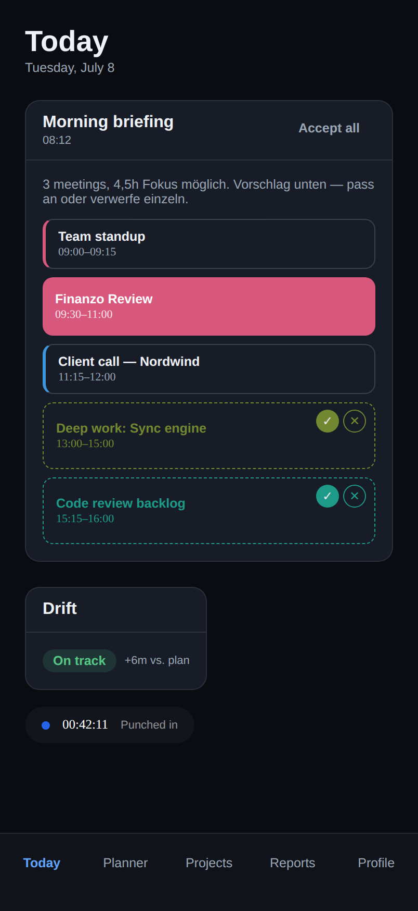
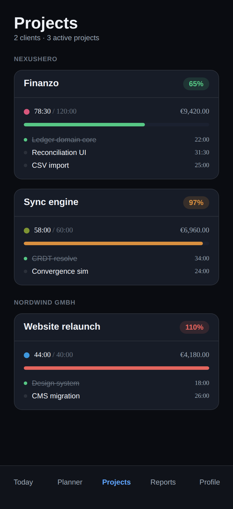
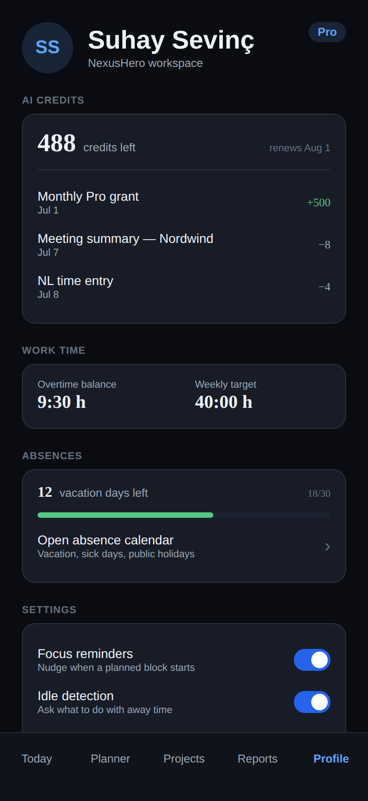
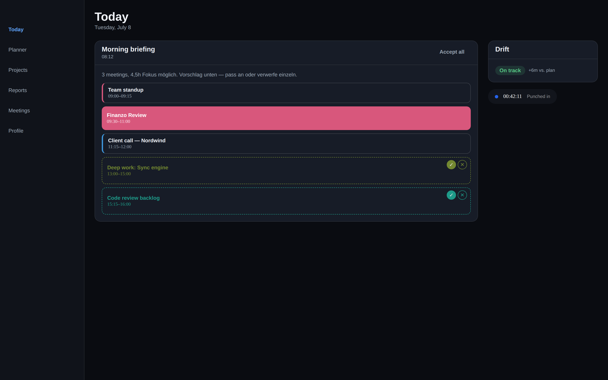

<h1 align="center">myDevTime</h1>

<p align="center">
  <strong>Time tracking that plans your day, not just logs it.</strong><br>
  iOS · Android · Web — one codebase. Tyme-class UX, Tactiq-class meeting AI, and a
  deterministic core you can trust with a timesheet.
</p>

<p align="center">
  <a href="docs/roadmap.md">Roadmap</a> ·
  <a href="docs/architecture.md">Architecture</a> ·
  <a href="docs/design/ux-vision.md">UX Vision</a> ·
  <a href="docs/adr/README.md">Decisions (ADRs)</a>
</p>

<p align="center">
  
  
  
  
</p>

---

## What it is

myDevTime is a cross-platform time tracker for developers, freelancers, and agencies. It takes
the two best products in the space — **Tyme's** fast, native-feeling tracking UX and **Tactiq's**
meeting AI plus credit-based monetization — and adds its own AI planning layer on top, all from a
single React Native + Expo codebase.

One principle runs through the whole architecture: **deterministic logic decides everything that
reaches a timesheet, budget, export, or invoice; AI proposes, parses, and explains — always with
recorded provenance — but never acts as the bookkeeper**
([ADR-0005](docs/adr/0005-deterministic-core-llm-assist.md)). Your numbers are exact, reproducible,
and auditable; the AI just makes them faster to get to.

## A look at it

<p align="center">
  
  &nbsp;
  
  &nbsp;
  
</p>

<p align="center">
  <em>Today · Projects · Profile — the same code renders phone tabs and a desktop sidebar:</em>
</p>

<p align="center">
  
</p>

## Why it's different

- **A Co-Planner, not a logbook.** The **Day Canvas** shows the plan (AI-proposed *ghost blocks*)
  and reality on one surface: a morning briefing, a quiet live-drift indicator, and an evening
  review. Accept the whole plan with one tap, or sculpt it.
- **The Island.** One persistent, glanceable element carries live timer + punch + break state
  everywhere — Live Activity / Dynamic Island on iOS, an ongoing notification on Android, a
  floating pill on web. Learn it once.
- **Numbers are the product.** Every duration and amount renders in tabular numerals and is
  computed by pure, exhaustively tested logic — integer minor units, no floating-point money.
- **Provenance everywhere.** Every entry records its source (`timer · manual · calendar ·
  rule · ai-proposal`) and review state, so a machine-made suggestion is always visible as one.

## Features

| Area | What you get |
|------|--------------|
| **Tracking** | Fast timers (one running, reboot-safe), manual entries with create/edit/split/merge, clients → projects → tasks, tags, offline-first with deterministic cross-device sync |
| **Budgets & rates** | Per-project budgets with consumption bars and threshold alerts; effective-dated hourly rates (workspace → client → project → task precedence); exact integer money math |
| **Work-time story** | Clock-in/out with breaks and overtime balance, vacation & sick days, and a **signable monthly work-time report** (PDF + Excel) your client or supervisor can countersign |
| **Meeting AI** | Consent-first transcription with AI summaries, action items, and reusable custom prompts |
| **Own AI layer** | Calendar auto-capture → deterministic rules engine with AI-assisted categorization, natural-language entry ("2h Finanzo Review gestern"), weekly summaries & standup reports, and a chat assistant grounded only in your own data |
| **Monetization** | Web + in-app subscriptions (Stripe · StoreKit 2 · Play Billing) unified behind one entitlement service, with a visible **AI-credit ledger** and purchasable top-ups |

## Status

Actively under construction. The foundations are in place and the first screens are live:

- **Backend** — Fastify modular monolith with auth, the tracking core, server-authoritative sync,
  budgets & rates, timesheet exports (CSV · XLSX · PDF), the entitlement service, and Stripe
  checkout / portal / webhooks.
- **Clients** — a themeable design system (three accents × light/dark), a responsive app shell
  (phone tabs ⇄ desktop sidebar), and **live Today, Projects, and Profile** screens on the shared
  Expo / React-Native-Web codebase.
- **Deterministic core** — money, rates, budgets, rounding, overlap resolution, sync convergence,
  and the timesheet builder are pure and held to **≥ 90 % coverage**.

See the [roadmap](docs/roadmap.md) for milestones M0–M5 and the Definition of 1.0, and the
[Requirements Register](docs/architecture.md) for per-requirement status.

## Getting started

```bash
pnpm install          # installs deps and wires the git hooks
./test.sh             # the full local gate = what CI runs

# run the app (iOS / Android / Web) from the shared codebase
pnpm --filter @mydevtime/mobile start
```

Requires Node ≥ 22 and pnpm. `./test.sh` builds the packages, checks formatting and lint,
type-checks, runs the test suite with coverage, and verifies domain purity and docs.

## Architecture at a glance

- **Monorepo** (pnpm workspaces): `apps/api` (Fastify), `apps/mobile` (Expo/RN),
  `packages/domain` (pure logic), `packages/design` (tokens · theme · nav model),
  `packages/shared` (types/schemas).
- **Ports & adapters** for volatile vendors — LLM, ASR, Stripe, StoreKit, Play Billing, calendar
  SDKs each sit behind one narrow interface; vendor types never leak upstream.
- **Workspace isolation by construction** — repository APIs take a `workspaceId` non-optionally,
  with negative isolation tests per entity.

## Documentation

| Document | Content |
|----------|---------|
| [`docs/roadmap.md`](docs/roadmap.md) | Milestones M0–M5, dependency graph, Definition of 1.0, post-1.0 backlog |
| [`docs/architecture.md`](docs/architecture.md) | arc42 documentation incl. the Requirements Register (REQ-001…) |
| [`docs/design/ux-vision.md`](docs/design/ux-vision.md) | Binding UX vision: principles, Day Canvas, Co-Planner, Island, visual & motion language |
| [`docs/adr/`](docs/adr/README.md) | Architecture Decision Records + Tech Radar |
| [`skills/ultimate-dev-process/SKILL.md`](skills/ultimate-dev-process/SKILL.md) | The development process (governance, TDD, SOLID, Definition of Done) |
| [`CONTRIBUTING.md`](CONTRIBUTING.md) | Ways of working, branching, commits |

## License

See [LICENSE](LICENSE).
