# Backend Subsystems — Component View (C4 Level 3)

This document is the **C4 Level-3 (component) companion** to [`architecture.md`](./architecture.md).
Where the Building Block View there sketches the backend as one NestJS module-per-domain monolith on
the Fastify adapter (its Level-1/2 containers and modules), this document zooms into each backend
subsystem **in isolation** and shows its internal parts, grounded in the code under
`apps/api/src/modules/<name>/`.

Every subsystem is drawn to the same boundary contract, which is the same contract the ADRs impose:

- **The module owns the HTTP edge and persistence.** Controllers mount under `/api/<name>`; a
  per-request `*.context.ts` resolves the caller's workspace over the `DB` token, so isolation holds
  by construction (ADR-0015) — a route can only act on the workspace it resolves, never a
  client-supplied id.
- **The deterministic core is delegated to `packages/domain`.** Every number that reaches a
  timesheet, budget, plan, balance, or invoice is computed by pure, framework-free logic in
  `@mydevtime/domain`; the module persists and proposes, the domain computes (ADR-0005). Domain
  nodes below are drawn as the pure core the service calls into.
- **Volatile vendors sit behind one narrow port each.** LLM, ASR, dev-tool export, calendar, Stripe,
  and Better-Auth are reached through a single adapter that confines the SDK/auth to one file;
  nothing upstream imports a vendor type (skill §2.2). AI/vendor edges are marked
  *proposal only / degrades to Null adapter* — the feature degrades gracefully when the provider is
  absent (the `Null*` adapter is the default seam).

Diagram legend (shared `classDef` across sections): **controller** (HTTP route surface),
**service** (persistence + orchestration), **core** (pure `@mydevtime/domain` logic), **db** (owned
Postgres/Drizzle tables), **port** (narrow vendor interface), **adapter** (vendor-confined
implementation).

For the requirement register, quality goals, and the Runtime View sequences that cut across these
subsystems, see [`architecture.md`](./architecture.md); for the decisions cited here, see
[`adr/README.md`](./adr/README.md).

---

## tracking — entries · catalog · summary

The `tracking` module owns the core time-tracking surface: the client/project/task/tag catalog and
the time entries themselves, including the one-running-timer invariant (REQ-001/004). Its four
controllers (`apps/api/src/modules/tracking/tracking.controller.ts`,
`catalog.controller.ts`, `entries.controller.ts`, `summary.controller.ts`) all sit behind the
`AuthGuard` and resolve their workspace through `TrackingContext`
(`apps/api/src/modules/tracking/tracking.context.ts`), which provisions a workspace on first use and
supplies the owning user id for entry ownership. Deterministic validation stays out of the
controllers: `entries-service.ts` delegates to `isValidEntry` in `@mydevtime/domain`, and the module
never decides an entry's validity itself (ADR-0005). It owns the `timeEntries` and catalog tables
(`clients`, `projects`, `tasks`, `tags`) and provisions `workspaces`.


Mermaid source

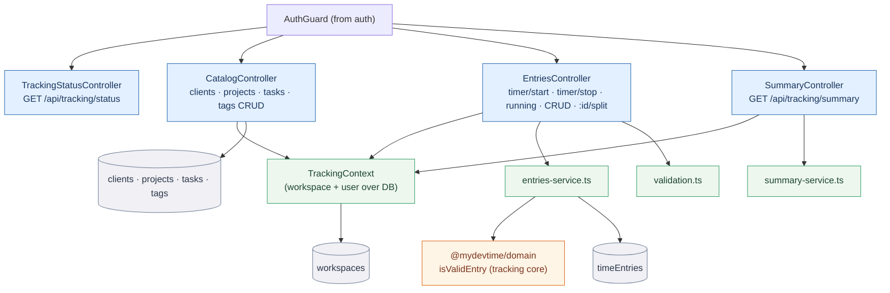

---

## worktime — attendance · schedules · overtime · signable report

The `worktime` module owns the work-time story: punch-clock shifts, weekly schedules, overtime
reconciliation, coverage, and the signable PDF/XLSX work-time report and monthly statement
(REQ-028/030). `worktime.controller.ts` exposes `clock-in`/`clock-out`, `shifts`, `coverage`,
`schedule`, `summary`, `report`, and `statement`; a separate `worktime.status.controller.ts` answers
the status probe. All ArbZG-preset break/overtime arithmetic is delegated to `@mydevtime/domain`
(`computeOvertime`, `breakShortfallMs`, `reconcileCoverage`, `ARBZG_PRESET` in
`apps/api/src/modules/worktime/service.ts`; `buildWorktimeReport`, `zonedTimeToInstant` in
`report/source.ts`; `localParts`/`MonthlyStatement` in `report/statement-source.ts`). The module owns
`attendanceShifts` and `workSchedules` and reads `timeEntries`, `projects`, and `absences` when it
composes a report. Rendering (`report/pdf.ts`, `report/xlsx.ts`, `report/statement-pdf.ts`) formats a
report the domain already computed — it never re-does the math.


Mermaid source

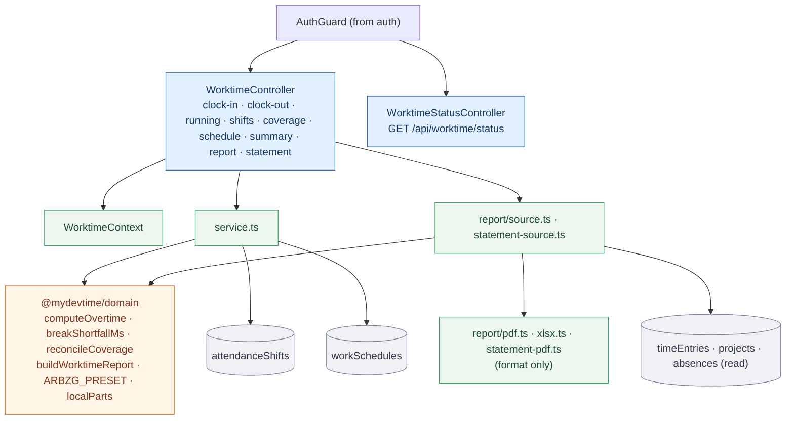

---

## absences — leave · vacation policy & balance · holidays

The `absences` module owns leave ranges, the per-workspace vacation policy, and holiday-calendar
lookups (REQ-029). `absences.controller.ts` lists and creates leave, deletes it, reads and writes the
`policy`, reports the `balance`, and serves `holidays`; `absences.status.controller.ts` answers the
probe. Allowance arithmetic is not done in the service: `apps/api/src/modules/absences/service.ts`
hands stored rows to the deterministic `vacationBalance` core, and the controller resolves public
holidays through `holidaysForRegion`/`HOLIDAY_REGIONS` in `@mydevtime/domain` (ADR-0005/0010). It owns
`absences` and `absencePolicies`.


Mermaid source

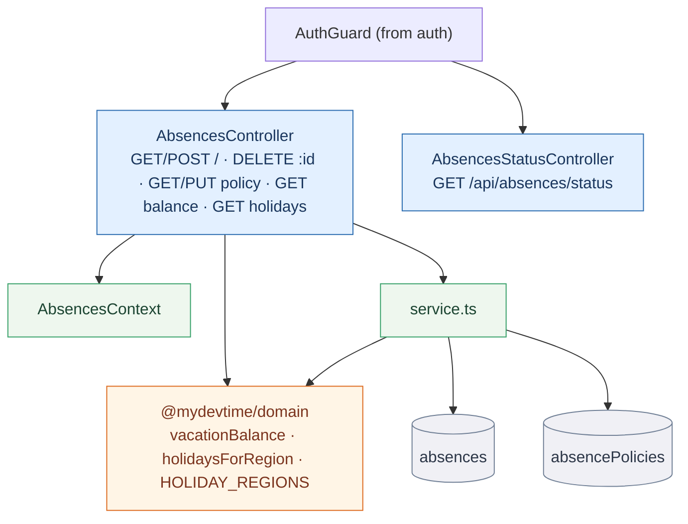

---

## planner — versioned day plans · Co-Planner review

The `planner` module owns versioned day plans and the Co-Planner review (REQ-031). `planner.controller.ts`
lists and creates plans, transitions a plan's `status`, serves the plan-vs-actual `review`, computes
deterministic `label`s, and produces a `briefing`. Placement is not done in the service:
`apps/api/src/modules/planner/service.ts` runs the deterministic `buildDayPlan` and `reviewDayPlan`
cores and stores their blocks verbatim — it never places time itself (ADR-0005/0011). `labeler.ts`
delegates to `deterministicLabels`, and `briefer.ts` composes a briefing over the domain `DayPlan`
type. It owns `plans` and reads `timeEntries` for the plan-vs-actual review.


Mermaid source

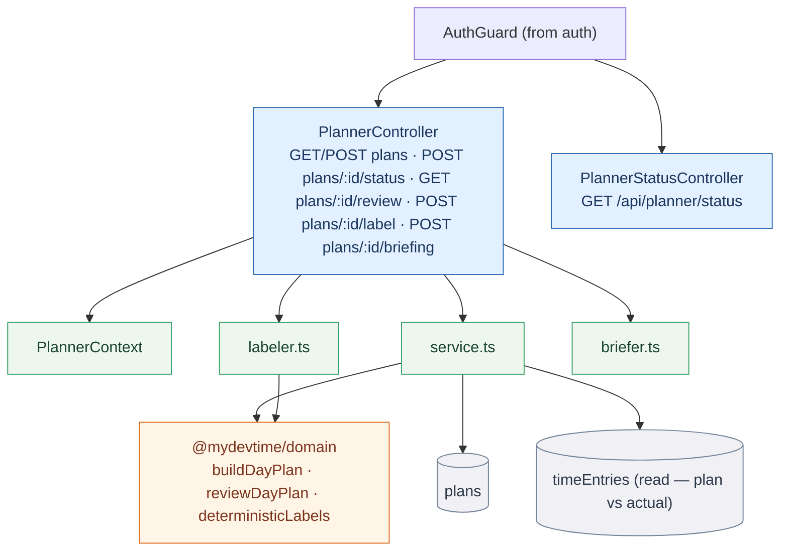

---

## automation — deterministic categorization rules

The `automation` module owns the deterministic categorization rules engine (REQ-011).
`rules.controller.ts` is CRUD over stored `matcher → action` rules plus a `rules/dry-run` that
previews matches and writes nothing; `automation.controller.ts` answers the status probe. Evaluation
is never decided by the service: `apps/api/src/modules/automation/service.ts` delegates every match to
the `dryRun` engine in `@mydevtime/domain`, so a rule's behaviour is pure, exhaustively tested logic
(ADR-0005). It owns the `rules` table.

Note on scope: the `automation` module is rules-only. **Calendar ingestion is not in this module** —
it lives in `connectors` (the `google-calendar/preview` route) over the `calendarsync` port and the
deterministic `mergeCalendar` core; see the *connectors* section below.


Mermaid source

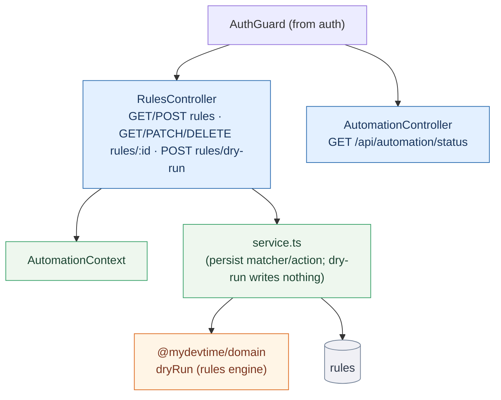

---

## ai — LLM · ASR · assistant · insights · export (proposals only)

The `ai` module is the AI layer's HTTP surface and the largest subsystem. `ai.controller.ts` exposes
`nl-entry`, `smart-add`, `insight`, `standup`, `categorize`, and `assistant`; a nested
`export/export.controller.ts` serves the confirmed-only dev-tool export ledger (`export/records`,
`export/run`). Everything the LLM/ASR produces is a **proposal** the deterministic core validates
(ADR-0005): `nl-entry.service.ts`/`smart-add.service.ts` delegate to `parseTimeEntry`/`parseEntry`,
`assistant.ts` grounds answers with `selectGroundingFacts`/`isOffData`, `standup.ts` uses
`buildStandup`/`standupSlots`, and `transcription/service.ts` runs `actionItemProposals`/`transcriptFacts`
after gating on stored consent (REQ-025).

Three narrow ports keep the vendors confined, each defaulting to a `Null*` adapter that ships now as
the seam and degrades gracefully when no provider is configured:

- **`LlmPort`** (`ai/llm/port.ts`) — every model (OpenAI, Anthropic, Gemini, Ollama) reached through
  one library-backed adapter (`ai/llm/vercel-llm.ts`); `NullLlm` is the default.
- **`TranscriptionPort`** (`ai/transcription/port.ts`) — ASR behind `whisper-http.ts`; `NullTranscription`
  the default, gated on spike #31.
- **`ExportTargetPort`** (`ai/export/port.ts`) — Jira/Linear/Slack behind confined adapters; idempotent,
  confirmed-only; `NullExportTarget` the default.

Credit-priced routes debit the billing ledger through the billing module's **public contract** only:
`ai.controller.ts` imports `balanceFor`/`debit` from `../billing/contract.js`, and a credit is charged
once **only when the AI actually proposed** — a down provider or a deterministic fallback costs nothing
(ADR-0008). The module owns `exportRecords` (the export ledger) and reads grounding data from
`timeEntries`/`plans`/`workspaces`.


Mermaid source

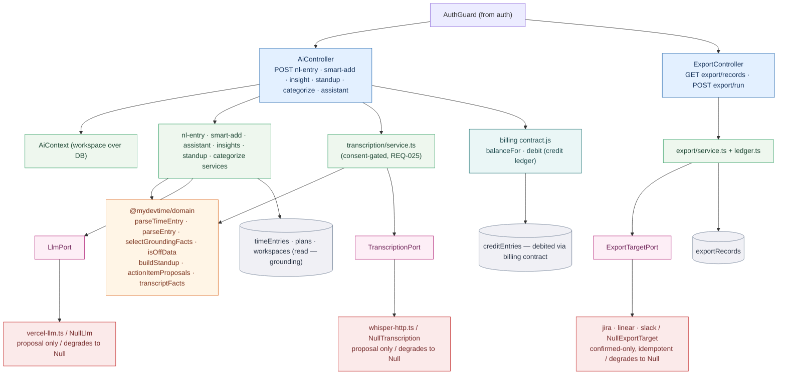

---

## billing — rates · budgets · invoicing · entitlements · credit ledger · Stripe rail

The `billing` module owns money and access: rate cards, budgets and thresholds, invoices/Abrechnung,
the credit ledger, and derived entitlements (REQ-005/009/016/017). `billing.controller.ts` carries the
bulk of the surface (`rates`, `budgets` + `status`/`evaluate`/`burndown`, `projects/:id/cost` and
`timesheet`, `summary`, `aging`, `invoices` + `preview`/`export`, `credits` + `ledger`/`usage`,
`entitlement`); `stripe.controller.ts` runs the payment rail (`checkout`, `portal`,
`stripe/webhook`); `billing.status.controller.ts` answers the probe. Every figure is deterministic
domain logic: `service.ts` (`budgetStatus`, `costOf`, `rateForEntry`, `evaluateThresholds`),
`invoice-service.ts` (`invoiceLines`, `summarizeInvoice`, `agingBuckets`), `credits-service.ts`
(`creditBalance`, `canDebit`, `monthlyCreditAllowance`, `usageByCategory`), and `entitlements-service.ts`
(`deriveEntitlement`, `can`, `featuresFor`). The Stripe SDK stays inside `payments/stripe/gateway.ts`
behind the `payments/port.ts` interface; the gateway provider resolves to `null` when Stripe is
unconfigured and the controller answers 404 (ADR-0006/0008). It owns `rates`, `budgets`,
`budgetAlerts`, `invoices`, `creditEntries`, `entitlementEvents`, and `billingCustomers`, and reads
`timeEntries`/`projects`/`clients` for costing.


Mermaid source

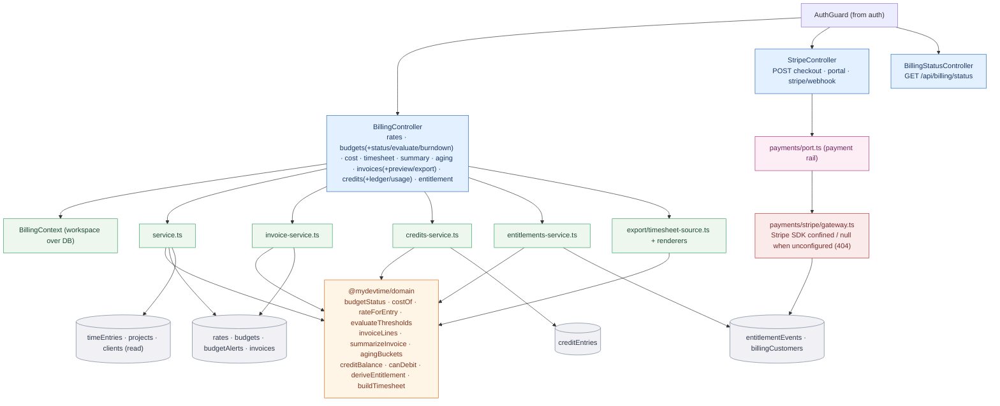

---

## connectors — OAuth vault · per-capability consent · calendar adapter

The `connectors` module owns third-party connections: real per-connector state, per-capability
consent, and the sealed OAuth token vault (M3, ADR-0032/0033). `connectors.controller.ts` lists
connectors, runs the OAuth `:id/authorize`/`:id/callback` flow, patches per-capability `:id/consent`,
disconnects (`DELETE :id`, which deletes sealed tokens and revokes every grant), and serves the
consent-gated `google-calendar/preview`. Secrets are confined: `vault.ts` seals/opens tokens over the
`crypto.ts` backend (ports & adapters — the master key lives only in the environment), and `consent.ts`
enforces that nothing runs without a stored, explicit opt-in (consent-first, REQ-025). This is where
**calendar ingestion** lives: the preview delegates to `planImport` (`calendarsync/service.ts`) over the
`CalendarPort` (`calendarsync/port.ts`, `GoogleCalendar`/`NullCalendar` adapters), which reads a window
and yields the deterministic `mergeCalendar` ghost-block **proposals** — it books nothing (ADR-0005). It
owns `connectorTokens` and `connectorGrants`.


Mermaid source

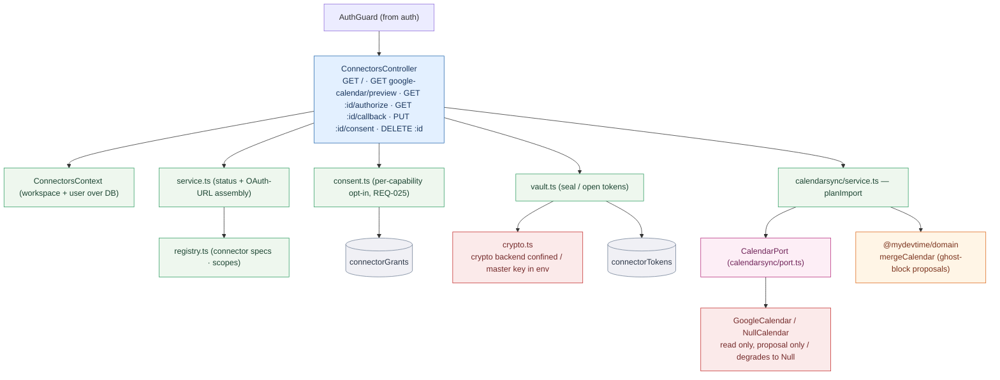

---

## auth — Better-Auth edge (authN & sessions)

The `auth` module owns authentication and the shared guard (ADR-0017/0025). `auth.controller.ts`
serves the Nest-routed `status`, `providers`, and `me`, while the Better-Auth `/api/auth/*`
catch-all is mounted directly on the raw Fastify instance at bootstrap (its wire format bypasses Nest
routing/validation by design). The vendor is confined to this module: `auth-instance.ts` builds the
Better-Auth instance (null without a DB), `email-port.ts` is the narrow email seam, and `AuthGuard`
(`auth.guard.ts`) validates the session and attaches a vendor-free `AuthenticatedUser` to the request.
Every other module imports only this module's public surface — `contract.ts` re-exports `AuthGuard`
and `CurrentUser`, and `auth.module.ts` exports the guard for `@UseGuards`. It reads the Better-Auth
schema (`user`/session tables); Better-Auth types never leak upstream.


Mermaid source

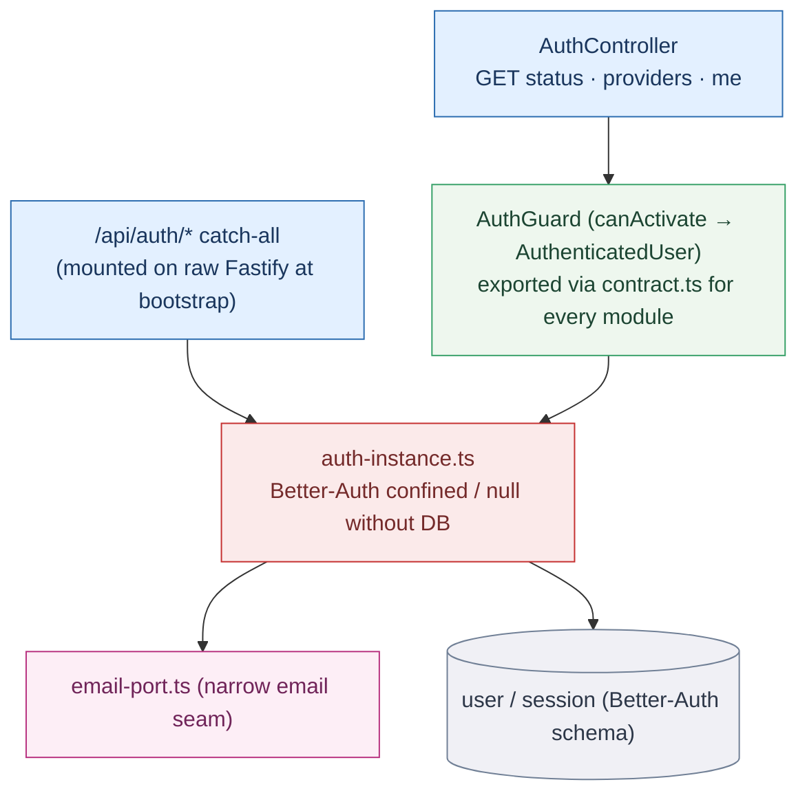

---

_These nine subsystem views complement the Building Block View in [`architecture.md`](./architecture.md);
keep a subsystem's diagram current in the same PR that changes its controllers, its owned tables, or
its ports (skill §1.5)._
