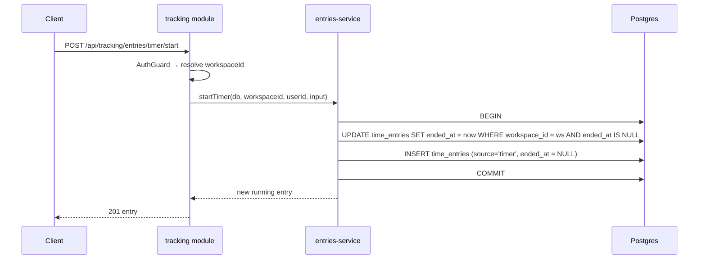

# Introduction and Goals {#section-introduction-and-goals}

## Requirements Overview {#_requirements_overview}

**myDevTime** is a cross-platform time-tracking product for developers, freelancers, and small
teams, shipping on **iOS, Android, and Web** from 1.0. Its product thesis
([ADR-0002](adr/0002-product-scope-unify-tyme-and-tackle.md)) is to unify the two best products
in the space — each of which lacks what the other has:

- **Tyme** (Apple-only): the benchmark for mobile/tablet-first tracking UX — fast timers,
  client → project → task hierarchy, budgets, statistics, offline-first sync — but no web app, no
  automation, no AI, no billing workflow.
- **Tactiq** (tactiq.io, browser-extension/web): the benchmark for meeting AI and AI
  monetization — live meeting transcription (Meet/Zoom/Teams, 30+ languages), AI summaries and
  action items, reusable AI prompts/workflows, sold through tiered plans with **AI credits**
  (1 credit = 1 AI action) — but it is not a time tracker and has no mobile app
  ([ADR-0008](adr/0008-tactiq-realignment-transcription-and-credits.md), amending ADR-0002's
  original reference).

On top of the union, myDevTime adds its **own AI layer**: natural-language time entry,
AI-generated summaries/standup reports, and a chat assistant grounded exclusively in the user's
own tracking data. Calendar auto-capture (Google/Microsoft) stays in scope as the strongest
automation source and the anchor that ties meetings — and their transcripts — to tracked time.
The commercial foundation — authentication and subscription billing across web and both app
stores — is in scope from the start, not a retrofit.

**The problem:** tracked time is billing-relevant data, and the tools that make capture effortless
(automation, AI) are exactly the tools that can silently corrupt it. The architecture therefore
follows one principle throughout ([ADR-0005](adr/0005-deterministic-core-llm-assist.md)):
**deterministic logic decides everything that reaches a timesheet or invoice; LLMs propose, parse,
explain, and assist — with recorded provenance — but never act as the bookkeeper.**

**Non-goals for 1.0** (backlog, not scope — ADR-0002): team/enterprise administration beyond a
personal workspace, native macOS/watchOS apps, screen-time/app-usage surveillance tracking,
integration marketplace, multi-currency workspaces, 2FA/passkeys.

**Essential functional requirements:**

| # | Requirement |
|---|-------------|
| F1 | Track time via live timers and manual entries, fully offline-capable, synced across devices |
| F2 | Organize work as clients → projects → tasks with tags, budgets, deadlines, and hourly rates |
| F3 | Ingest calendar events (Google/Microsoft) as candidate entries — never auto-committed without a rule the user enabled |
| F4 | Categorize candidates deterministically via user-defined, versioned rules; an LLM proposes only where rules are undecided, constrained to code-enforced candidates |
| F5 | Parse natural-language input ("2h Finanzo Review gestern") into draft entries the user confirms |
| F6 | Generate AI summaries, standup reports, and budget-risk explanations whose every number equals the deterministically computed one |
| F7 | Answer questions in a chat assistant grounded exclusively in the user's own workspace — read-only, deep-links instead of state mutation |
| F8 | Produce billing-grade timesheet exports (CSV/PDF) with per-value provenance and explicit rounding profiles |
| F9 | Authenticate via email/password, Google, and Apple; sessions revocable; account deletable |
| F10 | Sell a Pro subscription via Stripe on web and native IAP in both stores, unified by one internal entitlement service |
| F11 | Transcribe meetings (consent-first, capture channel per ADR-0009) and attach the transcript to the tracked time entry |
| F12 | Run AI actions on transcripts — summaries, action items, reusable custom prompts — each debiting a visible AI-credit balance with purchasable top-ups |
| F13 | Track the work day itself: clock-in/clock-out, breaks, target-hour schedules, overtime balance, break-rule warnings — with project entries recorded inside that frame |
| F14 | Record absences (vacation, sick, public holidays, custom types) with allowance/carry-over accounting, integrated with target hours and statistics |
| F15 | Export a signable monthly work-time report (Arbeitszeitnachweis) as PDF with signature blocks and as structured Excel/XLSX |
| F16 | Co-plan the day: AI-proposed timebox plan (ghost blocks) anchored on meetings and weighted by deadlines/budgets/target hours; live plan-vs-actual; evening review feeding the standup |
| F17 | Run focus sessions (Pomodoro cycles) inside tracked time, with calm focus statistics and a streak that absences don't break |
| F18 | Notice forgotten tracking: explainable trim and punch-correction proposals — user-confirmed, never auto-applied |
| F19 | Mirror tracked blocks into a dedicated calendar (opt-in, privacy presets, incremental write consent) |
| F20 | Export meeting insights and action items to Jira, Linear, and Slack after explicit, previewed confirmation |
| F21 | Attach notes to entries (incl. the running timer) that become timesheet position texts and are searchable |
| F22 | See the month at a glance: activity dots per day and deterministic booking-gap markers |
| F23 | Operate core actions from the system: Siri/App Intents/Shortcuts (iOS), Quick Settings Tile (Android) |
| F24 | Switch the day between Canvas and a classic list with per-entry amounts and day subtotals |

## Audits {#_audits}

Point-in-time quality & bug audits of the codebase live under [`docs/audit/`](audit/) so the
audit trail sits inside the architecture record:

- [2026-07-15 — Eight-perspective quality & bug audit](audit/2026-07-15-eight-perspective-audit.md)
  (Requirements · Architecture · Developer · DevOps · Tester · UX · Customer · Security; 39
  verified findings). Fixes ship as separate category PRs.

## Requirements Register {#_requirements_register}

Living register of tracked requirements (process skill §1.1). GitHub issues are where a
requirement is *discussed*; this table is where it is *tracked*. Selected invariant-critical
requirements gain a Runtime-View sequence diagram (§6); not every fulfilled requirement carries
one.

**Status vocabulary** (the leading word of the Status cell; parenthetical detail may follow). It
maps 1:1 to the coverage state in the [requirements-traceability matrix](testing/requirements-traceability.md):

| Register status | Meaning | Traceability state |
|-----------------|---------|--------------------|
| **Proposed** | Accepted into scope, not started | Planned |
| **In progress** | Under active construction; a load-bearing slice may already ship | Partial |
| **Partial** | A load-bearing slice is delivered and tested; the full requirement is not | Partial |
| **Done** | Delivered end-to-end and covered by an acceptance-tier test (SKILL §7) | Verified |
| **Deferred** | Consciously parked (an ADR records why); kept dormant, not delivered | Verified (dormant) / — |

| ID | Requirement | Delivered by | Status |
|----|-------------|-------------|--------|
| REQ-001 | Workspace & tracking data model: clients → projects → tasks, tags, archiving; every query workspace-scoped by construction (repository takes `workspaceId` non-optionally; negative isolation tests per entity) | [#6](https://github.com/NexusHero/myDevTime/issues/6) | Done (#6) |
| REQ-002 | Authentication: email/password + verification, Sign in with Google, Apple & GitHub, opaque revocable sessions (logout-everywhere), rate limiting, account deletion — self-hosted on Better-Auth behind a shared `AuthGuard` | ADR-0007/0017/0018, [#4](https://github.com/NexusHero/myDevTime/issues/4) [#5](https://github.com/NexusHero/myDevTime/issues/5) | Done (#4) |
| REQ-003 | Deterministic tracking core: timezone/DST-safe time math, overlap policy, rounding rules as data, aggregations — pure and dependency-free (`packages/domain/tracking`, purity-gated) | ADR-0005, [#7](https://github.com/NexusHero/myDevTime/issues/7) | Done (#7) |
| REQ-004 | Timers & manual entries: one running timer (DB-enforced, per-workspace), reboot-safe (running = persisted start instant, clock derived), manual create/edit/split/delete validated by the tracking core, provenance `source` on every entry | [#8](https://github.com/NexusHero/myDevTime/issues/8) | API done (#8); client is **online-only** ([ADR-0049](adr/0049-abandon-offline-first-architecture.md)) — the local offline store was removed; the tracking core still validates every entry server-side |
| REQ-005 | Budgets, effective-dated hourly rates (workspace→client→project→task precedence), deadlines, threshold alerts; integer money math (minor units, BigInt cost, no float) — pure core in `packages/domain/budgets`, persisted + served by the `billing` module. **Invoicing / "Abrechnung"** ([ADR-0051](adr/0051-invoicing-abrechnung.md), design v6): `packages/domain/invoicing` prices a client's billable entries in a period with the same rate math, an `invoices` table + `invoiced_at` markers freeze issued bills (server-authoritative, atomic, reversible), and `/api/billing/invoices` + `/clients/open` serve them | ADR-0005/0051, [#10](https://github.com/NexusHero/myDevTime/issues/10) | Done (#10); invoicing added (ADR-0051); Reports analytics completed (design v10) — a **budget burn-down** (`GET /api/billing/budgets/:id/burndown` samples the as-of consumption across the period; the client extrapolates the exhaustion via the pure `burndownProjection`) and a **12-week tracking heatmap** (`dailyMinutesSeries`) |
| REQ-006 | Cross-device sync: conflicts never silently merge into wrong durations — a deterministic per-entity conflict policy in `packages/domain` (LWW for catalog metadata, time-entry intervals surfaced never auto-merged). **Deferred by [ADR-0049](adr/0049-abandon-offline-first-architecture.md):** the app is now online-only, so the `sync` module and its `/api/sync/*` endpoints are removed; the pure conflict engine (`packages/domain/src/sync/*`) and the server `sync` tables are kept **dormant** as the documented re-entry point. Single-writer-per-request means no live conflict path today | ADR-0019, ADR-0043→0049, [#9](https://github.com/NexusHero/myDevTime/issues/9) | **Deferred (ADR-0049)** — offline-first abandoned; deterministic engine retained but unwired; multi-device sync revisits this if/when offline returns |
| REQ-007 | Mobile timer UX at the Tyme bar: today view, ≤2-tap start, background visibility (notification/Live Activity), tablet split-view | [#12](https://github.com/NexusHero/myDevTime/issues/12) | Done (client) — the Today view (≤2-tap start/stop, entry editing, the persistent Island), the responsive tablet split-view (`chromeForWidth`), and browser-acceptance sign-in-to-app are shipped and tested. Native background visibility (notification / iOS Live Activity) is device-only and out of CI — the one residual, tracked in [#12](https://github.com/NexusHero/myDevTime/issues/12) |
| REQ-008 | Statistics dashboard & report builder, keyboard-first on web (shortcuts + command palette), responsive on phone/tablet | [#13](https://github.com/NexusHero/myDevTime/issues/13) | Done — the Reports dashboard is live end-to-end: deterministic summary/finance rollups + instruments, billing summary, budget rings, overtime gauge, 12-week tracking heatmap and budget burn-down, plus the keyboard-first web `CommandBar`. The analytics **export** is carved out as its own requirement (REQ-045) |
| REQ-009 | Timesheet & invoice-ready export (CSV/XLSX/PDF): rates, rounding profile, totals — every number traceable to the deterministic `buildTimesheet`; serializers behind per-format adapters, de/en `Intl` formatting | ADR-0005/0020, [#14](https://github.com/NexusHero/myDevTime/issues/14) | Done (#14) — export infra reused by the signable report [#38](https://github.com/NexusHero/myDevTime/issues/38) |
| REQ-010 | Calendar integration (Google/Microsoft, read-only): encrypted revocable grants, events normalized into candidate entries, never auto-committed | [#15](https://github.com/NexusHero/myDevTime/issues/15) | Proposed |
| REQ-011 | Deterministic rules engine: ordered versioned matchers → categorization actions, dry-run preview, `rule:<id>@<version>` provenance | ADR-0005, [#16](https://github.com/NexusHero/myDevTime/issues/16) | Proposed |
| REQ-012 | LLM assist layer: one multi-provider adapter, proposals only for rule-undecided candidates, code-enforced candidate guardrail, graceful degradation | ADR-0005/0029, [#17](https://github.com/NexusHero/myDevTime/issues/17) | In progress — the provider-agnostic **`LlmPort`** is fixed ([ADR-0029](adr/0029-llm-provider-port.md)): one narrow `complete`/`available` interface with structured output + uniform token usage, vendor types confined to per-provider adapters (`openai`/`anthropic`/`gemini`/`ollama`), provider chosen by config, and a `NullLlm` default so AI degrades gracefully. The port + Null adapter landed in `apps/api/modules/ai/llm`, and the real adapter now ships as **one library-backed `VercelLlm`** over the Vercel AI SDK (ADR-0029 amended): a single `LlmPort` implementation serving OpenAI/Anthropic/Gemini/Ollama, provider chosen by config (`readLlmConfig` → `VercelLlm`, else `NullLlm`), SDK types confined to `vercel-llm.ts`; the proposal features (REQ-013/014/015/026) build on the port |
| REQ-013 | Natural-language time entry (de/en): deterministic pre-parser + LLM fallback, always a confirmed draft, never silently persisted | ADR-0005/0029, [#18](https://github.com/NexusHero/myDevTime/issues/18) | Done — the deterministic **`parseTimeEntry`** core (de/en duration `1,5h`/`90m`/`1:30`/`2 Std 15 min`, day, `@`/`#`/keyword project hint, billable, note, confidence) lives pure in `packages/domain/src/nlentry`; `POST /api/ai/nl-entry` returns a **draft** (`deterministic`/`ai-proposal`/`none`), falling back over the `LlmPort` ([ADR-0029](adr/0029-llm-provider-port.md)) only when the pre-parser can't, and degrading to `none` when the provider is down; the `NlQuickAdd` card on Today previews the draft and creates the entry only on confirm — nothing is persisted without it; covered end-to-end by the AI-module acceptance test |
| REQ-014 | AI summaries & standup reports: narrative around domain-computed numbers (slot integrity), read-only artifacts, plain-template degradation | ADR-0005, [#19](https://github.com/NexusHero/myDevTime/issues/19) | Proposed |
| REQ-015 | AI assistant chat: grounded in workspace data via read-only query tools, defined refusals, deep-links only — no state mutation from chat | ADR-0005, [#20](https://github.com/NexusHero/myDevTime/issues/20) | Done — grounded `LlmAssistant` over the `ASSISTANT`/`LlmPort` seam answers only from client-supplied facts (never invents numbers) with a defined `NO_DATA` refusal; `POST /api/ai/assistant` (AuthGuard) debits one credit per answered request; the `AssistantScreen` renders answers with provenance. No state mutation from chat |
| REQ-016 | Entitlement service: provider-agnostic plan model (`free`/`pro`), feature gates, idempotent/replay-safe webhook-event convergence, deterministic cross-rail resolution (AI usage moved to the credit ledger REQ-027 per ADR-0008) | ADR-0006/0008, [#21](https://github.com/NexusHero/myDevTime/issues/21) | Done (#21) — pure `deriveEntitlement` state machine + `can()` gating (`packages/domain/entitlements`, Phase A); append-only event log + derive-on-read service + `GET /billing/entitlement` and the idempotent `PaymentProviderPort` recording seam (Phase B). Real provider adapters are Stripe (REQ-017/#22) & store IAP (REQ-018/#23) |
| REQ-017 | Stripe subscriptions on web: Checkout, Billing portal, signature-verified idempotent webhooks, Stripe Tax | ADR-0006, [#22](https://github.com/NexusHero/myDevTime/issues/22) | Done (#22) — Stripe SDK confined to `billing/payments/stripe`; `POST /billing/checkout` (subscription + Stripe Tax) · `/billing/portal` · signature-verified raw-body `/billing/stripe/webhook` → adapter → entitlement log; `billing_customers` workspace↔customer link (migration 0008); idempotent via #21. Live checkout/portal are exercised test-mode in the M5 e2e suite (#27) |
| REQ-018 | Store subscriptions: StoreKit 2 + Play Billing with server notifications as source of truth; store-policy-compliant cross-rail UX | ADR-0006, [#23](https://github.com/NexusHero/myDevTime/issues/23) | Proposed |
| REQ-019 | Security hardening baseline: authz sweep, rate-limit map, headers/CORS, input validation, scanning, prompt-injection review — test-enforced | [#24](https://github.com/NexusHero/myDevTime/issues/24) | Proposed |
| REQ-020 | Privacy/DSGVO package: Art. 15 export, Art. 17 erasure, retention in code, provider DPA/no-training matrix, consent points | [#25](https://github.com/NexusHero/myDevTime/issues/25) | Proposed |
| REQ-021 | Observability & ops baseline: structured PII-free logging, metrics/alerts (incl. webhook lag + LLM spend), deploy/rollback, rehearsed restore | [#26](https://github.com/NexusHero/myDevTime/issues/26) | Proposed |
| REQ-022 | E2E suite: golden paths across web + both mobile platforms, faked externals, 20-consecutive-green flake gate | ADR-0053, [#27](https://github.com/NexusHero/myDevTime/issues/27) | In progress — the **browser acceptance tier** landed ([ADR-0053](adr/0053-acceptance-e2e-and-requirements-traceability.md)): Playwright drives the built web app through Chromium against the running Docker stack (`e2e/`), asserting the app mounts, a seeded user signs in past the auth gate, and a wrong password is rejected (REQ-002/007); email-verification is env-gated (`AUTH_REQUIRE_EMAIL_VERIFICATION`, prod-locked on) so tests seed-then-sign-in. Traceability is now machine-checked (`docs/testing/requirements-traceability.md` + `scripts/check-req-coverage.mjs`). Both mobile platforms + the 20-consecutive-green flake gate remain |
| REQ-023 | Distribution: web (PWA-installable) + App Store + Play Store, store-policy self-review, staged rollout | [#28](https://github.com/NexusHero/myDevTime/issues/28) | Proposed |
| REQ-024 | Pricing decision: free-tier limits + per-rail Pro prices, unit-economics check — recorded as an ADR before store submission | [#29](https://github.com/NexusHero/myDevTime/issues/29) | Proposed |
| REQ-025 | Meeting transcription pipeline: consent-first capture, `TranscriptionPort` ASR adapter, transcript linked to the time entry, DSGVO-grade lifecycle | ADR-0008/0009, [#32](https://github.com/NexusHero/myDevTime/issues/32) | Proposed — blocked on the capture spike [#31](https://github.com/NexusHero/myDevTime/issues/31) |
| REQ-026 | AI meeting insights: summaries, action items, Tactiq-style reusable custom prompts over transcripts; confirmed-only task creation | ADR-0008, [#33](https://github.com/NexusHero/myDevTime/issues/33) | Proposed |
| REQ-027 | AI-credit ledger: append-only, idempotent debits, monthly plan allowances, top-up packs on all three payment rails, visible balance | ADR-0008, [#34](https://github.com/NexusHero/myDevTime/issues/34) | Done (core, #34) — deterministic core (`packages/domain/credits`: append-only signed deltas → `creditBalance`, `usageByCategory`, `canDebit`) + the `billing` module's credit service persist it: `credit_entries` (migration 0012) with a partial unique index making debits **idempotent** on `operationId`. Endpoints `GET /api/billing/credits` (balance), `/credits/ledger`, `/credits/usage`, and `POST /credits/debit` (refuses to overdraw) / `/credits/grant` — all workspace-isolated; balance/usage derived by the core, never a stored counter (ADR-0008). The client **AI Credits** screen reads them live. **Monthly-allowance auto-grants + top-up packs (#148)**: a paid subscription event (`subscribed`/`renewed`/`recovered`) now grants the plan's monthly allowance via `grantMonthlyAllowance` (amount from the deterministic `monthlyCreditAllowance`), idempotent per event id so a re-delivered webhook never double-grants; `grantTopUp` grants a pack's credits (`TOPUP_PACKS`/`topUpPackCredits`) idempotent per verified purchase. Both are called only from verified provider processing, never a client (audit B1/B2). Wired end-to-end on the Stripe rail; per-rail *purchase detection* for IAP top-ups lands with the StoreKit/Play adapters (#23) |
| REQ-028 | Attendance: clock-in/out, breaks, effective-dated target-hour schedules, overtime balance, project-coverage reconciliation, configurable break-rule check (ArbZG §4 preset) | ADR-0010, [#36](https://github.com/NexusHero/myDevTime/issues/36) | Done (core, #36) — deterministic work-day core (`packages/domain/attendance`) + the `worktime` module persist it: `attendance_shifts` + effective-dated `work_schedules` (migration 0009), `POST /api/worktime/shifts`, `PUT /api/worktime/schedule`, `GET /api/worktime/summary` (overtime balance over a window, workspace-isolated), and the Reports overtime gauge reads it live. The **punch clock** is live end-to-end: `GET /api/worktime/running`, `POST /api/worktime/clock-in` / `clock-out`, `GET /api/worktime/shifts` (each completed shift annotated with its **ArbZG §4 break shortfall**, computed by the deterministic `breakShortfallMs` core), surfaced in the client's **Work time** screen (clock in/out, this-week's shifts with break warnings, overtime balance). The signable report (REQ-030), the absences interplay (REQ-029), and project-coverage reconciliation ([#149](https://github.com/NexusHero/myDevTime/issues/149): `GET /api/worktime/coverage` reconciles worked shifts against booked project entries via the deterministic `reconcileCoverage`, surfacing the worked-but-unbooked gap) are done |
| REQ-029 | Absences: vacation/sick/holiday/custom types, half-days, regional holiday calendars, allowance & carry-over math, target-hour interplay | ADR-0010, [#37](https://github.com/NexusHero/myDevTime/issues/37) | Done (core, #37) — deterministic core (`packages/domain/absences`: inclusive-range + half-day day counting, `vacationBalance` over allowance + carry-over) + the `absences` module persist it: `absences` + one-per-workspace `absence_policies` (migration 0010), `GET/POST /api/absences`, `DELETE /api/absences/:id`, `GET /api/absences/balance?year`, `GET`/`PUT /api/absences/policy` — all workspace-isolated. The client **Absences** screen reads them live (calendar marks, remaining-days balance, upcoming). The target-hour interplay (crediting absence days against the work schedule) is done via REQ-030; regional public-holiday calendars are done ([#150](https://github.com/NexusHero/myDevTime/issues/150): deterministic `holidaysForRegion` — DE/DE-BW/CH/CH-BS/CH-BL, Easter-derived + fixed feasts — a `region` on the workspace policy, and `GET /api/absences/holidays?region&year`) |
| REQ-030 | Signable work-time report: monthly Arbeitszeitnachweis as PDF with signature blocks + structured XLSX, rendered exclusively from domain-computed values | ADR-0010, [#38](https://github.com/NexusHero/myDevTime/issues/38) | Done — deterministic `buildWorktimeReport` (`packages/domain/attendance/report`: per-day worked/break/target/absence, totals, overtime with **absence days credited against the target** — the REQ-029 interplay). `GET /api/worktime/report?year&month&format=pdf\|xlsx&tz&locale` renders it: the PDF (de/en) carries employee + supervisor **signature blocks** and names the ArbZG §4 preset (a hint, not certification); the XLSX writes typed number cells. PDFKit/ExcelJS confined to `worktime/report/{pdf,xlsx}.ts`; every figure is the core's (ADR-0005) |
| REQ-031 | AI Co-Planner: versioned plan entity, deterministic planning algorithm with LLM garnish (ADR-0005 discipline), ghost-block proposals on the Day Canvas, plan-vs-actual + evening review | ADR-0011, [#40](https://github.com/NexusHero/myDevTime/issues/40) | Done (core, #40) — deterministic `buildDayPlan` core (`packages/domain/planner`: meetings anchor, focus fills the free gaps by priority, breaks satisfy the rules, overflow reported) + `reviewDayPlan` (plan-vs-actual drift). The `planner` module persists the **versioned plan entity**: `plans` (migration 0011), `POST /api/planner/plans` (generate from the core + version), `GET /api/planner/plans?date` (latest), `POST /api/planner/plans/:id/status` (accept/dismiss) — workspace-isolated. The client Planner screen shows today's proposal as ghost blocks (`usePlanner`, re-propose). The **LLM garnish** is done ([#151](https://github.com/NexusHero/myDevTime/issues/151), ADR-0031): a `PlanLabeler` port ranks/labels the code-enforced blocks (`deterministicLabels` fallback), `POST /api/planner/plans/:id/label` debits one credit only when the AI ran (idempotent per plan). The evening review is done (`GET /api/planner/plans/:id/review` → deterministic `reviewDayPlan`, surfaced as the Planner "Abend-Review" card: planned vs tracked focus + drift). Canvas drag/accept gestures ([#117](https://github.com/NexusHero/myDevTime/issues/117)/#39) remain the one deferred piece; everything degrades gracefully (ADR-0011) |
| REQ-032 | Focus mode: Pomodoro cycles in the Island as ordinary time entries, configurable intervals, optional native DND, calm focus stats + absence-proof streak | ADR-0012, ADR-0060, [#41](https://github.com/NexusHero/myDevTime/issues/41) | Partial (calm focus stats + absence-proof streak + neutral workload balance shipped on Today; the full **Balance** card shipped on Reports — deterministic workload meter + 10-week focus trend (`weeklyFocusTrend`) + day-length distribution (`dailyHoursDistribution`), composed by `buildBalance`, with the weekly OLBI self-report check-in stored **local-only** by contract (never uploaded, ADR-0060). **Pomodoro cycles** shipped — a deterministic focus/break phase machine (`pomodoro.ts`) driving the ONE shared timer (focus = tracked segment, break = pause), controlled from Today and shown as an Island badge; only optional native DND remains pending) |
| REQ-033 | Idle & forgotten-tracking detection: evidence-based, dismissible trim/punch proposals; no app/window surveillance | ADR-0012, [#42](https://github.com/NexusHero/myDevTime/issues/42) | Partial (Smart Reminder — a deterministic, dismissible "clocked in but not tracking" nudge on Today; **forgotten-tracking** — the deterministic `forgottenTimerProposal` behind a dismissible Today card offering Stop / Trim-to-Nh / Keep for a timer left running implausibly long, from the timer's own runtime, nothing auto-corrects; idle-return detection (design B7) pending) |
| REQ-034 | Calendar write-back: opt-in mirror into a dedicated calendar, privacy presets, idempotent sync, clean disable/revoke | ADR-0012, [#43](https://github.com/NexusHero/myDevTime/issues/43) | Proposed |
| REQ-035 | Dev-tool export: confirmed, previewed insight/action-item export to Jira/Linear/Slack via one `ExportTargetPort`, idempotent with recorded results | ADR-0012, [#44](https://github.com/NexusHero/myDevTime/issues/44) | Proposed |
| REQ-036 | Entry notes: description on every entry incl. running timer, timesheet position text, searchable, in exports/erasure | ADR-0013, [#46](https://github.com/NexusHero/myDevTime/issues/46) | Done (core) — a `note` on every entry (timer/manual/edit), captured on the running timer from the Today hero input, and carried into the timesheet as the entry-level **position text** (`buildTimesheet`). **Searchable** ([#46](https://github.com/NexusHero/myDevTime/issues/46)): the deterministic `matchesNoteQuery`/`searchEntriesByNote` core defines the case-insensitive-substring match; `GET /api/tracking/entries?q=` mirrors it server-side via `ILIKE` (LIKE-wildcards escaped, workspace-scoped), and the Task screen surfaces each entry's note as its row title with an instant note filter over the loaded entries. Notes flow into exports via the timesheet and are removed with their entry/workspace (erasure). A dedicated workspace-wide search screen consuming `?q=` remains the one follow-up piece |
| REQ-037 | Month overview: activity dots per day, deterministic booking-gap markers, Woche⇄Monat navigation | ADR-0013, [#47](https://github.com/NexusHero/myDevTime/issues/47) | Proposed |
| REQ-038 | Budget burn-down: remaining-over-time chart with explainable run-rate exhaustion forecast from the deterministic core | ADR-0013, [#48](https://github.com/NexusHero/myDevTime/issues/48) | Done — delivered under the Reports analytics work (REQ-005): `GET /api/billing/budgets/:id/burndown` samples as-of consumption across the period and the pure `burndownProjection` extrapolates the run-rate exhaustion, surfaced in Reports. Integration-tested |
| REQ-039 | System quick actions: App Intents/Siri/Shortcuts + Quick Settings Tile over one headless action layer (offline-capable) | ADR-0013, [#49](https://github.com/NexusHero/myDevTime/issues/49) | Proposed |
| REQ-040 | Classic day list: Canvas ⇄ Liste toggle, per-entry amounts, day subtotals, full action parity, accessibility-first | ADR-0013, [#50](https://github.com/NexusHero/myDevTime/issues/50) | Proposed |
| REQ-041 | Task effort estimation: deterministic category/complexity → hours **range** baseline (pure core, no false precision), user's own estimate on the task with baseline-vs-user provenance, an estimation form, AI estimate **review** (assist-only, ADR-0005 — proposal never mutates the number, degrades gracefully), and estimate-vs-actual once tracked | ADR-0021/0005, [#90](https://github.com/NexusHero/myDevTime/issues/90) | Proposed |
| REQ-042 | Auto-Tracker: deterministic aggregation of "app usage while tracking" spans into a percentage-correct breakdown (pure core); a narrow capture port with a first-party **web** adapter (own-tab Active/Idle/Away via Page Visibility, local-only) and an honest null adapter elsewhere; consent- and session-gated (the `autoTracker` opt-in, only while tracking); a tested native-usage adapter (`diffUsage`/`nativeUsageCapture`) with the Android `UsageStatsManager` module as a Dev-Client-only scaffold; a macOS/Windows desktop companion (`desktop-companion/`, Electron + `active-win`) that reuses the deterministic `summarizeActivity`; and a **reality core** (`autotracker/reality.ts`, ADR-0064) — timestamped `TimedSpan` + `trackedMs` (idle-excluded) + `realityDrift` (signed tracked−booked) + `detectUnbookedGap` — that feeds the Planner reality trace / drift chip (K1) and yesterday-healing (K3) | ADR-0057/0058/0059/0064/0005 | Partial (aggregation + web adapter + native adapter seam + desktop companion + the deterministic reality core; the native module & Electron companion are build-it-locally scaffolds, unverified in CI — on-hardware verification protocol + acceptance criteria in [docs/verification/native-trackers.md](verification/native-trackers.md); the local per-day activity history + K1/K3 Planner UI are the reality core's follow-ups) |

| REQ-043 | Accessibility baseline: semantic HTML/ARIA on the web build (react-native-web), keyboard navigation + visible focus, screen-reader labels on icon-only controls, focus management on nav/modals; WCAG 2.1 AA (contrast already enforced by `packages/design`) | [#263](https://github.com/NexusHero/myDevTime/issues/263) | In progress (ADR-0062) — graphical instruments announce their value (screen-reader labels); interactive primitives ARIA-labelled; contrast enforced in CI; an **axe-core E2E gate** fails on critical/serious WCAG A/AA violations on the core screens and the sign-in golden path is proven keyboard-operable. Pending: visible focus-ring + focus management on nav/modals |
| REQ-044 | First-run onboarding: the Welcome → Work-time → Projects → Auto-Tracker → Done flow persists its captured answers (created projects, not just the rate) and carries a **durable** "onboarded" flag on native, instead of discarding the projects (audit H8) and re-showing every cold start (audit M11) | ADR-0036, [#264](https://github.com/NexusHero/myDevTime/issues/264) | Done — the flow + gate ship (ADR-0036). Onboarding-created **projects persist** (client `createProject` → `POST /api/tracking/projects`, audit H8), and the **onboarded flag is durable and cross-device** via the server `onboarded` preference: the gate reconciles against it instead of the in-memory native flag that reset on every cold start (audit M11). With no API configured (local demo) it falls back to the local flag, keeping web instant |
| REQ-045 | Reports/analytics export: export the Reports dashboard view (summary tiles, breakdowns, budget burn-down, heatmap) as CSV/PDF from the deterministic Reports data — distinct from the timesheet/invoice export (REQ-009) | [#265](https://github.com/NexusHero/myDevTime/issues/265) | Proposed — the "Export — coming soon" control on Reports is the placeholder for this |
| REQ-046 | Planner utilization aggregation: a deterministic planned/tracked-load aggregation (pure core, ADR-0005) feeding the Planner **Month** (load per day) and **Year** (weekly intensity) views | ADR-0011, [#266](https://github.com/NexusHero/myDevTime/issues/266) | Proposed — the Planner Month/Year "coming soon" views are the placeholders for this |
| REQ-047 | Smart-Add typed quick-add (design v13 K6): the deterministic `parseEntry` classifies one free-text phrase into a **typed draft** (task / meeting / absence / travel / private) with times, day and a project/ticket hint — the single brain shared by the mobile field, ⌘K, and the Today field. A vague phrase (`needsAi`) falls to the grounded LLM **Stage 2**, which only rewrites into a canonical phrase re-parsed by the same core (never bypasses it, ADR-0005), debits one credit, and wears the violet AI signature; the draft is always confirmed before anything is written | ADR-0065/0005/0029 | Partial — deterministic `parseEntry` + Stage-2 service + `/api/ai/smart-add` + the Today Smart-Add sheet ship; e2e-verified acceptance pending |
| REQ-048 | Effective-rate truth (design v13 G2): the honest hourly worth — revenue ÷ **all** tracked hours (the effective rate) beside revenue ÷ billable hours (the nominal rate) and utilization, pure integer money math (ADR-0005), surfaced on Reports | ADR-0065/0005 | Partial — `economics/effective-rate` core + Reports card ship; e2e acceptance pending |
| REQ-049 | Overtime compound (design v13 G3): a deterministic running overtime balance over the last weeks with an ordinary-least-squares forecast and a plain-language pattern note, surfaced as an 8-week trend on Reports | ADR-0065/0005 | Partial — `economics/overtime-forecast` core + Reports card + `useOvertimeTrend` ship; e2e acceptance pending |
| REQ-050 | Price of the week (design v13 G1): a rule-based intensity solver (sustainable / balanced / dense) that prices a week's workload — active days, per-day load, overtime, revenue and a 0..100 strain score — trading peak-day strain for free days, no AI (ADR-0005) | ADR-0065/0005 | Partial — `economics/week-price` core + the **Reports** card + the Planner **in-canvas panel** after Fill-week ship; a panel render test is the follow-up |
| REQ-051 | Travel entry type (design v13 G4): deterministic travel pricing (reduced-fraction time + per-km allowance, **train = full worktime**) plus the G4b proposal helpers (return-trip nudge, magnetic leg chaining, commute favourites); location used only at start/stop (ADR-0058/0059 privacy) | ADR-0065/0005/0058/0059 | Partial — `travel/travel` core + Smart-Add travel classification + the **route-card drawer** (`TravelEntry`: route/distance/mode, deterministic worktime + mileage preview, return-trip nudge, magnetic chain, creates a travel entry) ship; a drawer render test is the follow-up |
| REQ-052 | Monthly work-time statement — "real punch clock" (design v13 X): a signable one-month-per-A4-page PDF from real punch events — begin / pause / end, actual, target, ± per day and a cumulative balance from a **year-to-date carryover** to a closing figure, absence rows and an audit note | ADR-0065/0010/0005 | Partial — `attendance/statement` core + `monthlyStatementToPdf` + `GET /api/worktime/statement` + the WorkTime export button ship; e2e acceptance pending |
| REQ-053 | Quote-from-history estimator (design v13 KI2): the deterministic distribution (median, quartiles, p90) of how long similar past work took plus a buffered suggestion — the number the AI quote calculator only phrases (ADR-0005/0029) | ADR-0065/0005/0029 | Partial — `estimating/quote` core ships; the quote surface is the follow-up |
| REQ-054 | Grounded AI difference-makers (design v13 KI1–KI4): a Drift-Coach, a history-grounded quote, a dev-jargon→client-prose invoice translator and meeting follow-ups — the LLM only phrases the caller's own facts, refuses cleanly off-data, degrades to a deterministic fallback, wears violet provenance and debits one credit per real proposal (ADR-0005/0029) | ADR-0065/0005/0029 | Partial — `ai/insights` service + `/api/ai/insight` + the `aiInsights` client + the generic `InsightCard` ship; **on-screen:** Drift-Coach (KI1, Reports), Quote-from-history (KI2, ProjectScreen), Invoice translator (KI3, InvoiceDrawer), Meeting follow-ups (KI4, MeetingsScreen — grounded in the user's own typed notes via `meetings/notes`). ASR **auto-capture** deferred until the ADR-0009 spike; the same notes core will feed it |
| REQ-055 | Capacity honesty — one person, one timeline (design v14 §F): a `life` entry type (sage `--life`, never a project color) shares the planner with work, and the **true plannable capacity** of a day/week is the contracted target minus the person's own life/protected (🛡) commitments ("KW32 nur 24h"). Fill-week, the overbooking warning and the quote calculator plan against this number, never the raw target. Partner sharing is Free/Busy/🛡 only — never titles. Deterministic (ADR-0005) | ADR-0066/0005 | Partial — the `capacity/plannable` core (`committedMinutes`, `dayCapacity`, `weekCapacity`, `overbookedMs`; overlaps merged, clamped) + the sage `--life` token ship, and the **Planner capacity head-trace** now surfaces it: a header strip shows plannable = target − life/protected from the real canvas blocks (`weekCapacityFromBlocks`), `life` blocks render in sage and are excluded from planned work. **Deferred (acceptance criteria in ADR-0066):** persisting the `life` entry type (create/edit) + the partner Free/Busy share, and capacity-aware Fill-week — each with an acceptance-tier test |
| REQ-056 | Roles & tiers as a visibility preset (design v14 §R): the onboarding role (employee / freelancer / both) is a **visibility switch over the existing modules, never a fork**; the Profile toggles individual modules. Two hard floors hold by construction: a Stempler (Free) **never** sees €/clients/rates/billing, Health/Balance is visible in **every** tier and can never be paywalled or hidden, and Family is an orthogonal add-on. Deterministic (ADR-0005); distinct from the `can()` payment gate | ADR-0066/0006/0005 | Partial — the `roles/visibility` resolver (`isModuleVisible`, `visibleModules`; Pro-gated money/AI, always-on Health, add-on Family, user overrides within the floors) ships, and the client wires it: `RoleProvider`/`useVisibility` run the chosen role through the resolver, **Settings** has the role picker ("What do you use DevTime for?" — Employed/Freelance/Both), and **Reports** hides the Revenue & Budget view for a Stempler (money never shows). **Deferred (acceptance criteria in ADR-0066):** persisting the role choice (a `role` preference) and gating the remaining money/AI surfaces + per-module Profile toggles |
| REQ-057 | Protection flag "🛡 Geschützt" (design v14 D14): a flag on **existing** entries (not a new type, not a focus mode) that governs **communication only, never time-tracking** — own nudges/requests are held during a protected block and Outlook reports "Busy", then surface as **exactly one** digest afterwards (nothing lost). Timer/punch clock are untouched; at a protected block that starts while punched in the Island asks **once** and **never auto-punches-out**. Deterministic (ADR-0005) | ADR-0066/0010/0005 | Partial — the `protection` core (`isProtectedAt`, `partitionByProtection`, `buildDigest` = one digest with per-kind counts, `transitionPromptDue` = ask-once, no auto-punch-out) ships, and the **drawer 🛡 toggle** now sets the flag on an existing entry (meeting / booked / life) — communication-only copy, and the protected time also counts against the plannable capacity (the §F head-trace). **Deferred (acceptance criteria in ADR-0066):** the Today digest card + Island transition prompt (need the held-nudge runtime) and the Outlook "Busy" adapter — with a client/adapter acceptance test |
| REQ-058 | Health & Balance (design v14 §H): the positioning is a personal planner for work, life **and health**. The **baseline principle (H3, binding)** — every health signal calibrates to the person's own >4-week average + spread, **never a fixed threshold** (">45h = red" is paternalistic); the honest **Balance row (H1)** splits waking time into Work / Protected / Free (Protected/life-logistics is not recovery, §F); **attachments (H2)** 📎 on any entry surface in billing/export; **Slack/comm metadata (H4)** is opt-in and reads only **WHEN**, never **WHAT** — not even "anonymised". Never a diagnosis (ADR-0005) | ADR-0066/0005 | Partial — the `insights/health` core ships: `personalBaseline` + `compareToBaseline` (relative to the person's own spread — the same absolute hours read differently for different people) and `balanceRow` (Work/Protected/Free of waking time, Free is the honest remainder), and the **Reports Balance view** now surfaces both: a Work/Protected/Free stacked bar (sage for protected) and a "vs your own usual" band from `compareToBaseline` over the 10-week trend (H3, not the fixed target). Protected is 0 until the life/🛡 persistence lands. **Deferred (acceptance criteria in ADR-0066):** entry attachments (H2) persistence + billing/export surfacing, and the opt-in Slack **WHEN-only** metadata adapter (H4) — each with an acceptance-tier test |
| REQ-059 | Simplification pass (design v14 §M): the Planner shows **at most one** contextual banner and the four variants collapse to **one** `ContextBanner` with a `variant` prop, a fixed priority deciding which shows — **Conflict > Price-of-week > Yesterday-healing > Note** (M2); travel is **one type**, direction from/to, no round-trip semantics (M1); the Island carries **only** timer + punch, travel starts via Smart-Add/⌘K (M3); the Planner header groups view left / actions right (M4). Deterministic (ADR-0005) | ADR-0066/0005 | Partial — the `planner/banner` resolver (`pickBanner` = the one highest-priority banner by the fixed order, ties stable, payload preserved; `BANNER_PRIORITY`) ships, and the client **`ContextBanner`** now realizes it: one component with a `variant` prop, and the Planner routes its healing + note banners through `pickBanner` so at most one shows (the Price-of-week detail panel stays a separate follow-panel). **Deferred:** the Island/header simplifications (M1/M3/M4), and a conflict-variant banner once week-level overbooking surfaces — with a client acceptance test |
| REQ-060 | Recurring entries (design v17 §F4): series are a **core** feature for **every** entry type (a daily standup, a weekday commute, football on Tuesdays), not a family extra. A rule is a frequency (none / daily-weekdays / weekly / monthly) plus an end (never / until / count); editing "this vs the series from here" splits it the **Outlook** way; the Co-Planner treats a series as **hard** (Fill-week fills around it). Deterministic (ADR-0005) | ADR-0067/0005 | Partial — the `recurrence/recur` core ships (`expandRecurrence` — occurrence dates in a window, **monthly skips short months**, never drifts; `isOccurrence`; `truncateBefore`; `describeRecurrence`), **and the persistence + API now ship**: the `recurrence` module stores one rule per **series** (`recurring_entries`, workspace-scoped, migration 0018) and projects occurrences at read time via `expandRecurrence` (`GET /api/recurrence/occurrences`), with create / list / delete and the Outlook "this and following" `POST /:id/truncate` (via `truncateBefore`), **and the client data seam ships**: `api/recurrence` (create / list / occurrences / delete / truncate + parsers) and the pure `planner/recurring.occurrencesToBlocks` mapper, **and the drawer ↻ editor ships**: `RecurrenceEditor` (frequency + end, live `describeRecurrence` label) in the Planner entry drawer, and "Make recurring" persists the block as a series via `createSeries`, **and the projected occurrences now render on the Planner canvas** as read-only ↻ ghosts (`useWeekOccurrences` fetches the shown week, `occurrencesToBlocks` places them; `pointerEvents="none"`, so they never touch the drag/index model). Deterministic occurrence math stays the server's. **Deferred (acceptance criteria in ADR-0067):** the this-vs-series edit prompt + Fill-week honouring series — with a client acceptance test |
| REQ-061 | Plan-vs-realized revenue (design v17 §K4): the Reports "Plan ±x%" chip for fixed-fee projects — the calculated (planned) revenue vs the realized revenue, a signed delta and a rounded variance, `over`/`on`/`under` within a tolerance (Clockify Expected/Realized, kept honest — no AI, no forecast). Deterministic (ADR-0005) | ADR-0067/0005 | Partial — the `economics/plan-variance` core (`planVsRealized`: delta, rounded %, tolerance-banded status; null % on a zero plan) ships, **and a project's expected (fixed-fee) revenue now persists**: a nullable `fixedFeeMinor` on `projects` (integer minor units, migration 0019) set through the project create/update DTO; realized revenue is the billing summary's per-project priced billable time (`byProject.costMinor`). **Deferred (acceptance criteria in ADR-0067):** the Reports / ProjectScreen "Plan ±x%" chip that renders `planVsRealized(fixedFeeMinor, realized)` on fixed-fee rows — with a client acceptance test |
| REQ-062 | Timesheet drafts (design v17 §K/KI6): "your day, already written" — the auto-tracker's reality becomes a review queue of bookable drafts (period + dominant source), a recovered-time counter, **never auto-booked**; the grounded LLM only phrases titles (violet, Pro, one credit). Deterministic core (ADR-0005) | ADR-0067/0057/0029/0005 | Partial — `autotracker/reality.timesheetDrafts` ships (every unbooked active stretch ≥ floor → a draft labelled by dominant source, `recoveredMs`; idle excluded, booked subtracted), and the **Today "Review your tracked day" card** now surfaces it: the `today/shutdown` presenter exposes the draft list and the card books a draft on the user's tap (`createEntry` → `POST /entries` over the stretch's window, "Book" / "Book all", **never auto-booked**). Booking is deterministic (the *time*); project + title stay a later step. **Deferred (acceptance criteria in ADR-0067):** the grounded-LLM title phrasing + per-draft project assignment (violet, Pro, one credit) — with a client/AI acceptance test |
| REQ-063 | Shutdown / Feierabend ritual (design v17 §K5): a Today "close the day" flow (Sunsama benchmark) — booked / reality / unbooked remainder / open drafts / tomorrow-first + a `git commit -m "Feierabend"` CTA in ~90 seconds. Deterministic (ADR-0005) | ADR-0067/0005 | Partial — `shutdown/summary.shutdownSummary` ships: booked, tracked, `unbookedMs` (tracked − booked, clamped), open-draft count, tomorrow-first, and `clean` (nothing open). The **Today "Close the day" card** now surfaces it: the `today/shutdown` presenter assembles the summary from real state (today's booked entries via `useTodayEntries` + the local Auto-Tracker reality history), shows booked / tracked / still-open with the draft count, and carries the `git commit -m "Feierabend"` gesture; on an empty day it is `idle` and stays hidden. **Deferred (acceptance criteria in ADR-0067):** persisting a per-day "closed" state + a real tomorrow-first source (the plan's next-day block) — with a client acceptance test |
| REQ-064 | Family-market layer filter + stroke-shield icon (design v17 §F6.5 + icon rule): the Planner header carries a **Work / Life / Both** filter (default **Both**) — one person, one timeline, the filter only changes what is *shown*, never what exists (capacity and price still read the full block set). The protection flag and every future 🛡 surface render a **stroke-shield SVG** (`currentColor`, 24px grid, 2px stroke), **never** the coloured 🛡 emoji, which would break the monochrome icon language. Deterministic filter (ADR-0005) | ADR-0067/0005 | Partial — the pure `planner/layer` filter (`inLayer`, `PLANNER_LAYERS`, default Both first) ships and the **Planner header** wires the Work/Life/Both pills to it (shown blocks filtered, capacity/price untouched), and the drawer's protection row now renders the `shield` Icon glyph instead of the 🛡 emoji. **Deferred (acceptance criteria in ADR-0067):** §F6 person-colour shades, the one-link partner-light share, Google/Apple two-way sync and the KI5 photo import — each with an acceptance-tier test |

The full milestone plan (M0–M5), dependency graph, and the Definition of 1.0 live in
[`docs/roadmap.md`](roadmap.md).

## Quality Goals {#_quality_goals}

| Priority | Quality Attribute | Goal |
|----------|------------------|------|
| 1 | **Correctness** | Tracked minutes become invoiced money: durations, rates, budgets, and exports are computed by deterministic, exhaustively tested pure logic — never by an LLM, never twice in two places (ADR-0005) |
| 2 | **Auditability** | Every entry carries provenance (`timer`/`manual`/`calendar`/`rule:<id>@<version>`/`ai-proposal` + accepted/corrected/rejected); every exported number traces back to its entries and rounding profile |
| 3 | **Online-only reliability** ([ADR-0049](adr/0049-abandon-offline-first-architecture.md)) | The client is online-only: the local offline store was removed and the sync engine deferred (REQ-004/006). Every entry is still validated server-side by the deterministic tracking core; the pure conflict engine is kept dormant as the documented re-entry point should offline return post-1.0 |
| 4 | **UX responsiveness** | The Tyme bar: ≤2-tap timer start, native-feeling phone/tablet apps, keyboard-first web — automation must never make capture slower |
| 5 | **Data protection** | Time data reveals clients, work patterns, and income — and meeting transcripts are verbatim third-party speech: DSGVO-compliant handling, consent-first capture, encrypted third-party grants, no training of provider models on user data |
| 6 | **Extensibility** | New capture source, new LLM provider, new payment rail = new adapter behind an existing port — no change to domain logic (OCP, §2.2) |

## Stakeholders {#_stakeholders}

| Role | Expectations |
|------|-------------|
| **Freelancer / developer (primary user)** | Effortless capture, trustworthy invoices, their data private and exportable; AI that saves time without ever quietly changing their numbers |
| **The user's clients (indirect)** | Timesheets/invoices that are accurate, itemized, and reproducible on inquiry |
| **Developer (Suhay Sevinc)** | A stack one person can sustain (one language end to end), testable pure core, volatile vendors behind adapters |
| **App Store / Play Store review (gatekeeper)** | Policy compliance: IAP for digital goods, Sign in with Apple, account deletion, honest privacy labels |

---

# Architecture Constraints {#section-architecture-constraints}

## Technical Constraints

| Constraint | Background |
|-----------|------------|
| Backend: single Node.js/TypeScript module-per-domain monolith (NestJS on Fastify) | [ADR-0003](adr/0003-node-typescript-backend.md), [ADR-0025](adr/0025-adopt-nestjs-on-fastify.md) |
| Client: one React Native + Expo codebase for iOS/Android/Web | [ADR-0004](adr/0004-react-native-expo-client.md) — Accepted (provisional), spike [#1](https://github.com/NexusHero/myDevTime/issues/1) passed; on-device residual tracked in [#152](https://github.com/NexusHero/myDevTime/issues/152) |
| Online-only client (offline-first abandoned) | [ADR-0049](adr/0049-abandon-offline-first-architecture.md) supersedes ADR-0002's offline-first line; the sync engine (REQ-006) is deferred and kept dormant, not an M1 blocker |
| LLMs never produce billing-relevant state | [ADR-0005](adr/0005-deterministic-core-llm-assist.md) |
| Meeting capture is consent-first; channel + ASR provider pending the spike | [ADR-0009](adr/0009-meeting-capture-asr-approach.md), [#31](https://github.com/NexusHero/myDevTime/issues/31) |
| Digital subscriptions inside the apps must use store IAP | Apple/Google policy — see [ADR-0006](adr/0006-subscription-billing-stripe-plus-store-iap.md) |
| Third-party login ⇒ Sign in with Apple mandatory | App Store guideline 4.8 — see [ADR-0007](adr/0007-authentication-email-oauth-sessions.md) |

## Organizational Constraints

| Constraint | Background |
|-----------|------------|
| One-person project (for now) | One runtime, one client codebase, one deployment; modular-monolith seams instead of microservices (ADR-0003) |
| Store review cycles gate every mobile release | Release process must include store lead time; staged rollouts (REQ-023) |
| LLM usage has real unit costs | AI features are metered and entitlement-capped (REQ-016); pricing must cover worst-case usage (REQ-024) |

## Conventions

| Convention | Application |
|-----------|-------------|
| Conventional Commits | All git commits follow `type(scope): summary` in English |
| arc42 (Markdown) | This documentation |
| MADR | ADRs in [`docs/adr/`](adr/README.md) |
| See [`skills/ultimate-dev-process/SKILL.md`](../skills/ultimate-dev-process/SKILL.md) | Full governance process (architecture, testing, implementation style, commits) |

---

# Context and Scope {#section-context-and-scope}

## Business Context {#_business_context}

External actors and systems at 1.0:

| Actor / System | Interaction |
|----------------|-------------|
| User (phone / tablet / browser) | Tracks time, reviews AI proposals, exports timesheets, manages subscription |
| Google Calendar / Microsoft 365 | Read-only event source for candidate entries (REQ-010) |
| LLM provider(s) | Categorization proposals, NL parsing, summaries, assistant, meeting insights — behind one adapter (REQ-012) |
| ASR provider / meeting-capture channel | Meeting audio/captions → transcripts, per ADR-0009 (REQ-025) |
| Meeting platforms (Meet, Teams, Zoom) | The environments the capture channel must cover (REQ-025) |
| Stripe | Web subscription checkout, billing portal, webhooks (REQ-017) |
| Apple App Store / Google Play | App distribution + IAP subscriptions + server notifications (REQ-018, REQ-023) |
| Google / Apple / GitHub identity | OAuth sign-in (REQ-002) |

## Technical Context {#_technical_context}

_Fill in (deployment topology, protocols, webhook endpoints) once the backend skeleton
([#3](https://github.com/NexusHero/myDevTime/issues/3)) lands._

---

# Solution Strategy {#section-solution-strategy}

| Problem | Decision | Rationale | Quality Goal |
|---------|----------|-----------|--------------|
| Three platforms, one developer | One TypeScript codebase everywhere: Node backend (ADR-0003) + React Native/Expo clients (ADR-0004) with shared domain packages | Domain logic written once, tested once, used by client and server | Correctness, Extensibility |
| Automation vs. billing integrity | Deterministic core + rules engine decide; LLM proposes/parses/explains with provenance (ADR-0005) | Billing data must be reproducible and auditable; LLM output is neither | Correctness, Auditability |
| Three payment rails, one plan | Internal entitlement service as single source of truth; Stripe/StoreKit/Play as adapters (ADR-0006) | Cross-rail edge cases handled once; providers swappable | Extensibility, Correctness |
| Capture is fast and reliable online | Online-only client ([ADR-0049](adr/0049-abandon-offline-first-architecture.md)); the deterministic conflict engine is retained but dormant for a possible offline re-entry | Tyme-class responsiveness is a launch bar; offline was descoped to ship 1.0 | Online-only reliability |

---

# Building Block View {#section-building-block-view}

The backend is a **NestJS module-per-domain monolith on the Fastify adapter** (ADR-0025, superseding
the hand-wired Fastify structure of ADR-0003/0015): each domain is a NestJS `@Module` whose
controllers are mounted under `/api/<name>`, composed at the root in `apps/api/src/app.module.ts`
(`AppModule.forRoot({ config, db })`). Cross-cutting concerns are Nest primitives — a global
`ProblemDetailsFilter` (RFC 7807), a global `nestjs-zod` `ZodValidationPipe`, and a shared
`AuthGuard` — while `packages/domain` stays pure and framework-free (Nest wraps only the HTTP edge).
A boundary test forbids cross-module internal imports: a module may reference only another module's
public surface — its `contract.ts` (types + the re-exported `AuthGuard`/`CurrentUser`) and its
`<name>.module.ts` (the DI entry point it lists in `imports:` to consume exported providers).

```
apps/api  (NestJS on the Fastify adapter — module-per-domain, ADR-0025)
  ├─ main.ts → app.ts (buildApp)        compose config → db → Nest app → listen
  ├─ /health, /health/ready            operational (liveness / readiness → DB ping)
  ├─ /api/auth        auth             authN & sessions (REQ-002); Better-Auth catch-all on raw Fastify
  ├─ /api/tracking    tracking         entries · projects · summary (REQ-001/003–005)
  ├─ /api/worktime    worktime         attendance shifts · schedules · overtime · coverage · signable report (REQ-028/030)
  ├─ /api/absences    absences         leave ranges · vacation policy & balance · holiday calendars (REQ-029)
  ├─ /api/planner     planner          versioned day plans · Co-Planner proposals (REQ-031)
  ├─ (sync module removed — online-only, ADR-0049; deterministic conflict engine kept dormant in packages/domain)
  ├─ /api/automation  automation       calendar ingestion + deterministic rules (REQ-010/011)
  ├─ /api/ai          ai               LLM/ASR assist — proposals only (ADR-0005)
  └─ /api/billing     billing          rates · budgets · invoicing/Abrechnung (ADR-0051) · entitlements + credit ledger + Stripe rail (ADR-0006/0008)
packages/domain   pure deterministic core (time math, budgets, rules) — no I/O, ≥90% coverage
packages/shared   branded id types & schemas shared with the clients
```

Shared config and the DB handle are provided through injection tokens (`CONFIG`, `DB`, `DB_HANDLE`)
by a `@Global CoreModule.forRoot(deps)`, so controllers depend on interfaces, not construction order
(DIP). Persistence is **PostgreSQL via Drizzle** (ADR-0015); the driver is confined to the `db`
module and never imported by `packages/domain` (ADR-0005). Request validation and the generated
**OpenAPI** spec (`/docs`) both come from the Zod schemas via `nestjs-zod` `createZodDto`; errors are
RFC 7807 `problem+json`. The Stripe webhook verifies the raw request bytes against its signature, so
the app is created with `rawBody: true`.

_Bootstrap [#2](https://github.com/NexusHero/myDevTime/issues/2) and backend skeleton
[#3](https://github.com/NexusHero/myDevTime/issues/3) landed; module internals fill in per their
own issues._

---

# Runtime View {#section-runtime-view}

Selected invariant-critical requirements get a scenario here (a Mermaid sequence diagram) linking
back to their `REQ-NNN` — see the process skill §1.3. Not every fulfilled requirement carries a
diagram; the flows most sensitive to correctness/ordering are the ones documented.

## Start a timer — one running timer per workspace (REQ-004)

Starting a timer must never leave two running timers in a workspace. The service stops any
already-running timer and inserts the new one inside a single transaction, so the partial unique
index `time_entries_one_running_per_ws` (on `workspace_id WHERE ended_at IS NULL`) never observes
two open rows — the invariant holds even if two starts race. A running timer is just a row with a
persisted `started_at` and `ended_at IS NULL`; the elapsed clock is derived from that instant, so
it survives app kill and device reboot.



---

# Cross-cutting Concepts {#section-concepts}

- **Provenance** (ADR-0005): every time entry records its origin and review state — the audit
  spine of the product.
- **Ports & adapters for volatile vendors** (process skill §2.2): LLM providers, payment
  providers, calendar providers — one narrow interface, vendor types in one file each.
- **Entitlement gating**: features and AI quotas ask the `billing` module's entitlement API,
  never a payment SDK (ADR-0006).
- **Workspace isolation**: repository layer takes a workspace id by construction (REQ-001).
- **Design language**: all client surfaces follow the binding UX vision
  ([`docs/design/ux-vision.md`](design/ux-vision.md)) — Day Canvas, Island, calm-AI ghost
  styling, keyboard-first web — validated by the prototype gate (#39) before component code.

_Extend (error handling, i18n de/en, notification surface) as they emerge._

---

# Architecture Decisions {#section-design-decisions}

ADRs live in [`docs/adr/`](adr/README.md) as individual files — see that directory's index and
Tech Radar for the full list.

---

# Quality Requirements {#section-quality-scenarios}

_Fill in concrete quality-attribute scenarios (e.g. "sync of a 30-day offline backlog completes
in < Ns without data loss") as they're defined per milestone._

## Test tiers & requirements traceability

Verification runs in four tiers, cheapest-and-fastest first (ADR-0014/0027/0052/0053):

1. **Local gate** (`./test.sh` = CI): build · format · lint · typecheck · unit tests +
   coverage (≥90 % on `domain`/`design`) · domain purity · docs staleness · requirements
   coverage · design adherence (no new raw-hex colours in the client, ADR-0054).
2. **API integration**: the real NestJS app booted in-process against a real Postgres service
   container, driven via `app.inject()`, incl. negative workspace-isolation tests.
3. **Container smoke** (ADR-0052): black-box HTTP checks against the shipped production images.
4. **Browser acceptance** (ADR-0053): Playwright drives the built web app through Chromium
   against the running Docker stack.

Every requirement in the register above maps to the tests that verify it in
**[`docs/testing/requirements-traceability.md`](testing/requirements-traceability.md)**. That
mapping is machine-checked by `scripts/check-req-coverage.mjs` (part of the local gate): no
register requirement may lack a traceability row, and no row may name a test file that doesn't
exist.

---

# Risks and Technical Debt {#section-technical-risks}

| Risk | Impact if unaddressed | Tracking |
|------|----------------------|----------|
| **Client-stack bet (ADR-0004) unvalidated** | If RN/Expo can't hit the Tyme UX bar (background timers, offline store, RN-web dashboards), every client feature built before finding out is rework | Spike [#1](https://github.com/NexusHero/myDevTime/issues/1) passed (ADR-0004 accepted, provisional); the on-device residual is [#152](https://github.com/NexusHero/myDevTime/issues/152); Flutter remains the named fallback |
| **Sync correctness** | A wrong merge silently changes billed minutes — worst-case product failure, hard to detect late | Sync-protocol ADR + simulation/property tests are acceptance criteria of [#9](https://github.com/NexusHero/myDevTime/issues/9) |
| **LLM cost overrun** | AI features are variable-cost; an unmetered free tier can be exploited into real money loss | Metering + caps in [#21](https://github.com/NexusHero/myDevTime/issues/21), spend alerts in [#26](https://github.com/NexusHero/myDevTime/issues/26), unit-economics check in [#29](https://github.com/NexusHero/myDevTime/issues/29) |
| **Store-policy rejection** | IAP, Sign in with Apple, account deletion, subscription-steering rules — any miss delays launch by review cycles | Policy items are explicit acceptance criteria in [#5](https://github.com/NexusHero/myDevTime/issues/5) [#23](https://github.com/NexusHero/myDevTime/issues/23) [#28](https://github.com/NexusHero/myDevTime/issues/28) |
| **Prompt injection via calendar events & transcripts** | Event titles and meeting-transcript content are attacker/participant-controlled input that reaches the LLM layer | Guardrails in [#17](https://github.com/NexusHero/myDevTime/issues/17) [#33](https://github.com/NexusHero/myDevTime/issues/33); adversarial review in [#24](https://github.com/NexusHero/myDevTime/issues/24) |
| **Recording consent & law** | Transcribing meetings records third parties: DSGVO and two-party-consent rules (e.g. §201 StGB) apply — a consent misstep is a legal, not a UX, failure | Consent analysis in the capture spike [#31](https://github.com/NexusHero/myDevTime/issues/31); consent-first capture is an acceptance criterion of [#32](https://github.com/NexusHero/myDevTime/issues/32) |
| **ASR unit cost** | Transcription has a real per-minute cost; mispriced, every active user loses money | Cost table from [#31](https://github.com/NexusHero/myDevTime/issues/31) feeds the credit model [#34](https://github.com/NexusHero/myDevTime/issues/34) and pricing [#29](https://github.com/NexusHero/myDevTime/issues/29) |
| **Competing with two entrenched products** | Feature-parity chase without the union thesis landing = no differentiation | ADR-0002 non-goals + the "would this feel at home in Tyme / reach Tactiq-level meeting AI" review questions |

---

# Glossary {#section-glossary}

| Term | Definition |
|------|-----------|
| Candidate entry | A normalized, not-yet-confirmed potential time entry (e.g. from a calendar event) awaiting rules/AI/user decision |
| Provenance | The recorded origin + review state of an entry (`timer`, `manual`, `calendar`, `rule:<id>@<version>`, `ai-proposal`; accepted/corrected/rejected) |
| Entitlement | Provider-agnostic record of an account's plan, period, and source — the only thing feature gates consult |
| Rounding profile | A named, versioned rounding configuration applied at report/export time; raw entries stay exact |
| Slot integrity | The test-enforced rule that every number inside AI-generated narrative equals the deterministically computed value passed in |
| AI credit | The unit of AI usage: 1 credit = 1 AI action, tracked in an append-only ledger with monthly plan allowances and purchasable top-ups (ADR-0008) |
| Transcript | The stored, consent-gated text of a captured meeting, linked to its time entry; source data for AI meeting insights (REQ-025/026) |
