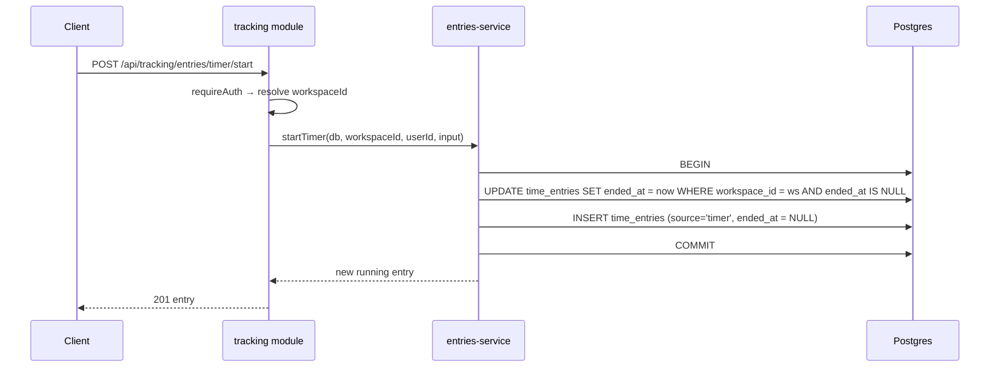

# Introduction and Goals {#section-introduction-and-goals}

## Requirements Overview {#_requirements_overview}

**myDevTime** is a cross-platform time-tracking product for developers, freelancers, and small
teams, shipping on **iOS, Android, and Web** from 1.0. Its product thesis
([ADR-0002](adr/0002-product-scope-unify-tyme-and-tackle.md)) is to unify the two best products
in the space — each of which lacks what the other has:

- **Tyme** (Apple-only): the benchmark for mobile/tablet-first tracking UX — fast timers,
  client → project → task hierarchy, budgets, statistics, offline-first sync — but no web app, no
  automation, no AI, no billing workflow.
- **Tactiq** (tactiq.io, browser-extension/web): the benchmark for meeting AI and AI
  monetization — live meeting transcription (Meet/Zoom/Teams, 30+ languages), AI summaries and
  action items, reusable AI prompts/workflows, sold through tiered plans with **AI credits**
  (1 credit = 1 AI action) — but it is not a time tracker and has no mobile app
  ([ADR-0008](adr/0008-tactiq-realignment-transcription-and-credits.md), amending ADR-0002's
  original reference).

On top of the union, myDevTime adds its **own AI layer**: natural-language time entry,
AI-generated summaries/standup reports, and a chat assistant grounded exclusively in the user's
own tracking data. Calendar auto-capture (Google/Microsoft) stays in scope as the strongest
automation source and the anchor that ties meetings — and their transcripts — to tracked time.
The commercial foundation — authentication and subscription billing across web and both app
stores — is in scope from the start, not a retrofit.

**The problem:** tracked time is billing-relevant data, and the tools that make capture effortless
(automation, AI) are exactly the tools that can silently corrupt it. The architecture therefore
follows one principle throughout ([ADR-0005](adr/0005-deterministic-core-llm-assist.md)):
**deterministic logic decides everything that reaches a timesheet or invoice; LLMs propose, parse,
explain, and assist — with recorded provenance — but never act as the bookkeeper.**

**Non-goals for 1.0** (backlog, not scope — ADR-0002): team/enterprise administration beyond a
personal workspace, native macOS/watchOS apps, screen-time/app-usage surveillance tracking,
integration marketplace, multi-currency workspaces, 2FA/passkeys.

**Essential functional requirements:**

| # | Requirement |
|---|-------------|
| F1 | Track time via live timers and manual entries, fully offline-capable, synced across devices |
| F2 | Organize work as clients → projects → tasks with tags, budgets, deadlines, and hourly rates |
| F3 | Ingest calendar events (Google/Microsoft) as candidate entries — never auto-committed without a rule the user enabled |
| F4 | Categorize candidates deterministically via user-defined, versioned rules; an LLM proposes only where rules are undecided, constrained to code-enforced candidates |
| F5 | Parse natural-language input ("2h Finanzo Review gestern") into draft entries the user confirms |
| F6 | Generate AI summaries, standup reports, and budget-risk explanations whose every number equals the deterministically computed one |
| F7 | Answer questions in a chat assistant grounded exclusively in the user's own workspace — read-only, deep-links instead of state mutation |
| F8 | Produce billing-grade timesheet exports (CSV/PDF) with per-value provenance and explicit rounding profiles |
| F9 | Authenticate via email/password, Google, and Apple; sessions revocable; account deletable |
| F10 | Sell a Pro subscription via Stripe on web and native IAP in both stores, unified by one internal entitlement service |
| F11 | Transcribe meetings (consent-first, capture channel per ADR-0009) and attach the transcript to the tracked time entry |
| F12 | Run AI actions on transcripts — summaries, action items, reusable custom prompts — each debiting a visible AI-credit balance with purchasable top-ups |
| F13 | Track the work day itself: clock-in/clock-out, breaks, target-hour schedules, overtime balance, break-rule warnings — with project entries recorded inside that frame |
| F14 | Record absences (vacation, sick, public holidays, custom types) with allowance/carry-over accounting, integrated with target hours and statistics |
| F15 | Export a signable monthly work-time report (Arbeitszeitnachweis) as PDF with signature blocks and as structured Excel/XLSX |
| F16 | Co-plan the day: AI-proposed timebox plan (ghost blocks) anchored on meetings and weighted by deadlines/budgets/target hours; live plan-vs-actual; evening review feeding the standup |
| F17 | Run focus sessions (Pomodoro cycles) inside tracked time, with calm focus statistics and a streak that absences don't break |
| F18 | Notice forgotten tracking: explainable trim and punch-correction proposals — user-confirmed, never auto-applied |
| F19 | Mirror tracked blocks into a dedicated calendar (opt-in, privacy presets, incremental write consent) |
| F20 | Export meeting insights and action items to Jira, Linear, and Slack after explicit, previewed confirmation |
| F21 | Attach notes to entries (incl. the running timer) that become timesheet position texts and are searchable |
| F22 | See the month at a glance: activity dots per day and deterministic booking-gap markers |
| F23 | Operate core actions from the system: Siri/App Intents/Shortcuts (iOS), Quick Settings Tile (Android) |
| F24 | Switch the day between Canvas and a classic list with per-entry amounts and day subtotals |

## Requirements Register {#_requirements_register}

Living register of tracked requirements (process skill §1.1). GitHub issues are where a
requirement is *discussed*; this table is where it is *tracked*. Each fulfilled requirement gains
a Runtime-View sequence diagram (§6).

| ID | Requirement | Delivered by | Status |
|----|-------------|-------------|--------|
| REQ-001 | Workspace & tracking data model: clients → projects → tasks, tags, archiving; every query workspace-scoped by construction (repository takes `workspaceId` non-optionally; negative isolation tests per entity) | [#6](https://github.com/NexusHero/myDevTime/issues/6) | Done (#6) |
| REQ-002 | Authentication: email/password + verification, Sign in with Google, Apple & GitHub, opaque revocable sessions (logout-everywhere), rate limiting, account deletion — self-hosted on Better-Auth behind a `requireAuth` guard | ADR-0007/0017/0018, [#4](https://github.com/NexusHero/myDevTime/issues/4) [#5](https://github.com/NexusHero/myDevTime/issues/5) | Done (#4) |
| REQ-003 | Deterministic tracking core: timezone/DST-safe time math, overlap policy, rounding rules as data, aggregations — pure and dependency-free (`packages/domain/tracking`, purity-gated) | ADR-0005, [#7](https://github.com/NexusHero/myDevTime/issues/7) | Done (#7) |
| REQ-004 | Timers & manual entries: one running timer (DB-enforced, per-workspace), reboot-safe (running = persisted start instant, clock derived), manual create/edit/split/delete validated by the tracking core, provenance `source` on every entry; offline-first local store follows the client | [#8](https://github.com/NexusHero/myDevTime/issues/8) | API done (#8); client offline-first store unblocked — spike [#1](https://github.com/NexusHero/myDevTime/issues/1) passed (ADR-0004 provisional), timer reboot-safety & the local store pattern validated in `spikes/client-rn-expo` |
| REQ-005 | Budgets, effective-dated hourly rates (workspace→client→project→task precedence), deadlines, threshold alerts; integer money math (minor units, BigInt cost, no float) — pure core in `packages/domain/budgets`, persisted + served by the `billing` module | ADR-0005, [#10](https://github.com/NexusHero/myDevTime/issues/10) | Done (#10) |
| REQ-006 | Cross-device sync: offline-first, idempotent, resumable; conflicts never silently merge into wrong durations — server-authoritative delta sync (per-entity versioning via a DB trigger, tombstones for deletes) with a deterministic per-entity conflict policy in `packages/domain` and `/sync/push`+`/sync/pull` | ADR-0019, [#9](https://github.com/NexusHero/myDevTime/issues/9) | Done (#9) — server engine; on-device store unblocked — spike [#1](https://github.com/NexusHero/myDevTime/issues/1) passed, offline outbox→`applyPush` mapping validated in `spikes/client-rn-expo` |
| REQ-007 | Mobile timer UX at the Tyme bar: today view, ≤2-tap start, background visibility (notification/Live Activity), tablet split-view | [#12](https://github.com/NexusHero/myDevTime/issues/12) | Proposed |
| REQ-008 | Statistics dashboard & report builder, keyboard-first on web (shortcuts + command palette), responsive on phone/tablet | [#13](https://github.com/NexusHero/myDevTime/issues/13) | Proposed |
| REQ-009 | Timesheet & invoice-ready export (CSV/XLSX/PDF): rates, rounding profile, totals — every number traceable to the deterministic `buildTimesheet`; serializers behind per-format adapters, de/en `Intl` formatting | ADR-0005/0020, [#14](https://github.com/NexusHero/myDevTime/issues/14) | Done (#14) — export infra reused by the signable report [#38](https://github.com/NexusHero/myDevTime/issues/38) |
| REQ-010 | Calendar integration (Google/Microsoft, read-only): encrypted revocable grants, events normalized into candidate entries, never auto-committed | [#15](https://github.com/NexusHero/myDevTime/issues/15) | Proposed |
| REQ-011 | Deterministic rules engine: ordered versioned matchers → categorization actions, dry-run preview, `rule:<id>@<version>` provenance | ADR-0005, [#16](https://github.com/NexusHero/myDevTime/issues/16) | Proposed |
| REQ-012 | LLM assist layer: one multi-provider adapter, proposals only for rule-undecided candidates, code-enforced candidate guardrail, graceful degradation | ADR-0005, [#17](https://github.com/NexusHero/myDevTime/issues/17) | Proposed |
| REQ-013 | Natural-language time entry (de/en): deterministic pre-parser + LLM fallback, always a confirmed draft, never silently persisted | ADR-0005, [#18](https://github.com/NexusHero/myDevTime/issues/18) | Proposed |
| REQ-014 | AI summaries & standup reports: narrative around domain-computed numbers (slot integrity), read-only artifacts, plain-template degradation | ADR-0005, [#19](https://github.com/NexusHero/myDevTime/issues/19) | Proposed |
| REQ-015 | AI assistant chat: grounded in workspace data via read-only query tools, defined refusals, deep-links only — no state mutation from chat | ADR-0005, [#20](https://github.com/NexusHero/myDevTime/issues/20) | Proposed |
| REQ-016 | Entitlement service: provider-agnostic plan model (`free`/`pro`), feature gates, idempotent/replay-safe webhook-event convergence, deterministic cross-rail resolution (AI usage moved to the credit ledger REQ-027 per ADR-0008) | ADR-0006/0008, [#21](https://github.com/NexusHero/myDevTime/issues/21) | Domain core done (#21 Phase A) — pure `deriveEntitlement` state machine + `can()` gating in `packages/domain/entitlements`; provider adapters + persistence/API pending |
| REQ-017 | Stripe subscriptions on web: Checkout, Billing portal, signature-verified idempotent webhooks, Stripe Tax | ADR-0006, [#22](https://github.com/NexusHero/myDevTime/issues/22) | Proposed |
| REQ-018 | Store subscriptions: StoreKit 2 + Play Billing with server notifications as source of truth; store-policy-compliant cross-rail UX | ADR-0006, [#23](https://github.com/NexusHero/myDevTime/issues/23) | Proposed |
| REQ-019 | Security hardening baseline: authz sweep, rate-limit map, headers/CORS, input validation, scanning, prompt-injection review — test-enforced | [#24](https://github.com/NexusHero/myDevTime/issues/24) | Proposed |
| REQ-020 | Privacy/DSGVO package: Art. 15 export, Art. 17 erasure, retention in code, provider DPA/no-training matrix, consent points | [#25](https://github.com/NexusHero/myDevTime/issues/25) | Proposed |
| REQ-021 | Observability & ops baseline: structured PII-free logging, metrics/alerts (incl. webhook lag + LLM spend), deploy/rollback, rehearsed restore | [#26](https://github.com/NexusHero/myDevTime/issues/26) | Proposed |
| REQ-022 | E2E suite: golden paths across web + both mobile platforms, faked externals, 20-consecutive-green flake gate | [#27](https://github.com/NexusHero/myDevTime/issues/27) | Proposed |
| REQ-023 | Distribution: web (PWA-installable) + App Store + Play Store, store-policy self-review, staged rollout | [#28](https://github.com/NexusHero/myDevTime/issues/28) | Proposed |
| REQ-024 | Pricing decision: free-tier limits + per-rail Pro prices, unit-economics check — recorded as an ADR before store submission | [#29](https://github.com/NexusHero/myDevTime/issues/29) | Proposed |
| REQ-025 | Meeting transcription pipeline: consent-first capture, `TranscriptionPort` ASR adapter, transcript linked to the time entry, DSGVO-grade lifecycle | ADR-0008/0009, [#32](https://github.com/NexusHero/myDevTime/issues/32) | Proposed — blocked on the capture spike [#31](https://github.com/NexusHero/myDevTime/issues/31) |
| REQ-026 | AI meeting insights: summaries, action items, Tactiq-style reusable custom prompts over transcripts; confirmed-only task creation | ADR-0008, [#33](https://github.com/NexusHero/myDevTime/issues/33) | Proposed |
| REQ-027 | AI-credit ledger: append-only, idempotent debits, monthly plan allowances, top-up packs on all three payment rails, visible balance | ADR-0008, [#34](https://github.com/NexusHero/myDevTime/issues/34) | Proposed |
| REQ-028 | Attendance: clock-in/out, breaks, effective-dated target-hour schedules, overtime balance, project-coverage reconciliation, configurable break-rule check (ArbZG §4 preset) | ADR-0010, [#36](https://github.com/NexusHero/myDevTime/issues/36) | Proposed |
| REQ-029 | Absences: vacation/sick/holiday/custom types, half-days, regional holiday calendars, allowance & carry-over math, target-hour interplay | ADR-0010, [#37](https://github.com/NexusHero/myDevTime/issues/37) | Proposed |
| REQ-030 | Signable work-time report: monthly Arbeitszeitnachweis as PDF with signature blocks + structured XLSX, rendered exclusively from domain-computed values | ADR-0010, [#38](https://github.com/NexusHero/myDevTime/issues/38) | Proposed |
| REQ-031 | AI Co-Planner: versioned plan entity, deterministic planning algorithm with LLM garnish (ADR-0005 discipline), ghost-block proposals on the Day Canvas, plan-vs-actual + evening review | ADR-0011, [#40](https://github.com/NexusHero/myDevTime/issues/40) | Proposed |
| REQ-032 | Focus mode: Pomodoro cycles in the Island as ordinary time entries, configurable intervals, optional native DND, calm focus stats + absence-proof streak | ADR-0012, [#41](https://github.com/NexusHero/myDevTime/issues/41) | Proposed |
| REQ-033 | Idle & forgotten-tracking detection: evidence-based, dismissible trim/punch proposals; no app/window surveillance | ADR-0012, [#42](https://github.com/NexusHero/myDevTime/issues/42) | Proposed |
| REQ-034 | Calendar write-back: opt-in mirror into a dedicated calendar, privacy presets, idempotent sync, clean disable/revoke | ADR-0012, [#43](https://github.com/NexusHero/myDevTime/issues/43) | Proposed |
| REQ-035 | Dev-tool export: confirmed, previewed insight/action-item export to Jira/Linear/Slack via one `ExportTargetPort`, idempotent with recorded results | ADR-0012, [#44](https://github.com/NexusHero/myDevTime/issues/44) | Proposed |
| REQ-036 | Entry notes: description on every entry incl. running timer, timesheet position text, searchable, in exports/erasure | ADR-0013, [#46](https://github.com/NexusHero/myDevTime/issues/46) | Proposed |
| REQ-037 | Month overview: activity dots per day, deterministic booking-gap markers, Woche⇄Monat navigation | ADR-0013, [#47](https://github.com/NexusHero/myDevTime/issues/47) | Proposed |
| REQ-038 | Budget burn-down: remaining-over-time chart with explainable run-rate exhaustion forecast from the deterministic core | ADR-0013, [#48](https://github.com/NexusHero/myDevTime/issues/48) | Proposed |
| REQ-039 | System quick actions: App Intents/Siri/Shortcuts + Quick Settings Tile over one headless action layer (offline-capable) | ADR-0013, [#49](https://github.com/NexusHero/myDevTime/issues/49) | Proposed |
| REQ-040 | Classic day list: Canvas ⇄ Liste toggle, per-entry amounts, day subtotals, full action parity, accessibility-first | ADR-0013, [#50](https://github.com/NexusHero/myDevTime/issues/50) | Proposed |

The full milestone plan (M0–M5), dependency graph, and the Definition of 1.0 live in
[`docs/roadmap.md`](roadmap.md).

## Quality Goals {#_quality_goals}

| Priority | Quality Attribute | Goal |
|----------|------------------|------|
| 1 | **Correctness** | Tracked minutes become invoiced money: durations, rates, budgets, and exports are computed by deterministic, exhaustively tested pure logic — never by an LLM, never twice in two places (ADR-0005) |
| 2 | **Auditability** | Every entry carries provenance (`timer`/`manual`/`calendar`/`rule:<id>@<version>`/`ai-proposal` + accepted/corrected/rejected); every exported number traces back to its entries and rounding profile |
| 3 | **Offline-first reliability** | Tracking never blocks on connectivity: timers, entries, and edits work offline and converge without losing or duplicating minutes (REQ-006) |
| 4 | **UX responsiveness** | The Tyme bar: ≤2-tap timer start, native-feeling phone/tablet apps, keyboard-first web — automation must never make capture slower |
| 5 | **Data protection** | Time data reveals clients, work patterns, and income — and meeting transcripts are verbatim third-party speech: DSGVO-compliant handling, consent-first capture, encrypted third-party grants, no training of provider models on user data |
| 6 | **Extensibility** | New capture source, new LLM provider, new payment rail = new adapter behind an existing port — no change to domain logic (OCP, §2.2) |

## Stakeholders {#_stakeholders}

| Role | Expectations |
|------|-------------|
| **Freelancer / developer (primary user)** | Effortless capture, trustworthy invoices, their data private and exportable; AI that saves time without ever quietly changing their numbers |
| **The user's clients (indirect)** | Timesheets/invoices that are accurate, itemized, and reproducible on inquiry |
| **Developer (Suhay Sevinc)** | A stack one person can sustain (one language end to end), testable pure core, volatile vendors behind adapters |
| **App Store / Play Store review (gatekeeper)** | Policy compliance: IAP for digital goods, Sign in with Apple, account deletion, honest privacy labels |

---

# Architecture Constraints {#section-architecture-constraints}

## Technical Constraints

| Constraint | Background |
|-----------|------------|
| Backend: single Node.js/TypeScript modular monolith | [ADR-0003](adr/0003-node-typescript-backend.md) |
| Client: one React Native + Expo codebase for iOS/Android/Web | [ADR-0004](adr/0004-react-native-expo-client.md) — Proposed, gated on the spike ([#1](https://github.com/NexusHero/myDevTime/issues/1)) |
| Offline-first is core architecture, not a feature | ADR-0002; forces the sync engine (REQ-006) into M1 |
| LLMs never produce billing-relevant state | [ADR-0005](adr/0005-deterministic-core-llm-assist.md) |
| Meeting capture is consent-first; channel + ASR provider pending the spike | [ADR-0009](adr/0009-meeting-capture-asr-approach.md), [#31](https://github.com/NexusHero/myDevTime/issues/31) |
| Digital subscriptions inside the apps must use store IAP | Apple/Google policy — see [ADR-0006](adr/0006-subscription-billing-stripe-plus-store-iap.md) |
| Third-party login ⇒ Sign in with Apple mandatory | App Store guideline 4.8 — see [ADR-0007](adr/0007-authentication-email-oauth-sessions.md) |

## Organizational Constraints

| Constraint | Background |
|-----------|------------|
| One-person project (for now) | One runtime, one client codebase, one deployment; modular-monolith seams instead of microservices (ADR-0003) |
| Store review cycles gate every mobile release | Release process must include store lead time; staged rollouts (REQ-023) |
| LLM usage has real unit costs | AI features are metered and entitlement-capped (REQ-016); pricing must cover worst-case usage (REQ-024) |

## Conventions

| Convention | Application |
|-----------|-------------|
| Conventional Commits | All git commits follow `type(scope): summary` in English |
| arc42 (Markdown) | This documentation |
| MADR | ADRs in [`docs/adr/`](adr/README.md) |
| See [`skills/ultimate-dev-process/SKILL.md`](../skills/ultimate-dev-process/SKILL.md) | Full governance process (architecture, testing, implementation style, commits) |

---

# Context and Scope {#section-context-and-scope}

## Business Context {#_business_context}

External actors and systems at 1.0:

| Actor / System | Interaction |
|----------------|-------------|
| User (phone / tablet / browser) | Tracks time, reviews AI proposals, exports timesheets, manages subscription |
| Google Calendar / Microsoft 365 | Read-only event source for candidate entries (REQ-010) |
| LLM provider(s) | Categorization proposals, NL parsing, summaries, assistant, meeting insights — behind one adapter (REQ-012) |
| ASR provider / meeting-capture channel | Meeting audio/captions → transcripts, per ADR-0009 (REQ-025) |
| Meeting platforms (Meet, Teams, Zoom) | The environments the capture channel must cover (REQ-025) |
| Stripe | Web subscription checkout, billing portal, webhooks (REQ-017) |
| Apple App Store / Google Play | App distribution + IAP subscriptions + server notifications (REQ-018, REQ-023) |
| Google / Apple / GitHub identity | OAuth sign-in (REQ-002) |

## Technical Context {#_technical_context}

_Fill in (deployment topology, protocols, webhook endpoints) once the backend skeleton
([#3](https://github.com/NexusHero/myDevTime/issues/3)) lands._

---

# Solution Strategy {#section-solution-strategy}

| Problem | Decision | Rationale | Quality Goal |
|---------|----------|-----------|--------------|
| Three platforms, one developer | One TypeScript codebase everywhere: Node backend (ADR-0003) + React Native/Expo clients (ADR-0004) with shared domain packages | Domain logic written once, tested once, used by client and server | Correctness, Extensibility |
| Automation vs. billing integrity | Deterministic core + rules engine decide; LLM proposes/parses/explains with provenance (ADR-0005) | Billing data must be reproducible and auditable; LLM output is neither | Correctness, Auditability |
| Three payment rails, one plan | Internal entitlement service as single source of truth; Stripe/StoreKit/Play as adapters (ADR-0006) | Cross-rail edge cases handled once; providers swappable | Extensibility, Correctness |
| Capture must work anywhere | Offline-first local store + sync engine in the core (REQ-004/006) | Tyme-class reliability is a launch bar, not an optimization | Offline-first reliability |

---

# Building Block View {#section-building-block-view}

The backend is a **Fastify modular monolith** (ADR-0003/0015): each module is an encapsulated
plugin registered under its own prefix in `apps/api/src/app.ts`, and a boundary test forbids
cross-module internal imports (modules may depend only on another module's `contract.ts`).

```
apps/api  (Fastify modular monolith)
  ├─ /health, /health/ready            operational (liveness / readiness → DB ping)
  ├─ /api/auth        auth             authN & sessions (REQ-002)
  ├─ /api/tracking    tracking         entries · projects · attendance · budgets (REQ-001/003–005)
  ├─ /api/sync        sync             offline-first cross-device sync (REQ-006)
  ├─ /api/automation  automation       calendar ingestion + deterministic rules (REQ-010/011)
  ├─ /api/ai          ai               LLM/ASR assist — proposals only (ADR-0005)
  └─ /api/billing     billing          entitlements + credit ledger (ADR-0006/0008)
packages/domain   pure deterministic core (time math, budgets, rules) — no I/O, ≥90% coverage
packages/shared   branded id types & schemas shared with the clients
```

Persistence is **PostgreSQL via Drizzle** (ADR-0015); the driver is confined to the `db` module
and never imported by `packages/domain` (ADR-0005). Request/response validation and the generated
**OpenAPI** spec both come from Zod route schemas; errors are RFC 7807 `problem+json`.

_Bootstrap [#2](https://github.com/NexusHero/myDevTime/issues/2) and backend skeleton
[#3](https://github.com/NexusHero/myDevTime/issues/3) landed; module internals fill in per their
own issues._

---

# Runtime View {#section-runtime-view}

Each fulfilled requirement gets a scenario here (a Mermaid sequence diagram) linking back to its
`REQ-NNN` — see the process skill §1.3.

## Start a timer — one running timer per workspace (REQ-004)

Starting a timer must never leave two running timers in a workspace. The service stops any
already-running timer and inserts the new one inside a single transaction, so the partial unique
index `time_entries_one_running_per_ws` (on `workspace_id WHERE ended_at IS NULL`) never observes
two open rows — the invariant holds even if two starts race. A running timer is just a row with a
persisted `started_at` and `ended_at IS NULL`; the elapsed clock is derived from that instant, so
it survives app kill and device reboot.



---

# Cross-cutting Concepts {#section-concepts}

- **Provenance** (ADR-0005): every time entry records its origin and review state — the audit
  spine of the product.
- **Ports & adapters for volatile vendors** (process skill §2.2): LLM providers, payment
  providers, calendar providers — one narrow interface, vendor types in one file each.
- **Entitlement gating**: features and AI quotas ask the `billing` module's entitlement API,
  never a payment SDK (ADR-0006).
- **Workspace isolation**: repository layer takes a workspace id by construction (REQ-001).
- **Design language**: all client surfaces follow the binding UX vision
  ([`docs/design/ux-vision.md`](design/ux-vision.md)) — Day Canvas, Island, calm-AI ghost
  styling, keyboard-first web — validated by the prototype gate (#39) before component code.

_Extend (error handling, i18n de/en, notification surface) as they emerge._

---

# Architecture Decisions {#section-design-decisions}

ADRs live in [`docs/adr/`](adr/README.md) as individual files — see that directory's index and
Tech Radar for the full list.

---

# Quality Requirements {#section-quality-scenarios}

_Fill in concrete quality-attribute scenarios (e.g. "sync of a 30-day offline backlog completes
in < Ns without data loss") as they're defined per milestone._

---

# Risks and Technical Debt {#section-technical-risks}

| Risk | Impact if unaddressed | Tracking |
|------|----------------------|----------|
| **Client-stack bet (ADR-0004) unvalidated** | If RN/Expo can't hit the Tyme UX bar (background timers, offline store, RN-web dashboards), every client feature built before finding out is rework | Spike [#1](https://github.com/NexusHero/myDevTime/issues/1) is M0 and blocks all client issues; Flutter is the named fallback |
| **Sync correctness** | A wrong merge silently changes billed minutes — worst-case product failure, hard to detect late | Sync-protocol ADR + simulation/property tests are acceptance criteria of [#9](https://github.com/NexusHero/myDevTime/issues/9) |
| **LLM cost overrun** | AI features are variable-cost; an unmetered free tier can be exploited into real money loss | Metering + caps in [#21](https://github.com/NexusHero/myDevTime/issues/21), spend alerts in [#26](https://github.com/NexusHero/myDevTime/issues/26), unit-economics check in [#29](https://github.com/NexusHero/myDevTime/issues/29) |
| **Store-policy rejection** | IAP, Sign in with Apple, account deletion, subscription-steering rules — any miss delays launch by review cycles | Policy items are explicit acceptance criteria in [#5](https://github.com/NexusHero/myDevTime/issues/5) [#23](https://github.com/NexusHero/myDevTime/issues/23) [#28](https://github.com/NexusHero/myDevTime/issues/28) |
| **Prompt injection via calendar events & transcripts** | Event titles and meeting-transcript content are attacker/participant-controlled input that reaches the LLM layer | Guardrails in [#17](https://github.com/NexusHero/myDevTime/issues/17) [#33](https://github.com/NexusHero/myDevTime/issues/33); adversarial review in [#24](https://github.com/NexusHero/myDevTime/issues/24) |
| **Recording consent & law** | Transcribing meetings records third parties: DSGVO and two-party-consent rules (e.g. §201 StGB) apply — a consent misstep is a legal, not a UX, failure | Consent analysis in the capture spike [#31](https://github.com/NexusHero/myDevTime/issues/31); consent-first capture is an acceptance criterion of [#32](https://github.com/NexusHero/myDevTime/issues/32) |
| **ASR unit cost** | Transcription has a real per-minute cost; mispriced, every active user loses money | Cost table from [#31](https://github.com/NexusHero/myDevTime/issues/31) feeds the credit model [#34](https://github.com/NexusHero/myDevTime/issues/34) and pricing [#29](https://github.com/NexusHero/myDevTime/issues/29) |
| **Competing with two entrenched products** | Feature-parity chase without the union thesis landing = no differentiation | ADR-0002 non-goals + the "would this feel at home in Tyme / reach Tactiq-level meeting AI" review questions |

---

# Glossary {#section-glossary}

| Term | Definition |
|------|-----------|
| Candidate entry | A normalized, not-yet-confirmed potential time entry (e.g. from a calendar event) awaiting rules/AI/user decision |
| Provenance | The recorded origin + review state of an entry (`timer`, `manual`, `calendar`, `rule:<id>@<version>`, `ai-proposal`; accepted/corrected/rejected) |
| Entitlement | Provider-agnostic record of an account's plan, period, and source — the only thing feature gates consult |
| Rounding profile | A named, versioned rounding configuration applied at report/export time; raw entries stay exact |
| Slot integrity | The test-enforced rule that every number inside AI-generated narrative equals the deterministically computed value passed in |
| AI credit | The unit of AI usage: 1 credit = 1 AI action, tracked in an append-only ledger with monthly plan allowances and purchasable top-ups (ADR-0008) |
| Transcript | The stored, consent-gated text of a captured meeting, linked to its time entry; source data for AI meeting insights (REQ-025/026) |
