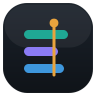

# myDevTime — Brand assets

The visual identity, derived from the binding [UX vision](../ux-vision.md) §4 and the product's
design tokens. Everything here is vector and self-contained.

## The mark

The icon is the product's hero screen distilled: three rounded **time blocks** in project colours,
crossed by the amber **“now” playhead**. It follows the interface's own rule — *data is the colour,
the accent marks the live moment* — so it reads as this product, not a generic stopwatch.

The wordmark is set in a **monospaced** face: numbers and code are the material, so the name wears
the same technical clothes. **Dev** always carries the accent.

## Files

| File | Use |
|------|-----|
| [`icon.svg`](icon.svg) | Primary app icon — dark tile. |
| [`icon-light.svg`](icon-light.svg) | Icon on light surfaces. |
| [`icon-mono.svg`](icon-mono.svg) | One-colour mark (inherits `currentColor`, no tile) — emboss, print, single-ink. |
| [`mark-glyph.svg`](mark-glyph.svg) | Bare mark without the tile, for placement on the app's own surfaces. |
| [`lockup-horizontal.svg`](lockup-horizontal.svg) | Icon + wordmark — app bars, headers, marketing. |
| [`wordmark.svg`](wordmark.svg) | Wordmark only. |
| [`favicon.svg`](favicon.svg) | Favicon / touch icon (bolder blocks for small sizes). |
| [`splash.svg`](splash.svg) | First-launch splash (portrait, dark). |

## Colour

The accent is the only chrome colour; the saturated palette is reserved for project data.

| Token | Hex | Role |
|-------|-----|------|
| Accent · amber | `#e8a33d` | the live/“now” playhead, interactive elements |
| Accent (on light, text) | `#b9761a` | amber that holds AA contrast on white |
| Project · teal | `#1fa894` | data (dark) — `#0f9a86` on light |
| Project · purple | `#8b7bf5` | data (dark) — `#6f5df0` on light |
| Project · blue | `#3e97dd` | data (dark) — `#2f83c9` on light |
| Canvas · near-black | `#0f1318` | the ground (never pure `#000`) |
| Ink | `#e9edf2` | primary text on dark |

## Usage

- **Clear space:** keep free space of at least the height of one time block (≈ 9 units at the
  96-unit icon scale, i.e. ~⅒ of the icon) on all sides of the icon and lockup.
- **Minimum size:** icon down to **16 px**; below that use `favicon.svg`. Wordmark no smaller than
  14 px cap height so the monospace stays legible.
- **Dark-surface lockup:** the committed lockup/wordmark colours are tuned for light and neutral
  grounds. On the app's dark surfaces, recolour `my → #9aa6b4`, `Dev → #e8a33d`, `Time → #e9edf2`.
- **Don't:** recolour the playhead anything but amber; add drop shadows; stretch or rotate the mark;
  set the wordmark in a proportional (non-mono) face; place the full-colour blocks on a busy photo.

## Motion (for animated contexts)

Blocks settle in from the left with a short spring (150–250 ms, staggered); the playhead sweeps in
and its cap dot gives one calm pulse. All motion honours `prefers-reduced-motion` — the static mark
is always the fallback. See UX vision §4 (“motion is physics, not decoration”).
