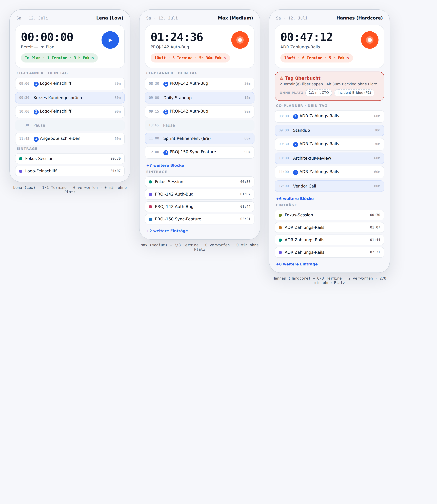
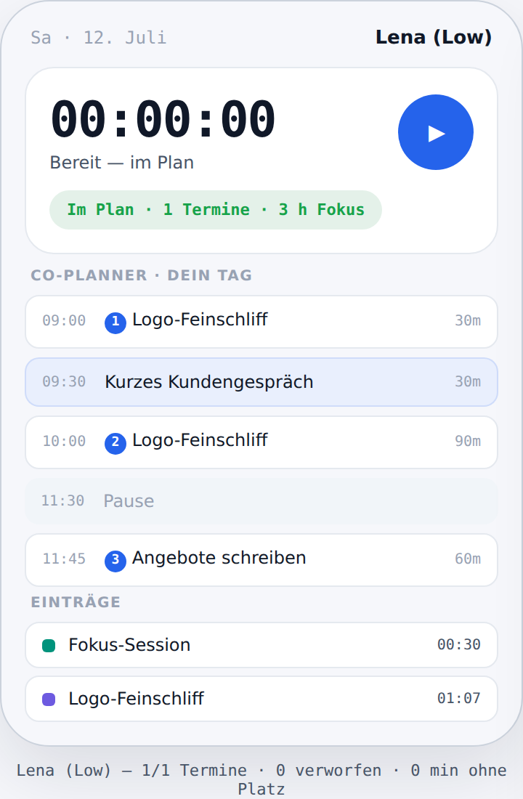
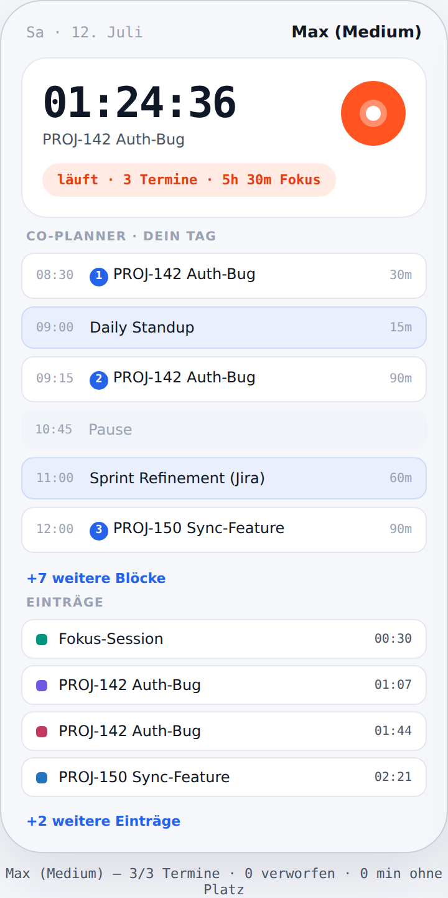
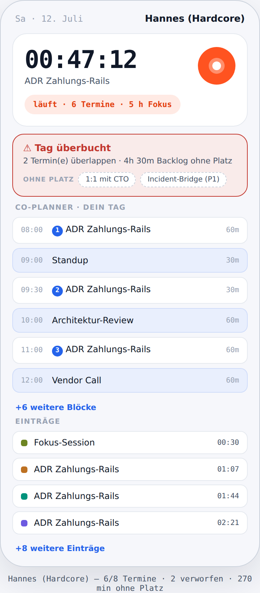

# Three-persona user test — design v3 (2026-07-12)

**Scope:** re-run of the recurring three-profile user test against the **design v3** build
(onboarding flow, bounded screens, signal palette, docked/floating Island). It answers one
question the earlier tests kept raising: **does the same screen stay calm as the user's workload
grows?**

**Method:** the personas drive the **real product core** (`@mydevtime/domain`) — the same
`buildDayPlan` / `parseTimeEntry` / label path the app ships — and the screens are rendered with
the **real design tokens** (`theme('light', 'blueprint')`, signal palette per
[ADR-0034](../../../adr/0034-signal-palette-refresh.md)). Every number and every dropped meeting
below comes from that deterministic core, not from a mock — see [Reproducing](#reproducing). Unlike
the earlier live-Gemini run, this harness is deterministic and secret-free, so it is committed and
re-runnable by anyone; the AI garnish is represented by its graceful-degradation fallback
(`deterministicLabels`), honouring [ADR-0005](../../../adr/0005-deterministic-core-llm-assist.md).

## The three variants

| Variant | Persona | Load | Integrations |
|---|---|---|---|
| **Low** | Lena — Freelancerin | trackt gelegentlich, wenige Termine | keine |
| **Medium** | Max — angestellter Dev | moderate Last, schaut hin und wieder rein | Jira |
| **Hardcore** | Hannes — Lead | **überbucht**, überlappende Termine, hoher Stress | alle |

## Side by side

The identical Today screen — hero tracker, Co-Planner Day Canvas, entries — at low / medium /
hardcore density:



## Per-variant findings

### 🟢 Lena (Low)



- **Plan:** 1 anchor in → **1 placed, 0 dropped**, 3 focus blocks, 0 min unplaced. The day fits.
- **Hero tracker** is idle: blue play control, calm green `Im Plan` status — Today owns the clock,
  so the persistent Island is deliberately **not** shown here (design v2 rule: never two clocks).
- **NL quick-add:** `2h logo feinschliff` → 120 min (deterministic). `kaffee mit kunde` → no match,
  so the LLM fallback would run — honest, no silent wrong parse.
- **Verdict:** nothing to warn about, nothing truncated. The screen is short because the day is.

### 🟡 Max (Medium)



- **Plan:** 3 anchors → **3 placed, 0 dropped**, 7 focus blocks, 5 h 30 m focus, 0 min unplaced.
- **Running timer** shows the signal-orange live dot + `PROJ-142 Auth-Bug` context; status pill
  reads `läuft · 3 Termine · 5h 30m Fokus`.
- **NL quick-add:** `1,5h PROJ-142 auth bug gestern` → 90 min with **projectHint `PROJ-142`** (the
  Jira ticket key is recognised), day offset −1; `30min review call` → 30 min.
- **Bounded:** the Day Canvas shows 6 blocks then **`+7 weitere Blöcke`**; entries show 4 then
  **`+2 weitere`** — the screen does not lengthen with the block count ([ADR-0035](../../../adr/0035-bounded-screens.md)).

### 🔴 Hannes (Hardcore)



- **Plan:** 8 anchors → **6 placed, 2 dropped** (`1:1 mit CTO`, `Incident-Bridge (P1)` overlap the
  10:00 slot), 6 focus blocks, **270 min (4 h 30 m) backlog unplaced**.
- **Overbooking is surfaced, not swallowed:** a red `⚠ Tag überbucht` banner names the two dropped
  meetings on an `OHNE PLATZ` overflow shelf (dashed chips), and states the 4 h 30 m of backlog that
  did not fit. This is the exact failure the first user test flagged — now visible.
- **Still bounded:** despite the load, the canvas caps at 6 blocks + `+6 weitere Blöcke` and the
  entries at 4 + `+8 weitere` — scroll depth is the **same** as Lena's, the density shows as *fill
  level and a warning*, not as an ever-longer scroll.
- **NL quick-add:** `3h ADR zahlungs-rails` → 180 min; `incident bridge 45min` → 45 min.

## What design v3 proves here

| Design-v3 element | Evidence in the test |
|---|---|
| **Bounded screens** ([ADR-0035](../../../adr/0035-bounded-screens.md)) | All three columns are the same height; blocks and entries collapse behind `+N weitere`. |
| **Signal palette** ([ADR-0034](../../../adr/0034-signal-palette-refresh.md)) | Running dot / live pill use `live #ff5320`; calm state uses `good`; overbooking uses `crit`. |
| **Overbooking honesty (M4)** | `droppedAnchors` + `unplacedMin` from the core become a visible warning + overflow shelf. |
| **Deterministic core** ([ADR-0005](../../../adr/0005-deterministic-core-llm-assist.md)) | Every metric is computed by `@mydevtime/domain`; the AI path is a graceful add-on, not a dependency. |
| **Onboarding gate** ([ADR-0036](../../../adr/0036-first-run-onboarding-gate.md)) | New in v3; each persona reaches this Today screen once past the first-run flow. |

## Reproducing

From the repo root:

```sh
pnpm --filter @mydevtime/domain build
node docs/design/user-tests/2026-07-12-design-v3/harness.mjs   # prints metrics, writes results.json
node docs/design/user-tests/2026-07-12-design-v3/render.mjs    # writes the four PNGs from results.json
```

- **`harness.mjs`** — deterministic persona harness over the real core (no secrets, no network).
- **`results.json`** — the computed plan metrics the report cites (committed for traceability).
- **`render.mjs`** — token-accurate design-v3 render of each persona's *actual* computed plan.

## Verdict

The design-v3 build passes the three-variant test: **the same Today screen stays glanceable from
Lena's near-empty day to Hannes's overbooked one.** Load is expressed as fill level, a top-N + "+N
weitere" collapse, and — where the day genuinely does not fit — an explicit overbooking warning with
the dropped meetings named. No screen grows unbounded, and no number is faked: the deterministic core
produces them and the AI layer only garnishes on top.
