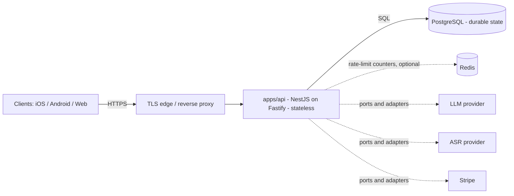

# Operations Runbook — myDevTime API

Operational reference for running, monitoring, and recovering the myDevTime backend
(`apps/api`). Scope is the API service and its stateful dependencies. This runbook
satisfies REQ-021 (operational observability) and encodes the graceful-degradation
guarantees of ADR-0005.

> Audience: on-call engineers and operators. For architecture and decisions, see
> `docs/architecture.md` and `docs/adr/`. For the deterministic-core contract that
> underpins the degradation playbooks below, see ADR-0005.

---

## 1. Service topology

The API is a stateless NestJS-on-Fastify process (ADR-0025). All durable state lives
in PostgreSQL (ADR-0015). Redis is an optional shared store for the global rate
limiter (ADR-0050) and, when absent, the limiter falls back to per-instance
in-memory counters. External vendors (LLM, ASR, Stripe, calendar providers) are
reached only through ports & adapters — never imported upstream.



<details>
<summary>Mermaid source</summary>



</details>

Key properties:

- **Stateless API** — any instance can serve any request; scale horizontally. A pod
  restart loses only in-process counters (see the metrics endpoint below), never
  business data.
- **PostgreSQL is the single source of truth.** If it is unreachable the service is
  not ready (readiness fails, below).
- **Vendors degrade, they do not crash the service.** Every AI/vendor path is behind
  an adapter and fails soft (ADR-0005); the deterministic core in `packages/domain`
  never depends on a vendor being up.

---

## 2. Health & readiness endpoints

Both are unauthenticated and exempt from rate limiting so orchestrators can poll them
continuously.

| Endpoint | Purpose | Healthy response | Unhealthy |
|----------|---------|------------------|-----------|
| `GET /health` | Liveness — process is up, no I/O | `200` `{ "status": "ok" }` | no response / non-200 → restart the pod |
| `GET /health/ready` | Readiness — dependencies reachable | `200` `{ "status": "ready", "db": "up", "redis": "up" \| "not_configured" }` | `503` `{ "status": "not_ready", ... }` |

Readiness pings PostgreSQL (`select 1`) and, when configured, Redis. A `503` from
`/health/ready` means the instance should be pulled from the load-balancer rotation
but **not** necessarily restarted — the dependency, not the process, is the fault.

Common readiness bodies:

- `{ "status": "not_ready", "db": "down" }` — DB ping failed → see §5.1.
- `{ "status": "not_ready", "db": "not_configured" }` — the instance booted without a
  database URL; a misconfiguration, not an outage.
- `{ "status": "not_ready", "db": "up", "redis": "down" }` — DB fine, Redis down; the
  rate limiter cannot share counters across instances → see §5.4.

---

## 3. Metrics endpoint (REQ-021)

```
GET /api/observability/metrics        (AuthGuard — internal, authenticated)
```

Returns a JSON snapshot of in-process operational counters. Counters are per-instance
and reset on restart; when scraping a multi-instance deployment, sum across instances
and treat a counter reset (uptime dropping) as a restart marker.

```json
{
  "requests": { "total": 0, "ok": 0, "clientError": 0, "serverError": 0 },
  "ai": { "calls": 0, "creditsSpent": 0 },
  "uptimeSeconds": 0,
  "collectedAtMs": 0
}
```

| Field | Meaning |
|-------|---------|
| `requests.total` | All HTTP requests routed through Nest since process start. |
| `requests.ok` | Responses classified 2xx/3xx. |
| `requests.clientError` | Responses classified 4xx (bad input, auth failures, rate limits). |
| `requests.serverError` | Responses classified 5xx (unhandled faults) — the primary alerting signal. |
| `ai.calls` | LLM/AI provider calls recorded by the `ai` module. |
| `ai.creditsSpent` | AI credits consumed — cross-check against the billing credit ledger for anomalies. |
| `uptimeSeconds` | Whole seconds since process start; a drop signals a restart. |
| `collectedAtMs` | Wall-clock epoch milliseconds at which the snapshot was taken. |

Status classification mirrors the RFC 7807 exception filter exactly, so counter
classes match the statuses clients actually observe. The `ai.*` counters are seeded to
0 and incremented by the `ai` module via the shared counter service — they are
operational tallies only and are **never** the source of any billed or exported number
(those are computed deterministically in `packages/domain`, ADR-0005).

---

## 4. Alerting signals

Derive alerts from the metrics snapshot and the health probes. Suggested signals
(tune thresholds per environment):

| Signal | Condition | Severity |
|--------|-----------|----------|
| **5xx rate** | `requests.serverError` / `requests.total` over a rolling window exceeds ~1% (or any sustained increase) | High → §5.3 |
| **Readiness failing** | `/health/ready` returns `503` on any instance for more than a couple of poll intervals | High → §5.1 / §5.4 |
| **Liveness failing** | `/health` not returning `200` | Critical → orchestrator should restart; page if restarts loop |
| **Credit-ledger anomaly** | `ai.creditsSpent` growth diverges from the billing credit ledger, or spikes far above the request/AI-call baseline | High → §5.2, then billing review |
| **AI error surge** | `ai.calls` climbing while user-visible AI features report degradation | Medium → §5.2 |
| **Restart storm** | `uptimeSeconds` repeatedly resetting to near-zero | High → check crash logs / OOM |

---

## 5. Incident playbooks

### 5.1 PostgreSQL is down / unreachable

Symptoms: `/health/ready` → `503 { "db": "down" }`; requests that touch the DB fail;
`requests.serverError` climbs.

1. Confirm scope: is it one instance (network/DNS) or the database itself? Check the
   DB provider dashboard and connectivity from a healthy instance.
2. The API is stateless — do **not** restart pods to "fix" the DB; readiness will pull
   them from rotation automatically and return them when the DB recovers.
3. If the database is genuinely down, escalate to the database owner / provider.
   Restore from backup only per §6.
4. Post-recovery: verify `/health/ready` returns `ready` on all instances and the 5xx
   rate returns to baseline.

### 5.2 LLM / AI provider is down or degraded (graceful degradation, ADR-0005)

Symptoms: AI features (categorization proposals, NL entry, summaries, assistant,
Co-Planner) return fallbacks or errors; `ai.calls` may spike with failures.

1. **Expected behavior:** AI is proposal-only and degrades gracefully. Timers,
   manual entry, calendar capture, the rules engine, timesheets, and exports all keep
   working because every number that reaches a timesheet/budget/export/invoice is
   computed by the deterministic core, not the LLM. Confirm the core paths are healthy
   (create a manual entry, run a report).
2. Confirm the outage is upstream (provider status page) versus our adapter/config
   (credentials, quota). The vendor lives behind a single adapter — check its logs.
3. If it is the provider: no emergency action is required for core service. Communicate
   reduced AI availability; do **not** disable deterministic features.
4. Watch `ai.creditsSpent` — failed calls must not be charging credits; if they are,
   escalate to billing (§5.click-through to the credit ledger).
5. Recovery: AI proposals resume automatically when the provider returns; no state was
   mutated by the LLM while it was down.

### 5.3 High 5xx rate

Symptoms: `requests.serverError` rising; clients report failures.

1. Read logs by `x-request-id` (every response carries one; inbound trace ids are
   echoed) to find the failing route(s).
2. Correlate with `/health/ready`: if readiness is failing, treat as a dependency
   outage (§5.1 / §5.4) rather than a code fault.
3. If confined to one route/module, consider disabling the offending feature via its
   flag/entitlement rather than rolling back the whole service.
4. If a recent deploy correlates with the spike, roll back to the previous known-good
   release.
5. Confirm recovery: 5xx rate returns to baseline and readiness is green.

### 5.4 Redis (rate limiter) down

Symptoms: `/health/ready` → `503 { "redis": "down" }` when Redis is configured.

1. The limiter falls back to per-instance in-memory counters, so requests still serve,
   but global limits are no longer shared across instances (a client could exceed the
   intended global rate by spreading load across pods).
2. Restore Redis connectivity; the limiter reattaches automatically.
3. If Redis will be down for an extended period, decide whether to accept relaxed
   limiting or tighten per-instance limits temporarily.

---

## 6. Backup & restore

PostgreSQL is the only durable store; back it up and test restores per the database
provider's runbook. Restore procedure and RPO/RTO targets are owned by the database
platform — **[PLACEHOLDER: link to the database backup/restore procedure and
schedule]**. The stateless API needs no backup; redeploy the known-good image and
point it at the restored database. After any restore, verify `/health/ready` returns
`ready` and spot-check a deterministic export against expectations.

---

## 7. On-call & escalation

- **Primary on-call:** _[PLACEHOLDER — rotation / pager]_
- **Escalation (secondary):** _[PLACEHOLDER]_
- **Database owner:** _[PLACEHOLDER]_
- **Billing / credit-ledger owner:** _[PLACEHOLDER]_
- **Vendor status pages:** _[PLACEHOLDER — LLM, ASR, Stripe, calendar providers]_

When paging, include the failing `x-request-id`(s), the relevant metrics snapshot
(`GET /api/observability/metrics`), and the current `/health/ready` body.
