# Consent-Point Inventory (REQ-020 / REQ-025)

**Status:** Living document. Owned by the `privacy` posture (REQ-020), governed by the
non-negotiable **consent-first capture** rule (REQ-025 — *no capture path may exist without stored,
explicit opt-in*) and ADR-0033 (per-capability, consent-first connector grants), which generalises
REQ-025 from meeting capture to every integration.

This document inventories **every point where explicit consent is captured or required**, tied to
the real code that stores and enforces it. It is the companion to the sub-processor matrix
(`docs/privacy/dpa-no-training-matrix.md`).

**Two consent stores exist in the codebase:**

1. **User preferences** (`user_preferences`, per user + workspace) — coarse user-facing toggles,
   including `meetingConsent`. Default **off** for anything capture-related. Code:
   `modules/preferences/preferences.ts`.
2. **Connector grants** (`connector_grants`, per user + workspace + connector + capability) — the
   fine-grained, per-capability opt-in ledger for integrations (ADR-0033). Code:
   `modules/connectors/consent.ts`.

---

## 1. Consent inventory

| Consent point | What it gates | Where stored | Granularity | Revocation path | Code reference |
|---------------|---------------|--------------|-------------|-----------------|----------------|
| **Meeting capture opt-in** (REQ-025) | Any transcription / meeting-insights path. `planMeetingInsights` returns `no-consent` (empty) before any ASR call unless `consented` is true. | `user_preferences.meetingConsent` (default **false**) | Per user + workspace (one flag) | Set `meetingConsent: false` via `PUT /api/preferences` | `modules/ai/transcription/service.ts` (gate); `modules/preferences/preferences.ts` (`meetingConsent`, default false) |
| **Connector inbound consent** | Importing issues / commits / calendar events / context from a connector. The calendar preview refuses with `409` unless `inbound` is granted **and** a sealed token exists. | `connector_grants` (`capability = 'inbound'`, `granted = true`) | Per user + workspace + connector + capability | `PUT /api/connectors/:id/consent {capability:'inbound', granted:false}`; or disconnect | `modules/connectors/consent.ts` (`setGrant`/`grantedCapabilities`); `modules/connectors/connectors.controller.ts` (`consent`, `previewGoogleCalendar` gate) |
| **Connector outbound consent** | Exporting a **confirmed** action item → issue/message (Jira/Linear/Slack). Least-privilege: the write OAuth scope is requested only when `outbound` is on; every write is previewed before it hits the provider. | `connector_grants` (`capability = 'outbound'`) | Per user + workspace + connector + capability | `PUT /api/connectors/:id/consent {capability:'outbound', granted:false}`; or disconnect | `modules/connectors/consent.ts`; `modules/connectors/registry.ts` (`scopesForGrantedCapabilities` — no consent ⇒ no scope) |
| **Connector capture consent** | Treating a calendar/connector source's events as capture candidates. | `connector_grants` (`capability = 'capture'`) | Per user + workspace + connector + capability | `PUT /api/connectors/:id/consent {capability:'capture', granted:false}`; or disconnect | `modules/connectors/consent.ts`; `modules/connectors/registry.ts` (`capture` capability, e.g. `google-calendar`) |
| **Calendar import** (REQ-010) | Reading calendar events into ghost-block proposals. Two gates: the `inbound` connector grant + a sealed token (enforced at the endpoint), and the coarse `calendarSync` preference in the client Settings. `planImport(consented=false)` returns an empty `no-consent` plan. | `connector_grants` + `user_preferences.calendarSync` (default **false**) | Per connector capability + a per-user toggle | Revoke `inbound`, disconnect, or set `calendarSync: false` | `modules/calendarsync/service.ts` (`planImport`); `modules/connectors/connectors.controller.ts` (`previewGoogleCalendar`); `modules/preferences/preferences.ts` (`calendarSync`) |
| **AI processing of user content** (implicit / degradation-gated) | Sending user content (entry text, transcript facts) to an LLM. No dedicated opt-in flag today; bounded instead by (a) the provider being **env-gated off by default** → `NullLlm`, and (b) AI output being **proposal-only** (ADR-0005). Meeting-derived content is additionally behind `meetingConsent`. | — (no dedicated store yet) | — | Deployment-level: leave `LLM_*` unset (⇒ `NullLlm`) or self-host (Ollama) | `modules/ai/llm/llm.provider.ts` (Null default); ADR-0005 (proposal-only). See §4 gap. |
| **Photo/mail schedule import** (REQ-064) | Extracting a timetable from a photo via a vision model. `planPhotoImport` gates on Pro, then `consented`, then availability. | Reuses the meeting-capture opt-in semantics (REQ-025); the `consented` gate is passed in by the caller. | Per invocation (caller-supplied) | Withhold consent / no Pro | `modules/photoimport/service.ts` (`planPhotoImport`, `consented` gate) |

---

## 2. Consent lifecycle

The lifecycle below holds for every capture/connector consent point. Grant is explicit and stored;
use is gated on the stored grant at **every** call; revoke both stops future use **and** triggers
data handling (token deletion for connectors, no retroactive capture for preferences).

```mermaid
stateDiagram-v2
    [*] --> NotConsented: default (meetingConsent=false,\ncalendarSync=false, no grant row)
    NotConsented --> Consented: explicit opt-in\n(PUT /api/preferences  •\nPUT /api/connectors/:id/consent)
    Consented --> InUse: gate passes\n(planMeetingInsights • planImport •\npreview • export runner)
    InUse --> Consented: request completes\n(proposal only — ADR-0005, nothing auto-booked)
    Consented --> Revoked: opt-out\n(set false • DELETE /api/connectors/:id)
    InUse --> Revoked: opt-out mid-lifecycle
    Revoked --> DataHandling: on revoke
    DataHandling --> NotConsented: connector — sealed tokens deleted +\nall capability grants revoked (ADR-0032/0033);\npreference — capture simply stops (no new data)
    NotConsented --> Erased: DELETE /api/privacy/account
    Revoked --> Erased: DELETE /api/privacy/account
    Erased --> [*]: workspace + identity cascade-deleted (Art. 17)
```

Mermaid source

**Enforcement notes (all real code):**

- **Grant is stored, not implied.** `setGrant` upserts a single `(workspace, user, connector,
  capability) → granted` row (`modules/connectors/consent.ts`). `meetingConsent`/`calendarSync`
  default to `false` (`modules/preferences/preferences.ts`).
- **Use is gated every time.** `planMeetingInsights` (`…/transcription/service.ts`) and
  `planImport` (`…/calendarsync/service.ts`) short-circuit to an empty `no-consent` result before
  touching a provider; the calendar preview endpoint returns `409` without an `inbound` grant + a
  sealed token (`connectors.controller.ts`).
- **Revoke does real work.** Disconnect deletes the sealed tokens **and** revokes every capability
  grant in one action (`deleteToken` + `revokeAllGrants`, `connectors.controller.ts`), so a
  provider is fully cut off, not just flipped off in the UI.
- **Erasure is the terminal state.** `DELETE /api/privacy/account` cascade-deletes the whole
  workspace, including `connector_grants` and `connector_tokens` (`modules/privacy/service.ts`).

---

## 3. Consent ⇒ data-processor mapping

Which stored consent unlocks which sub-processor (cross-reference
`docs/privacy/dpa-no-training-matrix.md`):

| Consent point | Sub-processor unlocked |
|---------------|------------------------|
| `meetingConsent` | ASR provider (transcription), then LLM (insight phrasing) |
| Connector `inbound` (google-calendar) | Google Calendar (read-only) |
| Connector `outbound` (jira/linear/slack) | Jira / Linear / Slack export targets |
| `calendarSync` preference | Calendar import pipeline (paired with the `inbound` grant) |
| Photo-import consent | Vision LLM (schedule extraction) |

---

## 4. Gaps / TODO (honest)

Consent surfaces that are **specified or partially wired but not fully built**:

1. **No meeting-capture HTTP surface yet.** The domain gate (`planMeetingInsights` with
   `gates.consented`) and the `meetingConsent` preference both exist and are tested, but **no
   controller endpoint currently accepts audio and calls `planMeetingInsights`**. When the live
   capture surface lands (blocked on the ASR capture spike, #31), it must read `meetingConsent`
   from preferences as its gate — the wiring, not the toggle, is the open work.
2. **AI-content processing has no dedicated opt-in.** Sending non-meeting user content (entry text,
   transcript facts) to an LLM is bounded only by the env-gated `NullLlm` default and the
   proposal-only rule (ADR-0005), not by a per-user consent flag. A first-class "AI features"
   consent toggle (distinct from `meetingConsent`) is not yet modelled.
3. **Consent audit trail not yet implemented.** ADR-0033 §Decision 6 calls for a per-workspace
   audit trail of grants and revocations. The current `connector_grants` table stores the *latest*
   state (`granted` + `updatedAt`), not an append-only history — the audit log is still to build.
4. **Preview-before-write is enforced per feature, not centrally.** ADR-0033 §Decision 3 requires
   every outbound action to be previewed and confirmed. The export runner honours this, but there
   is no single cross-cutting guard asserting it for all future outbound capabilities.
5. **Revocation grace for in-flight syncs is undecided** (ADR-0033 open item): behaviour when a
   grant is revoked mid-sync is not yet specified.
6. **Photo-import consent is caller-supplied, not stored distinctly.** `planPhotoImport` takes a
   `consented` boolean; there is no dedicated photo-capture preference separate from
   `meetingConsent` yet.

---

## 5. Traceability

| Claim | Source |
|-------|--------|
| Meeting-capture opt-in (REQ-025) | `apps/api/src/modules/preferences/preferences.ts` (`meetingConsent`); `apps/api/src/modules/ai/transcription/service.ts` (gate) |
| Per-capability connector consent | `apps/api/src/modules/connectors/consent.ts`; `apps/api/src/modules/connectors/connectors.controller.ts` (`consent` route) |
| Least-privilege scopes tied to consent | `apps/api/src/modules/connectors/registry.ts` (`scopesForGrantedCapabilities`) |
| Calendar import consent | `apps/api/src/modules/calendarsync/service.ts` (`planImport`); `connectors.controller.ts` (`previewGoogleCalendar`) |
| Preferences toggles + defaults | `apps/api/src/modules/preferences/preferences.ts` (`DEFAULT_PREFERENCES`) |
| Disconnect = delete tokens + revoke grants | `apps/api/src/modules/connectors/connectors.controller.ts` (`disconnect`); `modules/connectors/consent.ts` (`revokeAllGrants`) |
| Erasure cascades consent rows | `apps/api/src/modules/privacy/service.ts` (`eraseAccount`) |
| Photo-import consent gate | `apps/api/src/modules/photoimport/service.ts` (`planPhotoImport`) |
| Consent-first / per-capability mandate | REQ-025; ADR-0033 |
| Proposal-only bound | ADR-0005 |
