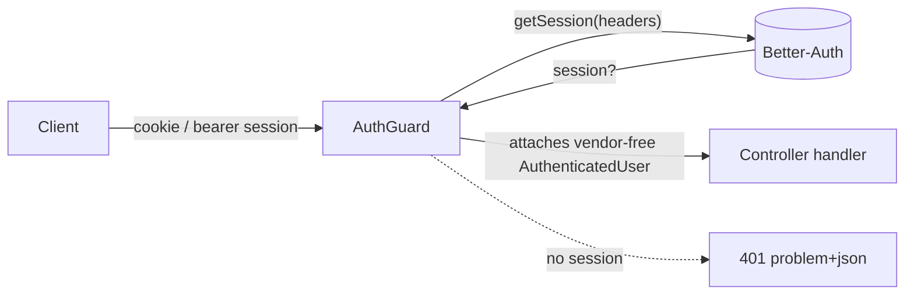
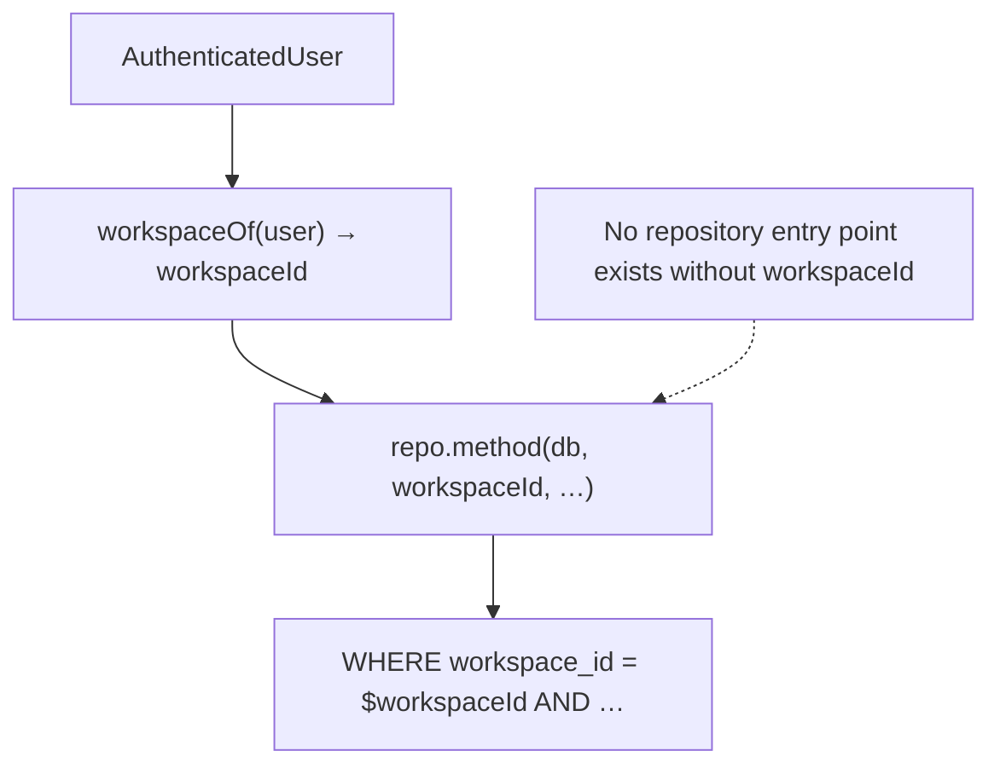

# Security hardening

**Requirement:** REQ-019 (Security review / authorization hardening) · **Issue:** #24
**Scope:** the `apps/api` HTTP edge, its authentication/authorization model, and the
structural controls that make the deterministic core (ADR-0005) safe to expose.

This document is the standing reference for how myDevTime's backend is hardened. It is
descriptive of the code as it ships, and honest about what is **planned but not yet
built** — where a control is aspirational it says so.

---

## 1. Threat model at a glance (STRIDE-lite)

| # | Threat (STRIDE) | Vector | Mitigation | Status |
|---|-----------------|--------|------------|--------|
| T1 | **S**poofing | Forged/absent session on a protected route | Better-Auth session guard (`AuthGuard`) on every non-public route; **enforced structurally** by `authz-sweep.test.ts` | ✅ Enforced |
| T2 | **S**poofing | Faked auth origin via `Host` header (cookie/redirect hijack) | `AUTH_BASE_URL` required in production; the auth origin is a trusted config value, never the client `Host` | ✅ Enforced (config gate) |
| T3 | **T**ampering | Modified request body / oversized payload | `nestjs-zod` validation pipe rejects anything off-schema before a handler runs | ✅ Enforced |
| T4 | **T**ampering | Forged Stripe webhook | HMAC signature verification over the **raw** request bytes; bad signature → 400 | ✅ Enforced |
| T5 | **T**ampering | At-rest tamper of stored OAuth tokens | AES-256-GCM AEAD; any bit-flip fails the auth-tag check on open (ADR-0032) | ✅ Enforced |
| T6 | **R**epudiation | "I never made that request" / untraceable errors | `x-request-id` propagation (REQ-021) on **every** response incl. 4xx/5xx; auth/cookie headers redacted from logs | ✅ Enforced |
| T7 | **I**nformation disclosure | Cross-workspace data read/write | **Workspace isolation by construction** — repository APIs take `workspaceId` non-optionally; negative isolation tests per entity | ✅ Enforced |
| T8 | **I**nformation disclosure | Secrets in source / logs / responses | Env-gated adapters; master key from env/KMS never source; log redaction; RFC 7807 bodies carry no internals | ✅ Enforced |
| T9 | **I**nformation disclosure | Clickjacking / MIME sniff / referrer leak | Baseline security headers on every response (`§4`) | ✅ Enforced |
| T10 | **I**nformation disclosure | Token theft at rest (DB dump) | Envelope encryption: per-record data key wrapped under a master key; plaintext never persisted | ✅ Enforced |
| T11 | **D**enial of service | Request flooding / credential stuffing | Global throttler (100 req/min/client, ADR-0050) + Better-Auth's own auth rate-limit | ⚠️ Partial (see `§7`) |
| T12 | **D**enial of service | Unbounded AI spend | Credit ledger gates every AI call; debit only on a real `ai-proposal`; graceful degradation when the provider is down (ADR-0005/0008) | ✅ Enforced |
| T13 | **E**levation of privilege | Untrusted AI output mutating state | LLMs **propose only**; deterministic core grounds/bounds every number; nothing books without human confirmation (see [`prompt-injection-review.md`](prompt-injection-review.md)) | ✅ Enforced |
| T14 | **E**levation of privilege | Vulnerable dependency (supply chain) | OSV-Scanner CI gate over the pnpm lockfile; documented, revisited exception list | ✅ Enforced (see `§8`) |

---

## 2. Authentication model

Authentication is delegated to **Better-Auth**, confined to the `auth` module behind a
narrow contract (ADR-0007/0017/0025). Nothing upstream imports a Better-Auth type.

- **`AuthGuard`** (`modules/auth/auth.guard.ts`) validates the session and attaches a
  vendor-free `AuthenticatedUser` (`{ id, email, emailVerified, name }`) to the request.
  Better-Auth session/user types never cross the module boundary.
- **Unconfigured auth fails closed:** if no auth instance is wired the guard throws 401,
  never allows through.
- **Production config gates** (`config.ts`, ADR-0053) reject boot unless:
  - `AUTH_SECRET` (≥ 32 chars) is set,
  - `AUTH_BASE_URL` (the trusted auth origin) is set,
  - `AUTH_REQUIRE_EMAIL_VERIFICATION` is on,
  - `AUTH_RATE_LIMIT_ENABLED` is on.

  The E2E "escape hatches" that relax these exist only outside production.

### Public route allowlist (the only unauthenticated surface)

Every route is `AuthGuard`-covered **except** the deliberately-public set below. This is
not a convention — it is asserted by [`apps/api/src/authz-sweep.test.ts`](../../apps/api/src/authz-sweep.test.ts),
which reflects over the real Nest module graph and fails if any route is neither guarded
nor allowlisted. A new controller cannot ship unauthenticated by accident.

| Route | Why public |
|-------|-----------|
| `GET /health`, `GET /health/ready` | Liveness/readiness probes; up/down only, no tenant data. |
| `GET /api/{ai,auth,automation,planner,absences,billing,tracking,worktime}/status` | Static module-mounted pings; no tenant data. |
| `GET /api/auth/providers` | Pre-login social-provider discovery; ids/labels only, no secrets. |
| `POST /api/billing/stripe/webhook` | Authenticated by the Stripe-Signature HMAC, not a user session; also `@SkipThrottle`. |
| `GET /api/sharing/:token/freebusy` | The opaque capability token **is** the credential; only busy spans + free gaps cross the boundary, never a detail column. |

> Better-Auth's own sign-in/sign-up/session endpoints are served by its catch-all mount,
> not by a Nest controller, so they are outside the sweep by construction.

---

## 3. Authorization model — workspace isolation by construction

Authorization is not a post-hoc check bolted onto handlers; it is a **type-level
invariant** of the persistence layer (CLAUDE.md non-negotiable, ADR-0015/0025):

- Every repository-layer API takes a `workspaceId` **non-optionally**. There is no
  "read all" overload that could omit the tenant scope.
- The authenticated user is resolved to a workspace once (`AiContext.workspaceOf`,
  and the equivalent per module) and that id threads through every query.
- **Negative isolation tests** are part of every entity's suite: a caller in workspace A
  must not read or mutate workspace B's rows. These are unit-level, exhaustive, and part
  of the ≥ 90 % core coverage bar.

Connector token queries go further: keyed by `(workspaceId, userId, connector)` so one
user cannot open another's sealed tokens even within a shared workspace.

---

## 4. Transport & security headers

Set in one Fastify `onSend` hook (`app.ts`, REQ-019) on **every** response — no helmet
dependency for a fixed set:

| Header | Value | Purpose |
|--------|-------|---------|
| `X-Content-Type-Options` | `nosniff` | Defeat MIME-type sniffing. |
| `X-Frame-Options` | `DENY` | Anti-clickjacking (no framing). |
| `Referrer-Policy` | `no-referrer` | No URL leakage to third parties. |
| `Permissions-Policy` | `camera=(), microphone=(), geolocation=()` | Deny powerful browser features. |
| `Cross-Origin-Opener-Policy` | `same-origin` | Process isolation from cross-origin openers. |
| `Strict-Transport-Security` | `max-age=31536000; includeSubDomains` | Sent when the request arrived via HTTPS **or** `NODE_ENV=production` (TLS terminates at the edge). |

**No Content-Security-Policy is set, deliberately.** The API serves no HTML except the
Swagger UI at `/docs`, which needs inline scripts/styles a strict CSP would break. Rather
than ship a loophole-ridden `unsafe-inline` CSP, it is omitted; the headers above are the
ones that matter for a JSON API. (If `/docs` is ever exposed publicly, revisit this.)

`x-request-id` is echoed (sanitized: `^[\w.-]{1,128}$`) or generated per request, stamped
in `onRequest` so success, 4xx and 5xx are all traceable (REQ-021). `trustProxy` defaults
**off** so a directly-reachable API cannot be spoofed via `X-Forwarded-For` (ADR-0050).

---

## 5. Secrets handling

- **Env-gated adapters:** every volatile vendor (Stripe, Google/Apple/GitHub OAuth, SMTP,
  LLM) is behind a port and only activates when its secret env var is present; absent
  config degrades the feature, it does not crash or leak.
- **Connector token vault (ADR-0032):** OAuth tokens are sealed with **envelope
  encryption + AEAD** before touching the DB (`modules/connectors/crypto.ts`, the only
  place Node `crypto` is used):
  - a fresh random **data key** per record encrypts the token (AES-256-GCM),
  - the data key is itself wrapped under a **master key** from `CONNECTOR_MASTER_KEY`
    (env/KMS, **never source**; must be 32 bytes),
  - persisted: ciphertext + wrapped key + nonces + auth tags. **Plaintext never persists**,
    and any tampering fails the GCM auth check on open (T5/T10).
  - Tokens are opened only inside the vault; nothing upstream sees plaintext or a crypto type.
- **Log hygiene:** the Fastify logger redacts `req.headers.authorization` and
  `req.headers.cookie` (SKILL §4/§8). RFC 7807 error bodies never carry stack traces,
  SQL, or vendor internals.

---

## 6. Input validation & error contract

- **Validation:** a global `ZodValidationPipe` (`nestjs-zod`) validates every DTO against
  its Zod schema; malformed/oversized/extra-field input is rejected with 422 **before** a
  handler runs (T3). Schemas double as the OpenAPI source of truth.
- **Errors (RFC 7807):** a global `ProblemDetailsFilter` renders every error as
  `application/problem+json` with a canonical title and status, and nothing else. Domain
  `AppError`s map to their status; unknown errors become a generic 500 with no internals.

---

## 7. Rate-limiting posture (honest current-state)

| Layer | Current | Notes |
|-------|---------|-------|
| Global API | ✅ 100 req/min per client (`ThrottlerGuard`, ADR-0050) | Redis-backed when `REDIS_URL` is set (shared across instances); otherwise **per-instance in-memory** — a multi-node deploy without Redis rate-limits per node, not globally. |
| Auth endpoints | ✅ Better-Auth's own `rateLimit` (`AUTH_RATE_LIMIT_ENABLED`, mandatory in prod) | Protects sign-in/sign-up brute force. |
| Stripe webhook, health | ⏭️ `@SkipThrottle` | Signature-verified / infra probes; exempt by design. |

**Planned, not yet built:** per-route / per-principal tiers (e.g. stricter limits on the
credit-spending AI endpoints beyond the credit ledger itself), and a WAF/edge layer for
L7 volumetric DoS. The credit ledger (T12) is today the primary economic brake on AI abuse;
network-level DoS protection is an edge/infra concern that is out of scope for the app.

---

## 8. Dependency & supply chain

- CI runs **OSV-Scanner** over the pnpm lockfile (`.github/workflows/security.yml`,
  ADR-0016); npm's retired audit endpoints are deliberately not relied on.
- Every knowingly-accepted advisory is documented and revisited in
  [`audit-exceptions.md`](audit-exceptions.md) — no silent suppressions. The current
  accepted set is **build/CLI tooling only** (Expo build CLI, drizzle-kit), never shipped
  at runtime.
- TypeScript `strict` everywhere, no blanket suppressions (CLAUDE.md); ports & adapters
  confine vendor types to one file each, shrinking the blast radius of a compromised SDK.

---

## 9. Residual risk & follow-ups

- **Rate limiting** is single-tier and per-instance without Redis (`§7`). A production
  multi-node deploy should provision `REDIS_URL` and add an edge WAF.
- **`/docs` (Swagger UI)** is the only HTML surface and the reason no CSP ships; gate or
  disable it in production if it need not be public.
- **CSRF:** cookie-session flows rely on Better-Auth's protections + `SameSite`; verify the
  cookie policy for any browser client that mutates state via cookies rather than bearer.

These are tracked as their own issues per the CLAUDE.md "never silently fixed or dropped" rule.
