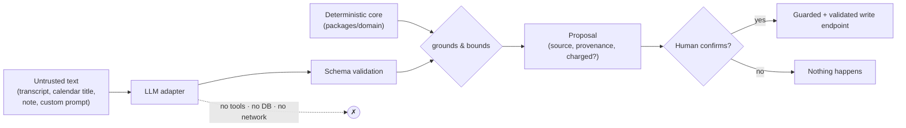

# Prompt-injection & AI-surface security review

**Requirement:** REQ-019 (security review) · **Governing decision:** ADR-0005
(deterministic core), ADR-0008 (credit ledger) · **Issue:** #24

This review covers the AI surface of `apps/api` (the `ai` and `planner` modules). Its
thesis is that myDevTime is **structurally resistant to prompt injection** — not because
the prompts are cleverly worded, but because the architecture denies an injected
instruction anything worth capturing. It is honest about the residual risk that remains.

---

## 1. The structural contract (why injection cannot escalate)

Per ADR-0005, across **every** AI endpoint:

1. **LLMs propose, parse, and explain — they never mutate state.** No AI call writes a
   time entry, task, plan, invoice, or credit. Every AI response is a **proposal** the
   client must confirm through the ordinary, guarded, validated write endpoints
   (e.g. a categorization is booked only when the user confirms and the entry then carries
   `ai-proposal` provenance; a meeting action-item becomes a task only via
   `POST /api/tracking/tasks`).
2. **The deterministic core grounds and bounds every number.** Where an LLM touches a
   figure, pure logic in `packages/domain` fixes the envelope: standup durations are
   slot-protected (the model narrates *around* numbers it cannot change), an estimate is
   clamped to a sane multiple of the deterministic baseline, meeting facts are computed
   deterministically and only the *summary prose* is AI. A dropped or altered figure
   degrades to the deterministic output.
3. **No tool-calling from untrusted text.** The LLM has no tools, no function-calling, no
   ability to reach the database, the network, or another endpoint. Its only output is
   text/JSON that is then **schema-validated** and rendered as a proposal.
4. **Credits debit only on a real `ai-proposal`.** A refusal, a deterministic fallback, a
   down provider, or an unparseable completion cost nothing (ADR-0008) — so an attacker
   cannot even force spend by garbling the model.
5. **Graceful degradation.** Provider down / no credits ⇒ the deterministic path runs and
   the feature still returns a useful, un-charged result.

Mermaid source

The worst an injected instruction inside a transcript can achieve is to make the LLM
**emit different proposal text**. It cannot book anything, cannot cross a workspace
boundary, cannot spend beyond one credit, and cannot invoke any tool. The blast radius is
"the user sees a bad suggestion and declines it."

---

## 2. Endpoint-by-endpoint

All endpoints below are `AuthGuard`-protected and workspace-scoped (`workspaceOf(user)`).

| Endpoint | AI role | Injection vectors | Structural mitigation | Writes? | Credit |
|----------|---------|-------------------|-----------------------|---------|--------|
| `POST /api/ai/nl-entry` (REQ-013) | Parse a phrase into a **draft** entry | Free-text phrase | Draft only; user confirms before any write | No | Free |
| `POST /api/ai/smart-add` (K6) | Stage-2 LLM rewrite of a vague phrase into a typed draft | Free-text phrase | Stage-1 deterministic path is free & always available; Stage-2 result is a draft | No | 1, only on real `ai-proposal` |
| `POST /api/ai/insight` (KI1–KI4) | Phrase the caller's **own facts** into a note/quote/invoice text | Supplied facts + optional `customPrompt` | Grounded in caller-supplied facts; `customPrompt` biases emphasis **only**, grounding rules win (REQ-026); refusal path | No | 1, only on non-refused `ai-proposal` |
| `POST /api/ai/standup` (REQ-014) | Narrate grouped durations into a report | `yesterday/today/blockers` text | **Slot integrity**: the model narrates around protected numbers; any dropped figure degrades to the free template | No (read-only) | 1, only on real `ai-proposal` |
| `POST /api/ai/categorize` (REQ-012) | Propose project/tags/billability per entry | Entry text; `knownProjects` | Project is chosen **strictly from `knownProjects`** — never invented; proposals only, confirmed entries get `ai-proposal` provenance | No | 1, only when ≥ 1 proposal produced |
| `POST /api/ai/estimate` (REQ-041) | Nudge a task-time estimate | `category/complexity/note/samples` | Deterministic baseline range **grounds and clamps** the LLM's minute figure — it can nudge, never fabricate; degrades to baseline midpoint | No | 1, only on real `ai-proposal` |
| `POST /api/ai/meeting-insights` (REQ-026) | Summarize a transcript; propose action items | **Transcript segments** + optional `customPrompt` | Facts + action items are **deterministic and free**; action items are **confirmed-only** (never auto-created); only the optional summary is AI, grounded in the transcript, `customPrompt` biases emphasis only | No | 1, only when AI summary produced |
| `POST /api/ai/assistant` (M2) | Answer a question from supplied facts | `question` + supplied `facts` | Answers **only** from caller-supplied facts; refusal path when unanswerable | No | 1, only on non-refused `ai-proposal` |
| `POST /api/planner/plans/:id/briefing` (M8) | Coaching text over a placed plan | Plan data | Grounded in the deterministic plan; text only, nothing rebooked | No | 1, only on real `ai-proposal` |

---

## 3. Injection vectors, enumerated

The untrusted strings that reach a prompt, and why each is contained:

- **Transcript text** (`meeting-insights`) — the richest vector (attacker controls meeting
  content). Contained: facts/action-items are deterministic; the AI summary is text-only,
  grounded, tool-less, and confirmed-only for anything that would become a task.
- **Calendar event titles / bodies** (feed into categorization / planning grounding) —
  treated as data, never as instructions; the model's structured output is schema-validated
  and its choices are constrained (e.g. project ∈ `knownProjects`).
- **User notes / phrases** (`nl-entry`, `smart-add`, `estimate.note`) — produce drafts /
  bounded proposals only.
- **Custom prompts** (`insight`, `meeting-insights`) — the one place the user *intends* to
  steer the model. By design they **bias emphasis only**; the grounding rules and output
  schema take precedence, so a `customPrompt` cannot turn a summarizer into an exfiltrator
  (it has nothing to exfiltrate to — no tools, no network).

---

## 4. Residual risk (honest)

Structural mitigations bound *impact*, not *occurrence*. Remaining risks:

1. **Persuasive bad proposals.** Injection can still make a proposal *look* legitimate,
   increasing the odds a user confirms something they shouldn't. Mitigation is UX:
   `ai-proposal` provenance is surfaced (the client's "violet" provenance treatment) so
   users know a suggestion is AI-originated and unverified. This is a human-factors risk,
   not a system-compromise risk.
2. **Prompt/output leakage between fields.** A crafted transcript could cause the summary
   to echo attacker text back to the user. Because output is text rendered to the same
   authenticated user (no cross-tenant path, no tool), the impact is cosmetic/nuisance.
3. **Model-side data handling.** Untrusted text is sent to a third-party LLM provider.
   That is a provider-trust and data-residency concern governed by the vendor adapter and
   consent model (REQ-025 for capture), not a prompt-injection escalation path.
4. **Schema-validation gaps.** The guarantees in `§1` depend on each endpoint actually
   schema-validating and clamping its output. Regressions here are caught by the domain
   suite's grounding/bounding tests (the ≥ 90 % core-coverage bar), which are the
   enforcement mechanism for this review's claims.

**Conclusion:** the AI surface is proposal-only, tool-less, workspace-scoped, credit-gated,
and grounded by a deterministic core. Prompt injection cannot mutate state, cross a
workspace boundary, invoke a tool, or force meaningful spend. The residual risk is that a
user is *shown* a manipulated suggestion and chooses to accept it — mitigated by explicit
AI provenance and the mandatory human-confirmation step, and tracked as an ongoing UX
concern rather than an open system vulnerability.
