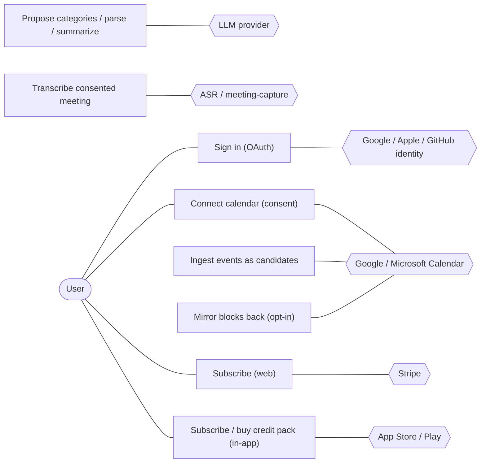

# Use-Case Overview {#section-use-cases}

## How to read this document {#how-to-read}

This document is the **use-case view** of myDevTime: it names the user-facing goals the product
serves, who pursues them, and where each is anchored in the tracked requirements. It is a lens, not
a plan. The **system of record for scope stays the [Requirements Register](architecture.md#_requirements_register)
(REQ-001…REQ-064), the [ADRs](adr/README.md), and the GitHub issues** they reference; this page
adds nothing to scope and tracks no work of its own. Where the two ever disagree, the register and
the ADRs win.

Read every row here as a pointer:

- **Each use case maps to one or more `REQ-NNN`** in the register — follow the id there for the
  authoritative requirement text, delivering issue, and status.
- **Every AI-assisted use case obeys the proposes-only rule
  ([ADR-0005](adr/0005-deterministic-core-llm-assist.md)).** The deterministic core in
  `packages/domain` computes every number that reaches a timesheet, budget, export, or invoice;
  the LLM (and the ASR) only propose, parse, phrase, and explain — always marked as a proposal,
  always with recorded **provenance**, never mutating state on their own, and degrading gracefully
  when the provider is down. In the use cases below this shows up as an explicit "propose → user
  confirms" step wherever AI is involved.
- **Statuses are copied honestly from the register.** A use case whose requirement is only
  *Partial* or *Proposed* is listed as such — this is a view over reality, not a wish list. The
  register's own status vocabulary is kept verbatim (`Done` / `Verified` / `Partial` /
  `In progress` / `Proposed` / `Deferred`); its
  [status table](architecture.md#_requirements_register) maps each to the coverage state in the
  [requirements-traceability matrix](testing/requirements-traceability.md).

Two cross-cutting invariants frame the whole catalog and are therefore not repeated per row:
**workspace isolation** (every repository API takes a `workspaceId` non-optionally, with negative
isolation tests per entity — REQ-001) and **provenance on every entry**
(`timer | manual | calendar | rule:<id>@<version> | ai-proposal`, plus review state — a Quality
Goal of the architecture). The commercial spine — entitlements and the **AI-credit ledger**
(1 credit = 1 AI action) — gates the paid and metered use cases (REQ-016, REQ-027).

## Actors {#actors}

The **primary actor is the individual user** — one person tracking their own work in a personal
workspace. myDevTime models that person's context as a **role visibility preset** chosen at
onboarding (REQ-056): the same modules, filtered, never a fork of the app. The external systems
are secondary actors: each sits behind one narrow port so the vendor stays swappable (ADR-0005,
skill §2.2). The table mirrors the architecture's
[Business Context](architecture.md#_business_context) actor list.

| Actor | Description | Primary goals |
|-------|-------------|---------------|
| **User — Freelancer** (`freelancer` preset, REQ-056) | Bills clients for time; sees money, clients, rates, invoicing, AI. | Effortless capture, trustworthy invoices, budget control, private and exportable data. |
| **User — Employee / "Stempler"** (`employee` preset, REQ-056) | Works to a target-hour schedule; on Free, **never** sees €/clients/rates/billing (a hard floor). | Honest punch clock, overtime and absence accounting, a signable monthly work-time report. |
| **User — Both** (`both` preset, REQ-056) | Runs the punch clock *and* bills projects on one timeline. | Everything above on a single Day Canvas; Health/Balance is visible in every tier and never paywalled. |
| **Google Calendar / Microsoft 365** | Read-only calendar event source (OAuth-granted, encrypted, revocable). | Supply events as **candidate** entries — never auto-committed (REQ-010); opt-in write-back mirror (REQ-034). |
| **LLM provider(s)** | Multi-provider model behind one `LlmPort` (`NullLlm` default). | Categorization proposals, NL/Smart-Add parsing fallback, summaries, standup, assistant, meeting insights — proposals only (REQ-012). |
| **ASR provider / meeting-capture channel** | Speech-to-text behind `TranscriptionPort` (`NullTranscription` default), across Meet/Teams/Zoom. | Turn consented meeting audio/captions into transcripts linked to the time entry (REQ-025). |
| **Stripe** | Web subscription rail (SDK confined to `billing/payments/stripe`). | Checkout, billing portal, signature-verified idempotent webhooks, credit top-ups (REQ-017). |
| **Apple App Store / Google Play** | App distribution + in-app purchase rail; server notifications are source of truth. | Store-compliant subscriptions + consumable credit packs (REQ-018, REQ-023). |
| **Google / Apple / GitHub identity** | OAuth identity providers behind Better-Auth. | Sign the user in; Sign in with Apple mandatory where third-party login is offered (REQ-002). |

The user's **clients** (who receive invoices/timesheets) and the **store review gatekeepers** are
[stakeholders](architecture.md#_stakeholders), not actors that interact with the running system;
they are named here only for context.

## Use-case overview diagrams {#diagrams}

Mermaid has no native UML use-case notation, so the associations are drawn as a `flowchart`. The
catalog is split across two diagrams for readability: the first shows the **primary user's** goals
grouped by product area; the second shows the **external-system integrations** that back the
AI, calendar, capture, identity, and payment use cases.

### Diagram 1 — The user's use cases by area {#diagram-user}

```mermaid
flowchart LR
  User(["User"])

  subgraph Track["Track"]
    UTimer["Start / stop / pause timer"]
    UManual["Manual entry & split"]
    USmart["NL / Smart-Add quick-add"]
    URules["Auto-categorize by rules"]
    UAiCat["Confirm AI category proposal"]
    UReview["Review auto-tracked drafts"]
  end

  subgraph Plan["Plan"]
    UPlan["Accept Co-Planner day plan"]
    UReviewDay["Evening plan-vs-actual review"]
    UEstimate["Estimate task effort"]
    UShutdown["Close the day"]
  end

  subgraph Report["Report / Bill"]
    UProjects["Manage projects, budgets, rates"]
    UStats["Read the stats dashboard"]
    UExport["Export timesheet"]
    UInvoice["Bill a client (Abrechnung)"]
  end

  subgraph AI["Meetings / AI"]
    UMeeting["Capture & transcribe a meeting"]
    UInsights["Confirm AI action items"]
    UStandup["Generate AI standup"]
    UAssistant["Ask the grounded assistant"]
    UDevExport["Export insights to dev tools"]
  end

  subgraph Work["Work-time / Absence"]
    UPunch["Clock in / out with breaks"]
    UAbsence["Record vacation / sick days"]
    UWorkReport["Get signable work-time report"]
    UHealth["See Health & Balance"]
  end

  subgraph Account["Account / Privacy"]
    USignIn["Sign in"]
    URole["Pick role visibility preset"]
    UCredits["Watch & top up AI credits"]
    UGdpr["Export or erase my data"]
  end

  User --- UTimer & UManual & USmart & URules & UAiCat & UReview
  User --- UPlan & UReviewDay & UEstimate & UShutdown
  User --- UProjects & UStats & UExport & UInvoice
  User --- UMeeting & UInsights & UStandup & UAssistant & UDevExport
  User --- UPunch & UAbsence & UWorkReport & UHealth
  User --- USignIn & URole & UCredits & UGdpr
```

Mermaid source

### Diagram 2 — External-system integrations {#diagram-systems}

Mermaid source

## Use-case catalog {#catalog}

One table per product area. **REQ(s)** link to the register; **Status** is copied verbatim from the
register's leading status word; **Delivering issue** is the register's "Delivered by" issue. Rows
whose requirement is not yet fully delivered say so plainly.

### Track {#uc-track}

| Use case | Actor(s) | Goal (one line) | REQ(s) | Status | Issue |
|----------|----------|-----------------|--------|--------|-------|
| Start / stop / pause the timer | User | Run the one live timer (reboot-safe, ≤2-tap start) and stop it. | REQ-004, REQ-007 | Done | [#8](https://github.com/NexusHero/myDevTime/issues/8), [#12](https://github.com/NexusHero/myDevTime/issues/12) |
| Create / edit / split a manual entry | User | Record time after the fact, validated by the tracking core. | REQ-004 | Done (API) | [#8](https://github.com/NexusHero/myDevTime/issues/8) |
| Natural-language quick-add | User, LLM provider | Turn "2h Finanzo Review gestern" into a **draft** entry the user confirms. | REQ-013 | Done | [#18](https://github.com/NexusHero/myDevTime/issues/18) |
| Smart-Add typed quick-add | User, LLM provider | Classify one phrase into a typed draft (task/meeting/absence/travel/life); vague phrases fall to a grounded LLM stage, always confirmed. | REQ-047 | Partial | [ADR-0065](adr/0065-design-v13-smart-add-economics-travel-monthly-statement-grounded-ai.md) |
| Attach a note to an entry | User | Describe an entry (incl. the running timer); note becomes searchable timesheet position text. | REQ-036 | Done | [#46](https://github.com/NexusHero/myDevTime/issues/46) |
| Ingest calendar events as candidates | User, Google/Microsoft Calendar | Pull events as **candidate** entries — never auto-committed without an enabled rule. | REQ-010 | Proposed (live Google preview ships) | [#15](https://github.com/NexusHero/myDevTime/issues/15) |
| Auto-categorize by deterministic rules | User | Dry-run then apply ordered, versioned matchers → categorization with `rule:<id>@<version>` provenance; the preview writes nothing. | REQ-011 | Verified | [#16](https://github.com/NexusHero/myDevTime/issues/16) |
| Confirm an AI category proposal | User, LLM provider | For rule-undecided candidates, the LLM proposes a project strictly from known projects (one credit on a real proposal); the user applies it. | REQ-012 | In progress | [#17](https://github.com/NexusHero/myDevTime/issues/17) |
| Review auto-tracked drafts | User | The auto-tracker's reality becomes a review queue of bookable drafts — never auto-booked. | REQ-042, REQ-062 | Partial | [#42](https://github.com/NexusHero/myDevTime/issues/42), [ADR-0067](adr/0067-design-v17-recurrence-competitive-parity-family-market-standards.md) |
| Focus / Pomodoro session | User | Run Pomodoro cycles as ordinary tracked time with a calm streak absences don't break. | REQ-032 | Partial | [#41](https://github.com/NexusHero/myDevTime/issues/41) |
| Idle & forgotten-tracking nudge | User | Get an evidence-based, dismissible trim/stop proposal — nothing auto-corrects. | REQ-033 | Verified | [#42](https://github.com/NexusHero/myDevTime/issues/42) |

### Plan {#uc-plan}

| Use case | Actor(s) | Goal (one line) | REQ(s) | Status | Issue |
|----------|----------|-----------------|--------|--------|-------|
| Accept the Co-Planner day plan | User, LLM provider | The deterministic planner proposes ghost blocks (meetings anchor, focus fills gaps); the LLM only labels/ranks them; the user accepts or sculpts. | REQ-031 | Done (core) | [#40](https://github.com/NexusHero/myDevTime/issues/40) |
| Evening plan-vs-actual review | User | See kept/moved/dropped drift and feed the standup. | REQ-031 | Done (core) | [#40](https://github.com/NexusHero/myDevTime/issues/40) |
| Plan against true capacity ("Fill week") | User | Distribute the task inbox into free slots against plannable capacity (target − life/protected), never over target, always undoable. | REQ-055 | Partial | [ADR-0066](adr/0066-design-v14-two-worlds-capacity-roles-tiers-protection-health-baseline.md) |
| Make an entry recurring | User | Define a series (frequency + end); the Co-Planner treats it as hard. | REQ-060 | Partial | [ADR-0067](adr/0067-design-v17-recurrence-competitive-parity-family-market-standards.md) |
| Month / Year overview | User | See activity dots, deterministic booking-gap markers, and per-day/week load. | REQ-037, REQ-046 | Done | [#47](https://github.com/NexusHero/myDevTime/issues/47), [#266](https://github.com/NexusHero/myDevTime/issues/266) |
| Toggle Canvas ⇄ classic list | User | Switch the day between the Day Canvas and a screen-reader-first list with day subtotals. | REQ-040 | Done | [#50](https://github.com/NexusHero/myDevTime/issues/50) |
| Estimate task effort | User, LLM provider | Get a deterministic hours **range** baseline + own estimate + estimate-vs-actual; the AI **review** is assist-only and never mutates the number. | REQ-041, REQ-053 | Partial | [#90](https://github.com/NexusHero/myDevTime/issues/90) |
| Protect a block ("🛡 Geschützt") | User | Flag an existing entry so communications are held (Busy) and surface as one digest — time-tracking untouched. | REQ-057 | Partial | [ADR-0066](adr/0066-design-v14-two-worlds-capacity-roles-tiers-protection-health-baseline.md) |
| Filter the planner Work / Life / Both | User | Change only what is *shown* on the one timeline; capacity/price still read the full set. | REQ-064 | Partial | [#266](https://github.com/NexusHero/myDevTime/issues/266) |
| Close the day (Feierabend ritual) | User | A ~90-second shutdown: booked / reality / unbooked remainder / open drafts / tomorrow-first. | REQ-063 | Partial | [ADR-0067](adr/0067-design-v17-recurrence-competitive-parity-family-market-standards.md) |

### Report / Bill {#uc-report}

| Use case | Actor(s) | Goal (one line) | REQ(s) | Status | Issue |
|----------|----------|-----------------|--------|--------|-------|
| Manage projects, budgets, rates | User (Freelancer) | Organize clients → projects → tasks with effective-dated rates, budgets, deadlines, threshold alerts. | REQ-001, REQ-005 | Done | [#6](https://github.com/NexusHero/myDevTime/issues/6), [#10](https://github.com/NexusHero/myDevTime/issues/10) |
| Read the stats dashboard | User | See deterministic rollups, budget rings, overtime gauge, heatmap, budget burn-down — every figure drillable to its entries. | REQ-008, REQ-038 | Done | [#13](https://github.com/NexusHero/myDevTime/issues/13), [#48](https://github.com/NexusHero/myDevTime/issues/48) |
| Export a billing-grade timesheet | User (Freelancer) | Produce CSV/XLSX/PDF where every number traces to `buildTimesheet` + a rounding profile. | REQ-009 | Done | [#14](https://github.com/NexusHero/myDevTime/issues/14) |
| Bill a client (Abrechnung / invoicing) | User (Freelancer) | Price a client's billable entries in a period and freeze issued bills (server-authoritative, reversible). | REQ-005 | Done | [#10](https://github.com/NexusHero/myDevTime/issues/10), [ADR-0051](adr/0051-invoicing-abrechnung.md) |
| Export the Reports/analytics view | User | Export the dashboard (tiles, breakdowns, burn-down, heatmap) as CSV/PDF, distinct from the timesheet. | REQ-045 | Partial (CSV ships) | [#265](https://github.com/NexusHero/myDevTime/issues/265) |
| See the honest hourly worth | User (Freelancer) | Effective rate (revenue ÷ all tracked hours) beside the nominal rate and utilization. | REQ-048 | Partial | [ADR-0065](adr/0065-design-v13-smart-add-economics-travel-monthly-statement-grounded-ai.md) |
| Overtime trend & "price of the week" | User | A deterministic overtime forecast and a rule-based weekly strain score (no AI). | REQ-049, REQ-050 | Partial | [ADR-0065](adr/0065-design-v13-smart-add-economics-travel-monthly-statement-grounded-ai.md) |
| Plan-vs-realized revenue chip | User (Freelancer) | For fixed-fee projects, a signed, tolerance-banded planned-vs-realized variance (no forecast). | REQ-061 | Partial (Verified core) | [ADR-0067](adr/0067-design-v17-recurrence-competitive-parity-family-market-standards.md) |
| Book a travel entry | User | Deterministic travel pricing (reduced-fraction time + per-km allowance; train = full worktime). | REQ-051 | Partial | [ADR-0065](adr/0065-design-v13-smart-add-economics-travel-monthly-statement-grounded-ai.md) |

### Meetings / AI {#uc-ai}

| Use case | Actor(s) | Goal (one line) | REQ(s) | Status | Issue |
|----------|----------|-----------------|--------|--------|-------|
| Capture & transcribe a meeting | User, ASR provider / meeting-capture | With stored explicit consent, transcribe the meeting and link the transcript to the time entry; a down ASR degrades to empty, never throws. | REQ-025 | Partial | [#32](https://github.com/NexusHero/myDevTime/issues/32) |
| Confirm AI meeting action items | User, LLM provider | Get summaries + action items as **confirmed-only** proposals; a task is created only on confirm. | REQ-026 | Partial | [#33](https://github.com/NexusHero/myDevTime/issues/33) |
| Generate an AI standup | User, LLM provider | The LLM narrates around **protected numeric slots**; any altered figure is rejected and falls back to the free plain template; one credit only when it actually wrote. | REQ-014 | Verified | [#19](https://github.com/NexusHero/myDevTime/issues/19) |
| Get an AI day-briefing / summary | User, LLM provider | A narrative around domain-computed numbers; degrades to the factual summary. | REQ-014 | Verified | [#19](https://github.com/NexusHero/myDevTime/issues/19) |
| Ask the grounded assistant | User, LLM provider | Answer questions grounded **only** in the user's own workspace facts; defined refusal off-data; deep-links, never state mutation. | REQ-015 | Done | [#20](https://github.com/NexusHero/myDevTime/issues/20) |
| Grounded AI difference-makers | User, LLM provider | Drift-coach, history-grounded quote, invoice-prose translator, meeting follow-ups — phrase the caller's own facts, one credit per real proposal. | REQ-054 | Partial | [ADR-0065](adr/0065-design-v13-smart-add-economics-travel-monthly-statement-grounded-ai.md) |
| Export insights to dev tools | User | Confirmed, previewed, idempotent export of insights/action items to Jira/Linear/Slack via one port. | REQ-035 | Partial | [#44](https://github.com/NexusHero/myDevTime/issues/44) |
| Mirror tracked blocks to calendar | User, Google/Microsoft Calendar | Opt-in write-back into a dedicated calendar with privacy presets and clean revoke. | REQ-034 | Proposed | [#43](https://github.com/NexusHero/myDevTime/issues/43) |

### Work-time / Absence {#uc-worktime}

| Use case | Actor(s) | Goal (one line) | REQ(s) | Status | Issue |
|----------|----------|-----------------|--------|--------|-------|
| Clock in / out with breaks & overtime | User (Employee, Both) | Run the punch clock against a target-hour schedule; each shift flags its ArbZG §4 break shortfall; overtime balance over a window. | REQ-028 | Done (core) | [#36](https://github.com/NexusHero/myDevTime/issues/36) |
| Reconcile presence vs. booked time | User (Both) | See the worked-but-unbooked gap between shifts and project entries. | REQ-028 | Done (core) | [#149](https://github.com/NexusHero/myDevTime/issues/149) |
| Record vacation / sick / holiday | User (Employee, Both) | Book absences with half-days, regional holiday calendars, allowance & carry-over, credited against target hours. | REQ-029 | Done (core) | [#37](https://github.com/NexusHero/myDevTime/issues/37) |
| Get a signable work-time report | User (Employee, Both) | A monthly Arbeitszeitnachweis PDF (signature blocks) + XLSX, rendered exclusively from domain values. | REQ-030 | Done | [#38](https://github.com/NexusHero/myDevTime/issues/38) |
| Get the monthly punch-clock statement | User (Employee, Both) | A one-month-per-A4 PDF from real punch events with year-to-date carryover. | REQ-052 | Partial | [ADR-0065](adr/0065-design-v13-smart-add-economics-travel-monthly-statement-grounded-ai.md) |
| See Health & Balance | User (all roles) | A Work/Protected/Free split and signals calibrated to the person's own >4-week baseline — never a fixed threshold, never a diagnosis, never paywalled. | REQ-058 | Partial | [ADR-0066](adr/0066-design-v14-two-worlds-capacity-roles-tiers-protection-health-baseline.md) |

### Account / Privacy {#uc-account}

| Use case | Actor(s) | Goal (one line) | REQ(s) | Status | Issue |
|----------|----------|-----------------|--------|--------|-------|
| Sign in | User, Google/Apple/GitHub identity | Email/password + verification or OAuth; opaque revocable sessions (logout-everywhere); account deletion. | REQ-002 | Done | [#4](https://github.com/NexusHero/myDevTime/issues/4), [#5](https://github.com/NexusHero/myDevTime/issues/5) |
| Complete first-run onboarding | User | Welcome → Work-time → Projects → Auto-Tracker → Done; captured projects persist, durable "onboarded" flag. | REQ-044 | Done | [#264](https://github.com/NexusHero/myDevTime/issues/264) |
| Pick a role visibility preset | User | Choose employee / freelancer / both — a visibility switch over existing modules, with hard floors (a Free Stempler never sees money; Health always visible). | REQ-056 | Partial | [ADR-0066](adr/0066-design-v14-two-worlds-capacity-roles-tiers-protection-health-baseline.md) |
| Connect a calendar (consent) | User, Google/Microsoft Calendar | Grant read-only calendar access via OAuth with least-privilege scopes; encrypted, revocable. | REQ-010 | Proposed (live Google flow ships) | [#15](https://github.com/NexusHero/myDevTime/issues/15) |
| Watch & manage AI credits | User | See the append-only credit balance and usage; each AI action debits idempotently; overdraw refused. | REQ-027 | Done (core) | [#34](https://github.com/NexusHero/myDevTime/issues/34) |
| Hold a subscription entitlement | User | A provider-agnostic `free`/`pro` plan with feature gates converging deterministically across rails. | REQ-016 | Done | [#21](https://github.com/NexusHero/myDevTime/issues/21) |
| Subscribe & top up on web (Stripe) | User, Stripe | Checkout + billing portal + credit top-ups via signature-verified idempotent webhooks. | REQ-017 | Done | [#22](https://github.com/NexusHero/myDevTime/issues/22) |
| Subscribe / buy credits in-app | User, App Store / Play | Store-compliant subscriptions + consumable credit packs with server notifications as source of truth. | REQ-018 | **Proposed — deferred** | [#23](https://github.com/NexusHero/myDevTime/issues/23) |
| Export or erase my data (DSGVO) | User | Art. 15 export of every workspace-scoped table; Art. 17 erasure with explicit confirmation; retention purge. | REQ-020 | Partial | [#25](https://github.com/NexusHero/myDevTime/issues/25) |

> **Out-of-scope / deferred money items, stated honestly.** Store IAP subscriptions and consumable
> packs (REQ-018 / [#23](https://github.com/NexusHero/myDevTime/issues/23)) are **Proposed**, and the
> **pricing decision** (free-tier limits + per-rail Pro prices — REQ-024 /
> [#29](https://github.com/NexusHero/myDevTime/issues/29)) is **Proposed** and recorded only as an
> ADR before store submission. Both are 1.0 scope by the
> [Definition of 1.0](roadmap.md#definition-of-1-0) but not yet delivered; they appear here so the
> view is complete, not to imply they are done.

## Representative user stories {#stories}

The register-driven process derives stories from requirements rather than maintaining a parallel
backlog, so the following are **illustrative** — a handful of the highest-value use cases written in
the standard form to make that derivation explicit. They are **not** a complete or authoritative
backlog; the [GitHub issues](roadmap.md) remain that.

1. **As a freelancer**, I want to start the running timer in at most two taps and have it survive an
   app restart, so that capturing time is cheaper than forgetting to. *(REQ-004, REQ-007)*
2. **As a freelancer**, I want to type "2h Finanzo Review gestern" and confirm a pre-filled draft,
   so that I can log yesterday's work without opening a form. *(REQ-013)*
3. **As a freelancer**, I want the AI to propose a project only from my existing projects for
   uncategorized calendar candidates and let me confirm each one, so that automation speeds me up
   without ever inventing or silently changing a booking. *(REQ-010, REQ-011, REQ-012)*
4. **As a developer planning my day**, I want the Co-Planner to lay proposed focus blocks around my
   meetings as ghost blocks I accept or reshape, so that my plan and my actuals live on one Day
   Canvas and drift is visible. *(REQ-031)*
5. **As a meeting participant**, I want a meeting transcribed only after I have given explicit stored
   consent, with action items offered as proposals I confirm, so that no capture happens behind my
   back and no task is created without my say-so. *(REQ-025, REQ-026)*
6. **As a freelancer preparing an invoice**, I want to export a timesheet where every number traces
   back to my entries and rounding profile, so that I can defend the bill if a client queries it.
   *(REQ-009, REQ-005)*
7. **As an employee ("Stempler") on the Free tier**, I want to clock in and out with breaks and
   receive a signable monthly work-time report, **without** ever seeing rates, clients, or money,
   so that the app fits my role and respects the hard visibility floor. *(REQ-028, REQ-030, REQ-056)*
8. **As any user**, I want my AI credit balance to be visible and each AI action to debit it
   idempotently and refuse to overdraw, so that I always know what the assistance is costing me.
   *(REQ-027, REQ-016)*
9. **As a privacy-conscious user**, I want a one-click export of all my data and a confirmed
   account erasure, so that I stay in control of information that reveals my clients, income, and
   work patterns. *(REQ-020)*
10. **As any user**, I want AI output to always look distinct (ghost style + provenance chip) and to
    never move my data by itself, so that I can trust every number on my timesheet is the
    deterministic one. *(REQ-012, REQ-014, and ADR-0005 product-wide)*

---

*This is a view; the source of truth is the [Requirements Register](architecture.md#_requirements_register),
the [ADRs](adr/README.md), the [roadmap](roadmap.md), and the GitHub issues. Keep this document in
step with the register when use-case-relevant scope changes — do not let it drift into a second,
competing tracker.*
