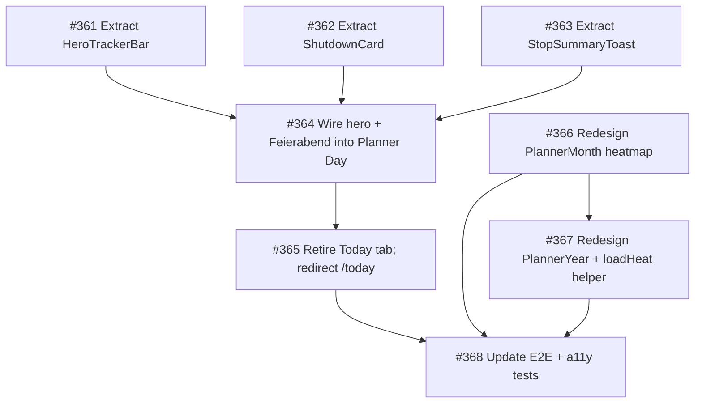

# Dev Handoff — Unified Day Canvas & Calendar Modernization

> **From:** Suhay (via Matthias) · **To:** Musti → Devs
> **Date:** 2026-07-24
> **Plan:** [`plans/unified-day-canvas-and-calendar-modernization.md`](unified-day-canvas-and-calendar-modernization.md)
> **ADR:** [`ADR-0075`](../docs/adr/0075-unified-day-canvas-calendar-modernization.md)
> **Grilling results:** [`plans/grilling-results-unified-day-canvas.md`](grilling-results-unified-day-canvas.md)
> **Process:** [`ultimate-dev-process`](../skills/skills/ultimate-dev-process/SKILL.md) — TDD, ≥90% coverage on core logic, Conventional Commits, one logical change per PR, `Closes #NNN` linking.

---

## What Matthias wants

Matthias wants the **calendar modernized** (the yellow-and-numbers grid looks old-fashioned) and the
**best of Today merged into the Planner** — specifically the big orange breathing Start/Pause button
([`LiveButton`](../apps/mobile/src/components/canvas/LiveButton.tsx:73)), the clock-out (Ausstempeln),
the `git commit -m "Feierabend"` ritual block, and the booked-time-on-stop summary. The Planner's
canvas is "geil" but it was missing those tracking pieces. The result should not look scattered — one
unified surface.

## What we decided (confirmed by Matthias)

1. **Merge into ONE screen** — the Planner Day view becomes the home; the Today tab disappears.
2. **Full calendar redesign** — replace the number-grid month/year with a blue-accent heatmap.
3. **5-step heat scale** (idle → sunk → accentSoft → accentText → accent).
4. **Remove `PlannerDayTracker` immediately** — the `HeroTrackerBar` fully replaces it.
5. **Entire hero bar moves** — task input, project chip, billable €, worked time, PauseCounter, big
   orange LiveButton — as one unit.
6. **Companions move to the Planner Day view** (below the Feierabend card) — SeviWatch,
   EveningCompanionCard, MoodEaseCard.

---

## The 8 tickets — dependency graph

### The frontier (can start immediately)

| # | Title | Scope | Est. |
|---|-------|-------|------|
| [#361](https://github.com/NexusHero/myDevTime/issues/361) | Extract `HeroTrackerBar` | Pure refactor — lift the hero bar JSX from `TodayScreen` into a reusable component. No behavior change. | S |
| [#362](https://github.com/NexusHero/myDevTime/issues/362) | Extract `ShutdownCard` | Pure refactor — lift the Feierabend card JSX from `TodayScreen` into a reusable component. No behavior change. | S |
| [#363](https://github.com/NexusHero/myDevTime/issues/363) | Extract `StopSummaryToast` | Thin helper — formalize the stop toast. No new logic. | XS |
| [#366](https://github.com/NexusHero/myDevTime/issues/366) | Redesign `PlannerMonth` heatmap | Visual redesign — borderless cells, 5-step blue heat, quiet numbers, accent ring on today. Independent of the merge. | M |

### Blocked (wait for blockers)

| # | Title | Blocked by |
|---|-------|------------|
| [#364](https://github.com/NexusHero/myDevTime/issues/364) | Wire hero + Feierabend into Planner Day | #361, #362, #363 |
| [#365](https://github.com/NexusHero/myDevTime/issues/365) | Retire Today tab; redirect `/today` | #364 |
| [#367](https://github.com/NexusHero/myDevTime/issues/367) | Redesign `PlannerYear` + `loadHeat` helper | #366 |
| [#368](https://github.com/NexusHero/myDevTime/issues/368) | Update E2E + a11y tests | #365, #366, #367 |

---

## Suggested dev distribution (Musti assigns)

> **Principle:** every dev is served — no one waits idle. The frontier has 4 unblocked tickets;
> two devs can work the extraction chain (#361→#364→#365) while another works the calendar chain
> (#366→#367) and a fourth picks up #363 (quick) then helps with #368.

### Dev A — Extraction chain (the merge)
- **#361** (HeroTrackerBar) → **#364** (wire into Planner Day) → **#365** (retire Today tab)
- This is the critical path. #361 is a pure refactor (S); #364 is the integration (M); #365 is the
  IA change (S). Sequential — each blocks the next.
- **Grilling note for Dev A:** the shared timer ([`TimerContext`](../apps/mobile/src/timer/TimerContext.tsx))
  is the single source of truth — never create a second clock. The `HeroTrackerBar` is a controlled
  view, not state owner. When wiring into the Planner Day view, make `Day` the default (currently
  `Week`).

### Dev B — Calendar chain (the modernization)
- **#366** (PlannerMonth heatmap) → **#367** (PlannerYear + `loadHeat` helper)
- Independent of the merge — can run in parallel with Dev A. #366 is the bigger piece (M); #367
  extracts the shared helper and aligns the year view (S).
- **Grilling note for Dev B:** the `live` orange is currently misused on the calendar (today-pill,
  year "NOW" border) — the redesign corrects this back to accent blue. The pure logic
  ([`dayLoad`](../packages/design/src/projects.ts), [`loadTone`](../packages/design/src/projects.ts))
  is unchanged — only the rendering changes. Every cell keeps an `accessibilityLabel` (REQ-043).

### Dev C — Quick win + E2E
- **#363** (StopSummaryToast — XS, done fast) → then help with **#368** (E2E + a11y) once its
  blockers land.
- **Grilling note for Dev C:** the toast snapshot must be taken **before** `timer.punchOut()` (the
  optimistic clear). For #368, the Feierabend E2E now runs on `/planner` Day, not `/today`.

### Dev D (if available) — can pair on #366 or #364
- If a fourth dev is available, pair on the two M-sized tickets (#364 and #366) to unblock the
  downstream chain faster.

---

## Non-negotiable rules (from the process — violating these fails review)

1. **TDD:** write the failing test first, then implement. Every new component gets a render test.
2. **≥90% coverage** on core logic (`packages/domain`, `packages/design`). The pure logic is already
   tested — don't move it, don't break it.
3. **Conventional Commits:** `feat(scope): summary` — one logical change per PR.
4. **`Closes #NNN`:** every PR links its issue.
5. **`./test.sh` passes** before merge — this is the local gate, same as CI.
6. **ADR-0005:** only view code moves. The deterministic core stays pure and tested.
7. **English-only UI copy.**
8. **No dead code:** `PlannerDayTracker` is deleted in #364, not left as a fallback.

---

## What Salih (QA) must verify

See the separate QA plan: [`plans/qa-acceptance-plan-unified-day-canvas.md`](qa-acceptance-plan-unified-day-canvas.md).

**Key acceptance tests Salih owns:**
- The Feierabend ritual (`git commit -m "Feierabend"`) works end-to-end on the Planner Day view.
- The big orange LiveButton starts/stops/pauses the timer on the Planner Day view.
- The booked-time-on-stop toast fires correctly.
- The calendar heatmap shows the right load intensity (5 steps) and is screen-reader accessible.
- `/today` redirects to `/planner` — no broken deep links.
- `./test.sh` is green before any PR merges.

---

## Docs to update in the same PRs

- **#365:** update [`docs/adr/0063`](../docs/adr/0063-calendar-centric-ia.md) status to
  "Superseded by ADR-0075 (point 1 only)". Update ux-vision §3 if it references the four-places model.
- **#366/#367:** no ADR needed (ADR-0075 already covers the calendar redesign).
- **Requirements Register** (`docs/architecture.md` §1): add REQ-075 (unified day canvas) and
  REQ-076 (calendar heatmap) — in the PR that delivers them.
