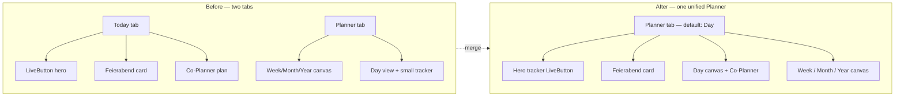
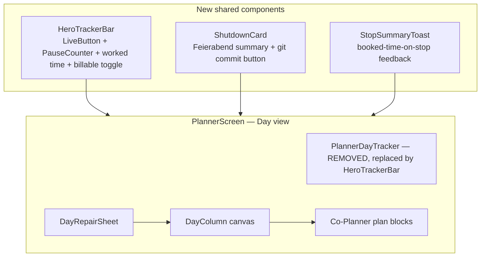
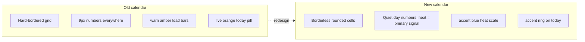

# Plan — Unified Day Canvas & Calendar Modernization

> **Goal:** Merge the best of Today (the **entire hero bar** — task input, project chip, billable €
> toggle, worked-time display, PauseCounter, and the big orange breathing `LiveButton` start/stop —
> plus the clock-out, the `git commit -m "Feierabend"` ritual, and the booked-time-on-stop summary)
> into the Planner as the single home, and modernize the calendar away from the dated
> yellow-and-numbers grid into a calm, blue-accented, heatmap-style surface.

This plan follows the project's governance ([`CLAUDE.md`](CLAUDE.md:1)): TDD, ≥90% coverage on
core logic, Conventional Commits, one logical change per PR, ADR for architectural decisions.

---

## 1. Current state — what we have and why it feels scattered

### 1.1 Two tabs, split strengths

The app ships **two top-level tabs** ([`PHONE_TABS`](packages/design/src/nav.ts:67) =
`today · planner · projects · reports · profile`), defaulting to `planner`
([`ShellChrome`](apps/mobile/src/shell/ShellChrome.tsx:72)).

| Capability | [`TodayScreen`](apps/mobile/src/screens/TodayScreen.tsx:122) | [`PlannerScreen`](apps/mobile/src/screens/PlannerScreen.tsx:2150) |
|---|---|---|
| Big breathing Start/Pause button | ✅ [`LiveButton`](apps/mobile/src/components/canvas/LiveButton.tsx:73) hero | ❌ only small [`PlannerDayTracker`](apps/mobile/src/components/planner/PlannerDayTracker.tsx:28) buttons (Day view) |
| Clock-out (Ausstempeln) | via Island only | ✅ [`PlannerDayTracker`](apps/mobile/src/components/planner/PlannerDayTracker.tsx:81) Clock in/out (Day view) |
| Feierabend block (`git commit -m "Feierabend"`) | ✅ [`shutdownCard`](apps/mobile/src/screens/TodayScreen.tsx:938) | ❌ missing |
| Booked-time-on-stop summary | ✅ toast + [`shutdownSummary`](apps/mobile/src/today/shutdown.ts:52) | ✅ toast only |
| Week/Month/Year canvas | ❌ | ✅ [`PlannerCalendar`](apps/mobile/src/components/planner/PlannerCalendar.tsx:88) |
| Co-Planner plan blocks | ✅ | ✅ (shared [`usePlanner`](apps/mobile/src/hooks/usePlanner.ts)) |

**The core tension:** Today owns the best *tracking* UX; Planner owns the best *planning* canvas.
Splitting them across two tabs makes the daily loop feel scattered — you plan in one place, track
in another, and close the day in a third.

### 1.2 The "yellow and numbers" problem

The calendar's month view ([`PlannerMonth`](apps/mobile/src/components/planner/PlannerMonth.tsx:52))
and year view ([`PlannerYear`](apps/mobile/src/components/planner/PlannerYear.tsx:33)) lean on warm
tones and dense numerals:

- **Load bars** use the `warn` amber (`#d9903f` dark / `#92400e` light) — reads as "warning", not
  "calm overview".
- **Today pill** uses `live` orange (`#ff6b3d`) — fine as a *signal*, but as the only color on the
  grid it dominates and dates the surface.
- **Dense 9px numerals** everywhere: day numbers, load figures (`fmtLoad`), `+N more`, event counts.
- The grid is a hard-bordered table with `borderLeftWidth`/`borderBottomWidth` hairlines — visually
  heavy.

Meanwhile the design system ([`palette.ts`](packages/design/src/palette.ts:31)) already ships a
modern **Sovereign royal-blue accent** (`#3654E0`) and a calm near-black neutral palette that the
calendar barely uses. The tokens ([`tokens.ts`](packages/design/src/tokens.ts:51)) give us clean
radii (`card: 14`, `block: 10`) and the Clash Display face — none of which the calendar wears.

---

## 2. Target architecture — one unified Day Canvas

### 2.1 The merge: Planner Day view becomes the home

The Planner already has a `Day` view with a small tracker row. We **elevate it** into the full
tracking home and **retire the Today tab**. The segmented control stays
(`Day · Week · Month · Year`), with `Day` as the default landing view.

### 2.2 Component extraction — shared, not duplicated

The Today-only pieces become reusable components so the Planner Day view consumes them without
copying code. This respects ADR-0005 (deterministic core) — the logic stays in the pure
[`todayShutdown`](apps/mobile/src/today/shutdown.ts:52) / [`useTimer`](apps/mobile/src/hooks/useTimer.ts)
seams; only the view is lifted.

### 2.3 Calendar modernization — heatmap, not grid

Replace the number-grid month/year with a **card-based heatmap** surface:

- **Month view:** each day becomes a rounded cell (no hard borders), filled with an **accent-tinted
  heatmap** (idle → `sunk` → `accentSoft` → `accentText` → `accent`) instead of the warn-amber load
  bar. Day numbers shrink to a quiet secondary role; the *fill intensity* is the primary signal.
  Today wears a subtle accent ring, not a loud orange pill.
- **Year view:** keep the 12-month card layout (already heatmap-ish in
  [`PlannerYear`](apps/mobile/src/components/planner/PlannerYear.tsx:33)) but drop the `live` orange
  "NOW" border → accent ring, and unify the intensity scale with the month view.
- **Color rule:** `live` orange is reserved strictly for "happening right now" (running timer,
  now-line) per [`palette.ts`](packages/design/src/palette.ts:67). The calendar overview uses the
  **accent blue** for load/heat — calm, not alarming.

---

## 3. Implementation steps (ordered, one PR each)

Each step is independently shippable and testable. Steps 1–3 are pure refactors (no behavior
change); steps 4–6 are the visual + IA changes.

### Step 1 — Extract `HeroTrackerBar` component

Extract the hero bar from [`TodayScreen`](apps/mobile/src/screens/TodayScreen.tsx:256) (the
`heroBar` JSX: task input, project chip, billable toggle, worked time, PauseCounter, LiveButton)
into a new reusable component `apps/mobile/src/components/canvas/HeroTrackerBar.tsx`.

- Props: the timer context slice + catalog + callbacks (start/stop/pause). No state ownership —
  it's a controlled view over [`useTimerContext`](apps/mobile/src/timer/TimerContext.tsx).
- [`TodayScreen`](apps/mobile/src/screens/TodayScreen.tsx:122) consumes it (behavior unchanged).
- Render test: `HeroTrackerBar.test.tsx` (idle / running / paused / billable states).

### Step 2 — Extract `ShutdownCard` component

Extract [`shutdownCard`](apps/mobile/src/screens/TodayScreen.tsx:938) into
`apps/mobile/src/components/today/ShutdownCard.tsx`.

- Props: the [`TodayShutdown`](apps/mobile/src/today/shutdown.ts:37) view-model + `onClose`.
- Logic stays in [`todayShutdown`](apps/mobile/src/today/shutdown.ts:52) (pure, already tested).
- [`TodayScreen`](apps/mobile/src/screens/TodayScreen.tsx:122) consumes it (behavior unchanged).
- Render test: `ShutdownCard.test.tsx` (idle hidden / clean / review states).

### Step 3 — Extract `StopSummaryToast` helper

Formalize the stop-tracking toast (`Timer stopped — X tracked`) into a small shared helper so both
the hero bar and the Planner can fire it consistently. This is a thin wrapper over
[`useToast`](apps/mobile/src/components/core/Toast.tsx) — no new logic.

### Step 4 — Wire hero tracker + Feierabend into Planner Day view

In [`PlannerScreen`](apps/mobile/src/screens/PlannerScreen.tsx:2353) (the `view === 'Day'` branch):

- Replace [`PlannerDayTracker`](apps/mobile/src/components/planner/PlannerDayTracker.tsx:28) with
  the new `HeroTrackerBar` (keeps the clock-in/out, gains the big LiveButton + PauseCounter).
- Add `ShutdownCard` below the day canvas (reads the same
  [`useTodayEntries`](apps/mobile/src/hooks/useTodayEntries.ts) + auto-tracker spans Today used).
- Make `Day` the default view (currently the screen opens on `Week`).
- **Remove** [`PlannerDayTracker`](apps/mobile/src/components/planner/PlannerDayTracker.tsx:28)
  immediately — the `HeroTrackerBar` fully replaces it; no dead code.

### Step 5 — Retire the Today tab; redirect `/today` → `/planner`

- Update [`PHONE_TABS`](packages/design/src/nav.ts:67): drop `'today'`, keep
  `planner · projects · reports · profile` (4 tabs).
- Update [`SIDEBAR_ITEMS`](packages/design/src/nav.ts:78) similarly (already excludes today).
- Add a redirect: `/today` → `/planner` (Expo Router + [`parsePath`](packages/design/src/nav.ts:112)
  fallback). Deep links to `today` land on the Planner Day view.
- Move Today-only companions ([`SeviWatch`](apps/mobile/src/components/today/SeviWatch.tsx),
  [`EveningCompanionCard`](apps/mobile/src/components/today/EveningCompanionCard.tsx),
  [`MoodEaseCard`](apps/mobile/src/components/today/MoodEaseCard.tsx)) into the Planner Day view,
  below the `ShutdownCard` — keeps the whole day-close ritual in one place (Option A, confirmed).
- Update [`ShellChrome`](apps/mobile/src/shell/ShellChrome.tsx:72) default + tests.
- **ADR:** record the IA change (Today tab retirement) — supersedes the two-tab model in
  ux-vision §3.

### Step 6 — Redesign `PlannerMonth` (heatmap month)

Rewrite [`PlannerMonth`](apps/mobile/src/components/planner/PlannerMonth.tsx:52):

- **Cells:** borderless, `radius.block`, `gap` between cells instead of hairline borders.
- **Heat fill:** 5-step accent scale (idle `bg` → `sunk` → `accentSoft` → `accentText` → `accent`)
  driven by [`dayLoad`](packages/design/src/projects.ts) / [`loadTone`](packages/design/src/projects.ts).
  Replace the 3px amber load bar with a full-cell tinted fill.
- **Day number:** quiet `ink3`, small; today gets an accent ring (border), not an orange pill.
- **Tasks:** keep the project-color left-border chips but lift them above the heat fill with a
  subtle surface background so they stay legible.
- **Booking-gap marker:** keep the hollow ring but switch from `warn` to `ink3` (it's information,
  not a warning).
- Drop the inline `fmtLoad` number (the heat *is* the signal); show it only on tap/long-press.
- Update [`PlannerMonth.test.tsx`](apps/mobile/src/components/planner/PlannerMonth.test.tsx).

### Step 7 — Redesign `PlannerYear` (unified heat scale)

Rewrite [`PlannerYear`](apps/mobile/src/components/planner/PlannerYear.tsx:33):

- Drop `live` orange "NOW" border → accent ring (consistent with month).
- Unify the [`heat`](apps/mobile/src/components/planner/PlannerYear.tsx:20) function with the
  month's 5-step scale (extract to a shared `loadHeat(t, level)` helper in
  [`packages/design`](packages/design/src/index.ts)).
- Update [`PlannerYear.test.tsx`](apps/mobile/src/components/planner/PlannerYear.test.tsx).

### Step 8 — Update E2E + a11y

- Update [`e2e/tests/feierabend.spec.ts`](e2e/tests/feierabend.spec.ts) (now on `/planner` Day).
- Update [`e2e/tests/planner-*.spec.ts`](e2e/tests/) for the new calendar selectors.
- Update [`e2e/tests/golden-paths.spec.ts`](e2e/tests/golden-paths.spec.ts) (no `/today` route).
- A11y: verify the heatmap cells still expose day + load via `accessibilityLabel` (REQ-043);
  the color is decorative, the label carries the meaning.

---

## 4. What does NOT change

- **Deterministic core (ADR-0005):** [`todayShutdown`](apps/mobile/src/today/shutdown.ts:52),
  [`shutdownSummary`](packages/domain), [`dayLoad`](packages/design/src/projects.ts),
  [`loadTone`](packages/design/src/projects.ts) — all pure, all stay. We only change how their
  output is *rendered*.
- **The shared timer:** one [`TimerContext`](apps/mobile/src/timer/TimerContext.tsx), one
  [`useWorktime`](apps/mobile/src/hooks/useWorktime.ts) — the merge just moves the controls, not
  the state. No second clock (ux-vision §2.3).
- **`live` orange semantics:** stays exactly "happening now" (running timer, now-line). The
  calendar overview stops borrowing it for decoration.
- **Co-Planner plan blocks:** shared via [`usePlanner`](apps/mobile/src/hooks/usePlanner.ts) on both
  surfaces — unchanged.

---

## 5. Risks & mitigations

| Risk | Mitigation |
|---|---|
| Losing Today's focused "just track" flow | The Planner Day view *is* that flow now — hero tracker on top, canvas below. The Week/Month/Year views are one tap away, not a context switch. |
| Deep links to `/today` break | Step 5 adds a redirect; [`parsePath`](packages/design/src/nav.ts:112) already falls back to `planner`. |
| Heatmap less precise than numbers | Numbers available on tap/long-press; the overview prioritizes *pattern* over *precision* (that's what the Week/Day canvas is for). |
| Calendar a11y regression (color-only signal) | Every cell keeps an `accessibilityLabel` with day + load; color is decorative (REQ-043). |
| Big PlannerScreen (2800 lines) gets bigger | Extraction in steps 1–3 *reduces* TodayScreen; the Planner Day branch consumes shared components, net-neutral. |

---

## 6. Confirmed decisions

1. **Heat scale:** 5 steps (idle `bg` → `sunk` → `accentSoft` → `accentText` → `accent`) — mirrors
   the existing [`loadTone`](packages/design/src/projects.ts) bands, finest granularity.
2. **`PlannerDayTracker`:** removed immediately in step 4 — the `HeroTrackerBar` fully replaces it.
3. **Hero bar scope:** the **entire** [`heroBar`](apps/mobile/src/screens/TodayScreen.tsx:256) from
   Today moves as one unit — task input, project chip, billable € toggle, worked-time display,
   [`PauseCounter`](apps/mobile/src/components/canvas/PauseCounter.tsx:21), and the big orange
   breathing [`LiveButton`](apps/mobile/src/components/canvas/LiveButton.tsx:73) start/stop.

## 7. Confirmed — Today-only companions → Planner Day view (Option A)

The companions ([`SeviWatch`](apps/mobile/src/components/today/SeviWatch.tsx),
[`EveningCompanionCard`](apps/mobile/src/components/today/EveningCompanionCard.tsx),
[`MoodEaseCard`](apps/mobile/src/components/today/MoodEaseCard.tsx)) move into the Planner Day view,
below the `ShutdownCard` — keeps the whole day-close ritual in one place. Confirmed by the user.
